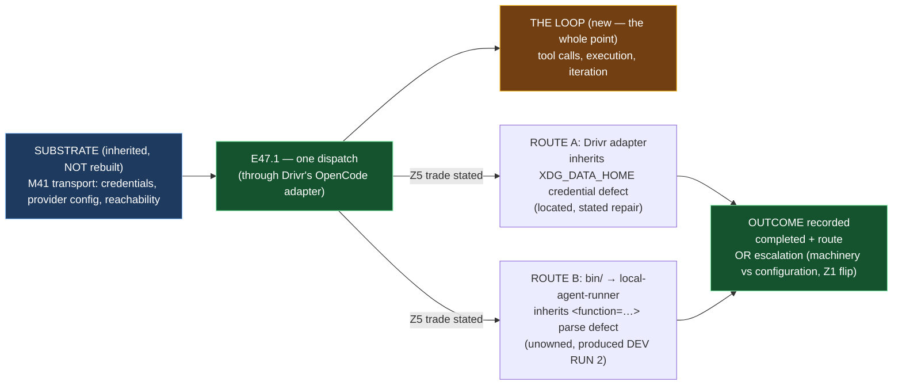

# Epic E47.1 — Remote Agentic Dispatch: Establish It, or Escalate

## Context

**Can an epic be dispatched to a remote engine today, by which path, and what does that path
carry?**

E47.1 is the milestone's **hard gate**. Every other epic depends on its answer: E47.2 can only
verify a project is *dispatchable* once E47.1 establishes what *dispatchable* means; E47.3 is the
proof run itself and cannot start until both exist. **E47.1 answers Z1's flip trigger before
anything depends on the answer.**

The milestone spec's five findings are carried here **as inputs, not re-derived**:

- **Z1 — SN-42 is sized M47-sized, with a flip trigger.** This repository cannot dispatch remote
  (`bin/run-dev-agent:114` gates on `local:`; `:109` calls a `remote:`-prefixed model *"no local
  endpoint to check"*); **Drivr's adapter is provider-generic** (`drivr/execution/opencode.py:164`
  splits `provider/model` and an unknown provider returns the config early rather than erroring;
  `:192` passes the model string straight to `opencode run --model`). **No remote dispatch has
  been run.** **FLIP TRIGGER:** if remote dispatch requires *new machinery* rather than
  *configuration*, that is the justified escalation and it becomes its own milestone.

- **Z2 — transport and dispatch share a substrate and split at the loop.** M41 established
  credentials, provider config and reachability on three remote engines (E41.4's transport
  back-test is **single-turn and tool-free** — it never makes a tool call). **This epic inherits
  the substrate and must not rebuild it.** What is genuinely new is the **agentic loop** — tool
  calls, execution, iteration.

- **Z5 — the routing choice decides which defects M47 inherits.** Route via `bin/run-dev-agent` →
  `local-agent-runner` and M47 inherits the **unowned `<function=…>` parse defect** at
  `local_agent_runner/tool_calls.py:171` (a third repository, unreachable by M42 or M47) — the
  defect that produced **DEV RUN 2**, one of the three cases the milestone criterion exists to
  catch. Route via Drivr's OpenCode adapter and it **does not** inherit that defect (different
  engine, different parser) — it inherits instead the **located `XDG_DATA_HOME` credential defect**,
  which is known with a stated repair.

**Planning-time re-measure (2026-09-04, this chat):** Drivr is at `114de1c`; `opencode.py:164`
and `:192` verified as the spec describes them; `local_agent_runner/tool_calls.py:171` (`def
parse_tool_call(`) verified present. The milestone spec's line-level citations are accurate at
this planning point. The epic **re-measures both at its own branch point** (G2).

## Problem Statement

**M47's proof is *"a real epic ran agentically end to end through Drivr AND we can show it did
work"* — but no remote dispatch has ever been run, and the routing choice determines which defects
the proof inherits.**

Three claims, stated separately because only one of them is inherited:

1. **Transport works** (remote provider, authenticate, send, receive) — **M41 established this.
   Inherited, not re-proven.**
2. **The loop works** (tool calls, execution, iteration, on a remote engine) — **never been run.
   This is the whole point, and it is not inherited.**
3. **The route is clean enough that the proof will not be a false success** — **undecided, and
   Z5 makes it the substantive question.** A route that dispatches successfully while carrying a
   defect that manufactures false successes produces *exactly* the run M47's criterion exists to
   reject.

## Goals

By the end of this Epic, the system (or the record) must:

1. **Establish whether remote dispatch works today, by which path** — a completed remote dispatch,
   or a recorded escalation with the machinery-versus-configuration judgment stated (Z1's flip
   trigger answered).
2. **State Z5's inheritance explicitly** — which defects the chosen route already carries, and why
   that trade was taken. Not merely *which path works*.
3. **Inherit, not rebuild, the M41 substrate** (Z2) — credentials, provider config, reachability on
   the configured engines.
4. **Record the effective credential path per dispatch**, treating zero credentials as
   `UNDETERMINED`, never *unreachable* (the confined `XDG_DATA_HOME` failure reports **every**
   remote target unreachable at once).
5. **Separate the loop claim from the transport claim** — whether the loop works is a distinct
   claim from whether the transport works, and only the second is inherited.

## Non-Goals

This Epic explicitly does **not** aim to:

- **Select the project** (E47.2) or **run the proof** (E47.3). It establishes the *route*; it does
  not commit a project to it.
- **Fix the `XDG_DATA_HOME` defect** or **the `local-agent-runner` parse defect** — those may be
  inherited, or avoided by route choice, but fixing them is not this epic's deliverable unless the
  chosen route makes the fix the only path to a clean dispatch. A *route* decision is not a *fix*
  decision.
- **Build new dispatch machinery in this repository.** `bin/run-dev-agent` gates on `local:`; if
  the remote path needs that changed, it is the escalation (Z1), not a silent extension of this epic.
- **Run the actual proof epic** — that is E47.3's, and it is the subject of the proof, never the
  supervisor.

## Scope of Work

### 1. One completed remote dispatch — or a recorded escalation (D1)

**One run is the whole answer to Z1's trigger.** The dispatch is *through Drivr* (M47's text, and
`through Drivr` means the Drivr OpenCode adapter, not `bin/`). If it needs configuration → M47
absorbs SN-42 as the CFO prefers. **If it needs new machinery → escalate; that is the justified
new milestone and not a failure.**

**Must include:**
- The route actually taken, stated (Drivr adapter vs `bin/run-dev-agent` → `local-agent-runner`).
- The model dispatched, and whether it resolved.
- The outcome recorded — **including a failure**, if the answer is "it does not work today, and
  here is why." A no-result is a result; silence is not.

### 2. Z5's inheritance, stated (D2)

**Which defects the chosen route already carries, and why that trade was taken.** Not merely which
path works.

**Must include:**
- If the route is Drivr's adapter: the `XDG_DATA_HOME` credential defect, its location, and its
  stated repair — inherited, and the record says how it is being worked around (or escalated) for
  the proof.
- If the route is `local-agent-runner`: the unowned `<function=…>` parse defect at
  `tool_calls.py:171`, its repository, and why a route carrying it would manufacture exactly the
  false success the milestone exists to reject — **grounds to reject that route for the proof.**
- A statement of **which route is chosen for the proof, and why**, on this defect analysis — not
  on "which one I got working first."

### 3. The substrate inherited, not rebuilt (D3)

**Z2's obligation in the negative:** M41 already established transport on three remote engines.
This epic must **not** re-establish it.

**Must include:**
- A statement of what is inherited verbatim from M41's transport work, and what is genuinely new
  (the loop).
- Evidence that no transport work was rebuilt — the inherited pieces are *used*, not *re-derived*.

### 4. The effective credential path, recorded (D4)

**Per dispatch, the effective credential path.** Zero credentials is `UNDETERMINED`, never
*unreachable*. A confined `XDG_DATA_HOME` reports every remote target unreachable at once — the
record must let a reader tell that failure apart from a real per-engine unreachable.

### 5. The loop claim, separated from the transport claim (D5)

**Whether the loop works is a distinct claim from whether the transport works.** The record states
both, and does not let a transport success read as a loop success.

## Deliverables

- [ ] **D1** — One completed remote dispatch, or a recorded escalation, with the machinery-versus-configuration judgment stated
- [ ] **D2** — Z5's inheritance stated explicitly: which route is chosen for the proof, and which defects it carries
- [ ] **D3** — The M41 substrate inherited, not rebuilt, with the inherited-versus-new boundary stated
- [ ] **D4** — The effective credential path recorded per dispatch; empty is `UNDETERMINED`
- [ ] **D5** — The loop claim separated from the transport claim
- [ ] A recorded dispatch, and if the answer is "not yet," the escalation notice (with the flip-trigger judgment)
- [ ] **Epic Delivery Notice**

## Binding Constraints

Settled above this epic — **not re-decidable here** (M47 milestone spec §Binding Constraints, with
the finding they bind):

1. **M42 is a hard prerequisite** (SN-31 Decision 2). **M42 has closed** — the closure declaration
   and Phase Chat Stage-2 ACCEPTANCE are ancestors of `phase/P12`, and M42's spec reads `status:
   completed`. This epic may proceed. *(The M47 Starter as issued still reads "M42 has not closed" —
   that is stale; this spec records the re-measured state.)*
2. **The run is checked by `bin/successful-nothing-instrument`** — never an exit status. (The
   instrument's counts apply to E47.3's proof; this epic's one dispatch is not the instrumented
   proof run, but the discipline "never an exit status" applies to any dispatch outcome it records.)
3. **SN-42 extends M47 by default; a new milestone is a justified escalation** — the bar is the
   work's actual size, not tidiness. **Z1's flip trigger is the test.**
4. **Through Drivr, never through `bin/`** — M47's own text, unchanged.

## Hard Constraint (binding — carried to every Epic)

> **M47 is the one milestone that can pass by accident.**

1. **Never accept the lane's own report of itself.** Exit codes are measured-unreliable in both
   directions on this stack (E33.2 Run A exited 0 having done nothing; E33.4 exited 2 having done
   green work). A dispatch's outcome is evidenced by *what it did*, not by its exit status.
2. **Zero credentials is `UNDETERMINED`, never *unreachable*** — and record the effective
   credential path per dispatch.
3. **Inherit the substrate; do not rebuild it.** M41 established transport on three remote engines.
4. **State the repository.** This epic spans this repo, Drivr, and possibly `local-agent-runner`.
   *"Suite green"* covers one of them.
5. **A run that surfaces a real defect is a SUCCESS.** A dispatch that fails and records *why* is
   this epic's strongest legitimate outcome. The deliverable is the record.

## Design Decisions Delegated — decide, document, proceed

1. **Which dispatch route** — and, critically, **stating what it inherits** (Z5). This is E47.1's
   substantive decision. The Drivr adapter (inherits the located `XDG_DATA_HOME` defect) vs
   `bin/run-dev-agent` → `local-agent-runner` (inherits the unowned parse defect). **The binding
   framing is fixed; the choice is yours, with the trade stated.**
2. **The precise shape and engine of the one dispatch** — a single-turn smoke dispatch through
   Drivr's adapter on a configured remote engine, or whatever minimally proves the loop. One run
   answers Z1; do not build a harness around one run.
3. **How the credential path is recorded** — the effective `XDG_DATA_HOME`/`XDG_CONFIG_HOME`
   resolution and the model/auth resolution, stated per dispatch. Zero credentials is
   `UNDETERMINED`.

**Escalate instead of deciding:** dispatch before M42 closes (not the case — M42 is closed);
anything that would substitute a human judgment for the completion signal silently; and **Z1's
trigger firing** — machinery rather than configuration is the justified escalation, not a silent
extension.

## Definition of Done

Epic E47.1 is complete when:

- [ ] A remote dispatch either completed and is recorded with its route, or was escalated with the machinery-versus-configuration judgment stated
- [ ] Z5's inheritance is explicit — what the chosen route already carries, and why the trade was taken
- [ ] No transport work was rebuilt that M41 had established
- [ ] The effective credential path is recorded per dispatch; empty is `UNDETERMINED`
- [ ] The loop claim is stated separately from the transport claim
- [ ] Every claim states its layer, repository, ref and date (`P11-GH-2`)
- [ ] Delivery Notice committed; PR opened from the epic branch to `milestone/M47`

## Acceptance Criteria

- [ ] A remote dispatch either completed and is recorded with its route, or was escalated with the flip-trigger judgment stated
- [ ] Z5's inheritance is explicit — what the chosen route already carries
- [ ] No transport work was rebuilt that M41 had established
- [ ] Credential visibility is recorded per dispatch; empty is `UNDETERMINED`

## Technical Constraints

**Repository:** the work lands in Drivr (`~/soft-dev/drivr`, `main` at `114de1c`) — if any adapter
change is needed, it lands there — and the record, spec and Delivery Notice land in
`ai-project-system`. `local-agent-runner` (`~/soft-dev/local-agent-runner`) is touched only as
analysis target of the Z5 decision, never modified by this epic. This repository's suite does not
cover Drivr's dispatch path; *"suite green here"* is not verification.

**Invocation:** `python3 -m pytest -q` from the Drivr root (if a Drivr change lands);
`PYTHONPATH=. pytest -q` in `ai-project-system` for the record/spec edits.

**Do not touch:** `bin/run-dev-agent` (gating on `local:` is the Z1 fact, not a defect this epic
fixes); `local-agent-runner/local_agent_runner/tool_calls.py` (the parse defect is stated, not
fixed).

## Dependencies

**Internal**
- **M42 (gate, satisfied).** Closed — closure declaration and Stage-2 ACCEPTANCE are in `phase/P12`.
- **M41 (satisfied).** Supplies the transport substrate (Z2) and the acceptance instrument (Z4).

**External**
- **Drivr at `~/soft-dev/drivr`, `main` `114de1c`** — the dispatch path; re-measure at the branch
  point (G2).
- **`local-agent-runner`** — analysis target only, if Z5 routes that way.

**Blockers**
- None at planning. The question is empirical — *does it dispatch* — and it is answered by one run,
  not by a design.

## Timeline

**Estimated Effort:** 1 session — one dispatch, or one escalation, with the Z5 trade stated.
**Target Completion:** **first** — E47.1 precedes and gates E47.3; E47.2 runs in parallel.
**Actual Completion:** In progress.

## Execution Notes

**Order:**
1. Re-measure the Drivr adapter (`opencode.py:164`, `:192`) and the `local-agent-runner` parse
   defect (`tool_calls.py:171`) at your branch point (G2).
2. Try the one remote dispatch through Drivr's adapter on a configured remote engine.
3. State Z5's inheritance for the route that worked — or escalate with the flip-trigger judgment
   if machinery was required.
4. Record the effective credential path; empty is `UNDETERMINED`.
5. Separate the loop claim from the transport claim in the record.

**Traps this project has already paid for:**

- **Exit status as evidence.** E33.2 Run A exited 0 having done nothing — a dispatch whose only
  evidence is an exit code has not been shown to have dispatched.
- **A confined `XDG_DATA_HOME` reporting every engine unreachable at once.** One failure shape
  that reads as *all* engines down is the credential defect, not a fleet outage. Record the
  effective path so the two are distinguishable.
- **Separating the loop from the transport.** A transport success (packet sent, text scored) is
  **not** a loop success (tool calls executed). E35.5's back-test is single-turn; do not let its
  success stand in for a loop that has never run.
- **Stating the repository.** This epic spans three repositories; a claim that names none is
  unverifiable.

## Related Documents

- [M47 Milestone Spec](P12-M47__milestone-spec.md) — E47.1 Epic Detail, findings Z1/Z2/Z5, Binding
  Constraints, Hard Constraint
- [M47 Milestone Execution Chat Starter](P12-M47__milestone-execution-chat-starter.md)
- [P12 Phase Spec](P12__phase-spec.md) — §P12.7 (M47)
- Drivr `drivr/execution/opencode.py:164`, `:192` at `main` `114de1c` — the provider-generic adapter
- `local-agent-runner/local_agent_runner/tool_calls.py:171` — the unowned parse defect (Z5)
- `bin/successful-nothing-instrument` + `tests/test_successful_nothing_instrument.py` — the acceptance instrument (Z4)
- [PROJECT-SYSTEM-GUIDELINES.md](../../../governance/PROJECT-SYSTEM-GUIDELINES.md)
- [AI-OPERATING-GUIDELINES.md](../../../governance/AI-OPERATING-GUIDELINES.md)

## Visual Bindings

**Visual binding**
- **Link:** (inline — Structural diagram; no hosted link needed per AOG §17.3/§17.5)
- **What:** diagram
- **Level:** Epic
- **State:** proposed

- **Description:** E47.1 answers whether remote dispatch works today, by which path. It inherits
  the M41 transport substrate (credentials, provider config, reachability) without rebuilding it;
  the genuinely new work is the agentic *loop*. The substantive decision is Z5's — which route, and
  which defects it inherits: Drivr's adapter (the located `XDG_DATA_HOME` defect) or
  `bin/`→`local-agent-runner` (the unowned parse defect that produced DEV RUN 2). The outcome is one
  completed dispatch with its route recorded, or a recorded escalation with the Z1
  machinery-versus-configuration judgment. Proposed-track Structural diagram (AOG §17.3/§17.6),
  Mermaid.

## Notes

- **One run is the whole answer.** Z1's flip trigger is a bar, not a survey: *does a remote
  dispatch work today, by which path*. This epic must not transmute one run into a framework. If it
  dispatches, record the route; if it needs machinery, escalate. Both are complete.

- **The route decision is the deliverable's substance, not a formality.** Z5 does not appear in the
  phase spec — it was measured by the Phase Chat and landed only in the milestone spec. A route that
  dispatches while silently carrying a false-success-manufacturing defect produces the exact run the
  instrument criterion exists to reject. Stating the inheritance is not decoration; it is the guard.

## Changelog

| Version | Date | Change |
|---|---|---|
| 1.0.0 | 2026-09-04 | Initial E47.1 spec, from the M47 milestone spec v1.0.0 (E47.1 Epic Detail, findings Z1/Z2/Z5, Binding Constraints, Hard Constraint). **Re-measured at planning (G2): Drivr `main` `114de1c`; `opencode.py:164`/`:192` and `local-agent-runner/tool_calls.py:171` verified; M42 re-checked CLOSED** (closure declaration + Stage-2 ACCEPTANCE are ancestors of `phase/P12`, M42 spec `status: completed`). Scopes one remote dispatch through Drivr's adapter — or a recorded escalation on Z1's flip trigger — with Z5's inheritance stated explicitly, the M41 substrate inherited (not rebuilt), and the loop claim separated from the transport claim. Delegates the route choice, the dispatch's concrete shape, and the credential-path recording. No scope, ordering, gate or acceptance-criterion change from the milestone spec. |
