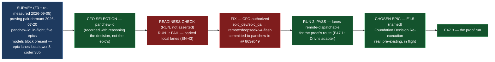

# Delivery Notice: P12-M47-E47.2 — Project Selection and Readiness

> **The CFO selected `panchew-io` for M47's proof, the readiness check was RUN (twice), and the
> parked-lane gap it caught was fixed with CFO authorization — E47.3 has a named project, a named
> real epic, and a project whose epic lanes now resolve to a dispatchable engine for the proof's
> route.** The E47.2 spec and the M47 milestone spec are cited by path and branch, never by version
> or sha. `merge_details` describe a merge that has not happened and are unfillable at delivery time
> (`P10-GH-4`, restated). Merge authorization follows the M47 Milestone Chat's Stage-2 review, and
> the parent performs the merge (§11.6).

---

## Summary

**CFO selection: `panchew-io`.** Put in front of the CFO with the survey (Z3 + re-measurement), the
CFO chose `panchew-io` — the only fleet project with real, current, in-flight epic work. The
decision is recorded with its reasoning in the record (D1).

**Readiness check run, not asserted — and it caught the gap.** The check parsed the live
`panchew-io/.ai-project.yml`: the `models:` block exists, but `epic_dev`/`epic_qa` =
`local:qwen3-coder:30b` — a **parked local lane (SN-43)**, not a dispatchable engine for the remote
proof route E47.1 established. **Run 1 = FAIL.** This is exactly the parked-lane gap an assert
papers over and a run catches.

**Fixed, CFO-authorized.** The CFO authorized editing `panchew-io`'s `.ai-project.yml` to point the
epic lanes at `remote:deepseek-v4-flash` (the fleet baseline, SN-41 — the same value
`ai-project-system` configures for its own epic lanes, and the engine class E47.1 dispatched). The
fix is committed to `panchew-io` at `863eb49`. **Run 2 = PASS.** The blocker is cleared before
E47.3.

**Chosen epic: E1.5 — Foundation Decision Re-execution and Provenance Recovery.** Real,
pre-existing, currently in flight, would-have-been-done-anyway work on `panchew-io`'s
`milestone/M1`.

## Verification layer, time, scope and ref (`P11-GH-2`)

| Axis | Value |
|---|---|
| **Layer** | CFO project selection (recorded) + readiness check run against the selected project's live config + CFO-authorized config fix. No `ai-project-system` code changed. |
| **Time** | **2026-09-05** |
| **Scope (selected project)** | `~/soft-dev/panchew-io`, `milestone/M1` — **read** for survey + check; **`.ai-project.yml` edited once, CFO-authorized**, committed at **`863eb49`**. No other file touched. |
| **Scope (governance repo)** | `ai-project-system`, branch **`epic/P12-M47-E47.2`**, branched from **`milestone/M47` @ `786b2b7`**. Adds the record, the check script, the fail/pass result artifacts, and this Delivery Notice. The E47.2 spec (`dcdff34`) and M47 milestone spec (v1.1.0, `e8ef20d`, merged in `786b2b7`) needed no amendment. |
| **Repo for `git log`** | Governed refs pinned and `git log`-ed at the branch point (`P11-GH-1` step 5): no post-branch amendments. Drivr at `114de1c` (read, from E47.1) — the route is inherited, not re-derived. |
| **Suite** | `ai-project-system`: **767 passed** (`PYTHONPATH=. pytest -q`). `panchew-io` has no test suite; the verification that matters there is the readiness check itself (Run 2 = PASS). |

## Model verification (`advisory` — stated plainly, per chat-hierarchy.md)

Harness-reported model: **`opencode/deepseek-v4-flash`**. Configured `epic_manual` in
`ai-project-system`: **`remote:deepseek-v4-flash`**; in the selected project `panchew-io`:
**`opencode/deepseek-v4-flash`**. **No mismatch** — all three name the same engine. Stated plainly.

## Re-measured at build time, not trusted from the spec (G2)

`panchew-io/.ai-project.yml` quoted verbatim in the record (G1). `milestone/M1` re-measured at
`7d99be6` (pre-fix) and `863eb49` (post-fix), clean working tree both times. E47.1's dispatch
record read at the branch point to establish the proof's route.

## Deliverables

- [x] **D1** — The CFO selection recorded with reasoning, and the survey behind it (`panchew-io`)
- [x] **D2** — A readiness check **run** (not asserted): `models:` block present, epic lanes dispatchable — **FAIL caught (parked local), PASS after CFO-authorized fix; both results recorded**
- [x] **D3** — The chosen epic named — **E1.5**, real, pre-existing, currently in-flight, would-have-been-done-anyway
- [x] **D4** — The project's framework version (v7.1.0) and governance state (submodule `bb727a5`, `milestone/M1` @ `863eb49`, clean) recorded
- [x] Anything blocking readiness is **fixed** (CFO-authorized) before E47.3 starts — the parked-lane gap
- [x] **Epic Delivery Notice** — this artifact

## Definition of Done — see the record for the full itemization

Every item is checked in `P12-M47-E47.2__record__project-selection-and-readiness.md` §Definition of
Done. The two easiest to skip are both present and evidenced: **the readiness check was actually
run** (its FAIL and PASS results are recorded as artifacts, not asserted from the spec); and **the
chosen epic is real, pre-existing work, named** (E1.5, in flight on `panchew-io`'s `milestone/M1`).

## Visual Bindings

**Visual binding**
- **Link:** (inline — Structural diagram; no hosted link needed per AOG §17.3/§17.5)
- **What:** diagram
- **Level:** Epic
- **State:** implemented

- **Description:** E47.2 selected the project — the CFO's decision, recorded with the survey behind
  it — and verified readiness **by running a check, not asserting one**. Run 1 caught the parked-lane
  gap (`epic_dev`/`epic_qa` = `local:qwen3-coder:30b`, SN-43) exactly as the milestone's Hard
  Constraint said a run must; the CFO authorized the fix to `remote:deepseek-v4-flash`; Run 2 passed.
  The chosen epic is E1.5, real pre-existing in-flight work. Implemented-track Structural diagram
  (AOG §17.3/§17.6), Mermaid.

---

## Status

⏸️ **Stopped. Awaiting Milestone Chat review and authorization. Not merged.** Per this epic's
Starter and §11.6, merge authorization for the Delivery Notice PR normally follows the Milestone
Chat's Stage-2 review, and the parent (the M47 Milestone Chat) performs the merge. This delivery is
the **first attempt** — the rework limit (3 attempts plus any written `+1`, PSG §11.6 / the SN-36/37
`+1` amendment) has not been touched.

The selected project's fix (`panchew-io` `863eb49`) was CFO-authorized in this chat; it lives in
that repository. This delivery's PR is on `ai-project-system` (`epic/P12-M47-E47.2` →
`milestone/M47`), which I will open.

Epic E47.2 execution complete. Epic Delivery Notice produced. Awaiting Milestone Chat review and
authorization.