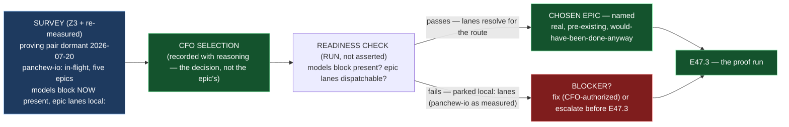

# Epic E47.2 — Project Selection and Readiness

## Context

**Which real project, and is it actually ready?**

E47.2 runs **in parallel with E47.1**. E47.1 establishes what *dispatchable* means; E47.2 selects
the project and — independently of which route E47.1 settles on — verifies by **running a check**,
not asserting, that the chosen project can be dispatched to. The two meet at E47.3, which needs
both.

The milestone spec's Z3 finding is carried here **as an input, not re-derived**, and then **re-measured**:

- **Z3 — the phase spec's candidate list is stale, and the live candidate had a blocker.** The
  phase spec names *"the proving pair (`home_finance`, `local-agent-runner`) and Drivr itself"*.
  Re-surveyed by the Phase Chat (2026-08-27→09-01): `home_finance` last moved 2026-07-20;
  `local-agent-runner` last moved 2026-07-20 with a dirty tree and owns the unowned parse defect;
  **`panchew-io` is the only fleet project with real, current, in-flight epic work** (v7.1.0, clean,
  active 2026-08-23, on `milestone/M1` with five planned epics). **At that time `panchew-io` had NO
  `models:` block, so it could not dispatch.**

**Planning-time re-measure (2026-09-04, this chat — G2):** `panchew-io` **now has a `models:`
block.** Verified, not inferred from a silent grep:

```yaml
models:
  creation: remote:claude-opus-5
  hq: remote:claude-opus-5
  phase: remote:claude-opus-5
  milestone: remote:claude-opus-5
  epic_dev: local:qwen3-coder:30b
  epic_qa: local:qwen3-coder:30b
  epic_manual: opencode/deepseek-v4-flash
```

(`~/soft-dev/panchew-io/.ai-project.yml`, `milestone/M1` at `7d99be6`, re-measured 2026-09-04.)
**This changes Z3's blocker, it does not clear it.** `panchew-io` can now name a dispatch lane —
**but its `epic_dev`/`epic_qa` are `local:qwen3-coder:30b`, and local inference is PARKED
(SN-43).** M47's proof is **remote** dispatch through Drivr; a lane configured for a parked local
runtime is not a ready remote-dispatch lane. The blocker moved from *"cannot dispatch — no models
block"* to *"models block exists, but the epic lanes point at parked local inference."* **The
readiness check's whole job is to catch exactly this — a project whose config says it can dispatch
but whose lanes are not actually dispatchable.**

## Problem Statement

**The phase spec's candidate list is stale, and the one project with real in-flight work has a
config that looks dispatchable but points its epic lanes at a parked runtime — which is the
readiness gap a *run* check exists to catch, and an assert would paper over.**

The project selection is the **CFO's**, recorded with reasoning. This epic's job is **not to
choose** — it is to (a) put the CFO's decision in front of the CFO with the survey behind it, (b)
record the selection with its reasoning, and (c) **verify by running a check** that the chosen
project can actually be dispatched to, before E47.3 commits to it.

## Goals

By the end of this Epic, the system must:

1. **Record a CFO selection with reasoning** — the CFO's decision, with the survey (Z3 + this
   epic's re-measurement) behind it. The CFO's choice is the answer; the survey is the evidence the
   choice is grounded in.
2. **Verify readiness by running a check, not asserting one** — including that the chosen
   project has a `models:` block *whose epic lanes actually resolve to a dispatchable remote
   engine*, not merely that a `models:` key exists.
3. **Identify a real, pre-existing epic** — work already planned that *would have been done anyway*.
   Not a task invented to be dispatched.
4. **Record the project's framework version and governance state** — so the run's context (E47.3)
   is reconstructible later.

## Non-Goals

This Epic explicitly does **not** aim to:

- **Establish the dispatch route** (E47.1) or **run the proof** (E47.3).
- **Decide the project on its own authority.** Selection is the CFO's; this epic prepares and
  records it, it does not make it.
- **Repair `panchew-io`'s or any project's model block** — unless the CFO's chosen project needs a
  readiness fix and the CFO authorizes it, which is the "fix or escalate before E47.3" acceptance
  path, not a proactive edit.
- **Survey the entire fleet exhaustively.** Z3's survey is the input; this epic re-confirms the
  chosen candidate's current state and does not re-derive the whole fleet sweep.

## Scope of Work

### 1. The CFO selection, recorded with reasoning (D1)

**The CFO's decision, with the survey behind it.** Z3's evidence is the input, not the answer: the
phase spec's candidate list is stale; the proving pair is dormant; `panchew-io` is the only fleet
project with current in-flight epic work.

**Must include:**
- The chosen project, named.
- The CFO's reasoning, recorded — and the survey (who moved, when, with what in flight) that the
  reasoning rests on.
- An explicit statement that the choice was **the CFO's**, not this epic's or the Milestone Chat's.

### 2. A readiness check that is run, not assumed (D2)

**Whatever project is chosen, verify it can be dispatched to before it is committed to** — by
running a check against the project's actual configuration, not by asserting it from the spec.

**Must include:**
- Confirmation a `models:` block exists — verified in the file, not from memory.
- Confirmation the **epic lanes** (`epic_dev`/`epic_qa`) resolve to a **dispatchable engine** for
  the proof's route — for the remote proof, that means a `remote:`-resolvable engine, **not** a
  parked `local:` lane and **not** a bare prefix string. The re-measured `panchew-io` block
  (`epic_dev: local:qwen3-coder:30b`) is the canonical case this check must catch.
- The check's mechanism and its result — **the run is the evidence, not the assertion.** If the
  check fails, that is recorded, and it is a finding, not a silent skip.

### 3. The chosen epic identified (D3)

**Real, pre-existing, would-have-been-done-anyway work.** `panchew-io` currently runs five planned
epics on `milestone/M1`; the chosen epic is one of them, **named**, not a task invented to be
dispatched.

### 4. The project's framework version and governance state recorded (D4)

**The reconstruction context** — the project's `.ai-project.yml` governance version/ref, its
current branch, and its clean/dirty state — so E47.3's run record can be read against the right
baseline later.

## Deliverables

- [ ] **D1** — The CFO selection recorded with reasoning, and the survey behind it
- [ ] **D2** — A readiness check **run** (not asserted): `models:` block present, epic lanes dispatchable, result recorded
- [ ] **D3** — The chosen epic named — real, pre-existing, would-have-been-done-anyway
- [ ] **D4** — The project's framework version and governance state recorded
- [ ] Anything blocking readiness is **fixed or escalated** before E47.3 starts
- [ ] **Epic Delivery Notice**

## Binding Constraints

Settled above this epic — **not re-decidable here** (M47 milestone spec §Binding Constraints):

1. **M42 is a hard prerequisite.** **M42 has closed** (closure declaration + Stage-2 ACCEPTANCE in
   `phase/P12`; M42 spec `status: completed`). This epic may proceed.
2. **Project selection is the CFO's**, recorded with reasoning.
3. **The run is checked by the instrument, never an exit status**, and **a run that surfaces a
   real defect is a success.** This applies to E47.3's proof; it shapes here too — a readiness
   check that *finds* a blocker is this epic working, not failing.

## Hard Constraint (binding — carried to every Epic)

> **M47 is the one milestone that can pass by accident.**

1. **Never accept the lane's own report of itself.** A "ready" claim from the project's own
   subtree is not evidence of readiness; the check is run against the config, not asserted from
   the project's own words.
2. **Zero credentials is `UNDETERMINED`, never *unreachable***.
3. **Inherit the substrate; do not rebuild it.**
4. **State the repository.** This epic spans this repo and the selected project. *"Suite green"*
   in one is not verification in the other.
5. **A run that surfaces a real defect is a SUCCESS.** A readiness check that catches the parked-
   lane gap is a stronger result than one that passes without checking.

## Design Decisions Delegated — decide, document, proceed

1. **How the readiness check is run** — the concrete mechanism (e.g., resolving the project's
   `models.epic_dev`/`epic_qa` against the route E47.1 established, or the project's own dispatch
   path), and how its result is recorded. **The binding property is fixed: it is run, not
   asserted.**
2. **The survey's current form** — this epic re-confirms the chosen candidate's state at execution
   time; the exact commands and scope are yours, bounded by "do not re-derive the whole fleet
   sweep."

**Escalate instead of deciding:** the project choice itself (the CFO's); any readiness fix that
changes the project's config without CFO authorization; and a readiness blocker that cannot be
fixed in-scope.

## Definition of Done

Epic E47.2 is complete when:

- [ ] The project is chosen by the CFO, with reasoning recorded
- [ ] Its readiness is **verified by running a check**, not asserted — including a `models:` block whose epic lanes resolve to a dispatchable engine
- [ ] The chosen epic is real, pre-existing work, and is named
- [ ] Anything blocking readiness is fixed or escalated before E47.3 starts
- [ ] The project's framework version and governance state are recorded
- [ ] Every claim states its layer, repository, ref and date (`P11-GH-2`)
- [ ] Delivery Notice committed; PR opened from the epic branch to `milestone/M47`

## Acceptance Criteria

- [ ] The project is chosen by the CFO with reasoning recorded
- [ ] Its readiness is **verified by running a check**, not asserted — including a `models:` block
- [ ] The epic is real, pre-existing work, and is named
- [ ] Anything blocking readiness is fixed or escalated before E47.3 starts

## Technical Constraints

**Repository:** the record, this spec and the Delivery Notice land in `ai-project-system`. The
selected project (e.g. `~/soft-dev/panchew-io`) is **read** for the readiness check and the
governance-state record; it is **not modified** by this epic unless the CFO authorizes a specific
readiness fix. This repository's suite does not cover the selected project; *"suite green here"*
is not verification of the project's readiness.

**Invocation:** `PYTHONPATH=. pytest -q` in `ai-project-system` for any spec/record edits.

## Dependencies

**Internal**
- **M42 (gate, satisfied).** Closed.
- **E47.1 (parallel).** Supplies what *dispatchable* means; E47.2's readiness check is run against
  the route E47.1 establishes. They run in parallel and meet at E47.3.

**External**
- **The selected project** (e.g. `~/soft-dev/panchew-io`, `milestone/M1` at `7d99be6`) — read for
  the check; re-measure at execution time (G2), it has moved since the milestone spec was written.
- **The CFO** — the project selection, with recorded reasoning, and authorization for any
  readiness fix.

**Blockers**
- **Z3's original blocker is re-measured stale** — `panchew-io` now has a `models:` block. **The new
  blocker is its `epic_dev`/`epic_qa` pointing at `local:qwen3-coder:30b` (parked, SN-43)** — which
  is precisely what the readiness check must catch and either fix (with CFO authorization) or
  escalate.

## Timeline

**Estimated Effort:** 1 session — obtain and record the CFO selection; run the readiness check;
  name the chosen epic.
**Target Completion:** in parallel with E47.1; before E47.3 starts.
**Actual Completion:** In progress.

## Execution Notes

**Order:**
1. Re-measure the chosen candidate's `.ai-project.yml` and branch state (G2) — it has moved since
   the milestone spec (2026-08-27→09-01).
2. Put the selection in front of the CFO, with the survey (Z3 + re-measurement).
3. Record the CFO selection with reasoning.
4. Run the readiness check against the chosen project's config; record the result — **run, not
   asserted.**
5. If blocked, fix (with CFO authorization) or escalate before E47.3.

**Traps this project has already paid for:**

- **An assert where a run belongs.** The milestone spec's acceptance is explicit — *"by running a
  check, not asserting one"* — because a config that *looks* dispatchable but points at a parked
  lane is exactly the gap an assert passes and a run catches. The re-measured `panchew-io` block is
  the live instance.
- **A `models:` key read as readiness.** The key existing is not the lanes resolving. The
  re-measurement shows a `models:` block whose epic lanes point at parked local inference — "has a
  models block" is true and "can dispatch" is false, at the same time.
- **A stale candidate list trusted.** The phase spec named the proving pair; both last moved
  2026-07-20. The live project was found by re-measurement, not by reading the spec.
- **The CFO's choice assumed.** Selection is the CFO's; this epic records it and must not let its
  own survey edge past "input" into "decision."

## Related Documents

- [M47 Milestone Spec](P12-M47__milestone-spec.md) — E47.2 Epic Detail, finding Z3, Binding
  Constraints, Hard Constraint
- [M47 Milestone Execution Chat Starter](P12-M47__milestone-execution-chat-starter.md)
- [P12 Phase Spec](P12__phase-spec.md) — §P12.7 (M47), "Project selection is M47's first decision"
- `~/soft-dev/panchew-io/.ai-project.yml` (`milestone/M1` `7d99be6`, re-measured 2026-09-04) — the
  live candidate and its re-measured models block
- [PROJECT-SYSTEM-GUIDELINES.md](../../../governance/PROJECT-SYSTEM-GUIDELINES.md)
- [AI-OPERATING-GUIDELINES.md](../../../governance/AI-OPERATING-GUIDELINES.md)

## Visual Bindings

**Visual binding**
- **Link:** (inline — Structural diagram; no hosted link needed per AOG §17.3/§17.5)
- **What:** diagram
- **Level:** Epic
- **State:** proposed



- **Description:** E47.2 selects the project (the CFO's decision, recorded with the survey behind
  it) and verifies readiness **by running a check, not asserting one**. The re-measured live
  candidate is `panchew-io` — now with a `models:` block, but with `epic_dev`/`epic_qa` pointing at
  `local:qwen3-coder:30b` (parked, SN-43), which is exactly the gap the run check must catch. The
  chosen epic is real, pre-existing, would-have-been-done-anyway work, named; anything blocking
  readiness is fixed (CFO-authorized) or escalated before E47.3 starts. Proposed-track Structural
  diagram (AOG §17.3/§17.6), Mermaid.

## Notes

- **The re-measurement changed the blocker, and that is the point.** Z3 measured `panchew-io` with
  no models block; this chat re-measured it with one — whose epic lanes point at a parked local
  runtime. A readiness check that runs catches the second; an assert catches neither, because the
  first was *"no block"* and the second is *"block present, lanes parked"* — two different facts,
  both false-read as "ready" if you only look for the string `models:`.

- **"Readiness is verified by running a check" is the milestone's own wording** (E47.2 Epic Detail,
  Deliverable 2). The re-measurement in this spec is not a substitute for the epic's check — it is
  the planning-time input that shows *why* the check must run. The epic runs it against the live
  project at execution time.

## Changelog

| Version | Date | Change |
|---|---|---|
| 1.0.0 | 2026-09-04 | Initial E47.2 spec, from the M47 milestone spec v1.0.0 (E47.2 Epic Detail, finding Z3, Binding Constraints, Hard Constraint). **Re-measured at planning (G2): `panchew-io` now HAS a `models:` block** (`~/soft-dev/panchew-io/.ai-project.yml`, `milestone/M1` `7d99be6`) — Z3's "no models block" blocker is stale; **the new blocker is its `epic_dev`/`epic_qa` pointing at `local:qwen3-coder:30b` (parked, SN-43)**, which the readiness check must catch. Scopes the CFO selection (recorded with reasoning), a readiness check **run, not asserted**, the named pre-existing epic, and the governance-state record. Delegates the check's mechanism and the survey's current form. No scope, ordering, gate or acceptance-criterion change from the milestone spec. |
