# Delivery Notice: P12-M47-E47.3 — The Proof Run and Its Record

> **A real epic — P1-M1-E1.1 on `panchew-io` — ran end to end agentically through Drivr, and the
> instrument verified it: 111 tool rounds, 21 files changed, two commits, clean tree. The run
> surfaced two real fleet defects (the opencode workspace $35 monthly limit and the Anthropic
> credit balance) and completed anyway on a third route.** The E47.3 spec and the M47 milestone
> spec are cited by path and branch, never by version or sha. `merge_details` describe a merge that
> has not happened and are unfillable at delivery time (`P10-GH-4`, restated). Merge authorization
> follows the M47 Milestone Chat's Stage-2 review, and the parent performs the merge (§11.6).

---

## Summary

**The proof run completed and the instrument confirmed it.** The subject is P1-M1-E1.1
(Foundation Decisions and Working Baseline) on `panchew-io` — the active in-flight epic under the
SN-2 P1-M1 **Attempt 2** restart. (E47.2 had named E1.5, which is now frozen under
`archive/P1-M1-attempt-1/`; the active epic is E1.1. The proof ran E1.1.)

**Three dispatch attempts through Drivr's OpenCode adapter:**

1. `opencode/deepseek-v4-flash` — **blocked**: workspace `$35` monthly spend limit, 0 work.
2. `anthropic/claude-opus-5` — **interrupted**: Anthropic credit balance too low mid-run (~60 tool
   rounds, never committed).
3. `google/gemini-3.8-flash` — **completed**: exit 0, **111 tool rounds**, **21 files changed**,
   **2 commits** on `epic/E1.1`, clean tree.

**The instrument is the checker, not the run's report.** `bin/successful-nothing-instrument`
verdict: **PASS** — C-A tool rounds **111**, C-B files changed **21** (worktree provenance), C-C
claims **4/12** (recorded, not scored on the dev floor). Never an exit status.

**The run's claimed checks were independently re-run here** and all passed: correctness (4/4),
accessibility (0 violations, WCAG 2.2 AA), security (0 at/above `high`; secret hygiene clean),
performance (p95 ≤ 100 ms per route, cold start 212 ms, 0 errors). The run's self-report is
corroborated, not merely transcribed.

**Two real defects surfaced, recorded not absorbed** (per the Hard Constraint, a surfaced defect is
a SUCCESS): F-1 the opencode workspace billing limit, F-2 the Anthropic credit balance, and F-3 the
instrument's C-C2 backtick-regex over-extraction on opencode-style final answers.

## Verification layer, time, scope and ref (`P11-GH-2`)

| Axis | Value |
|---|---|
| **Layer** | Proof-run supervision + Drivr dispatch + instrument check + run record. No `ai-project-system` code changed. The run's work (E1.1) lives in `panchew-io`. |
| **Time** | **2026-09-06 → 2026-09-07** |
| **Scope (selected project)** | `~/soft-dev/panchew-io`, `milestone/M1` @ **`e892b69`** — run in a **worktree** `/tmp/opencode/e47-3-e1-1-work` on `epic/E1.1` (2 commits `ff49a58`, `350a0f7`). **`panchew-io`'s main checkout was not modified.** |
| **Scope (governance repo)** | `ai-project-system`, branch **`epic/P12-M47-E47.3`**, branched from **`milestone/M47` @ `6562f3b`**. Adds the record, run-evidence artifacts, and this Delivery Notice. |
| **Repo for `git log`** | Governed refs pinned and `git log`-ed at the branch point (`P11-GH-1` step 5): E47.3 spec (`dcdff34`), M47 milestone spec (`e8ef20d`), M47 Starter (`e8ef20d`), instrument (`57554c3`) — all ancestors of `6562f3b`. No post-branch amendments. Drivr at `114de1c` (read, from E47.1). |
| **Suite** | No code landed in `ai-project-system`, so no suite gate applies here. The run's verification is the instrument's counts + the independently re-run E1.1 checks, in `panchew-io`. |

## Model verification (`advisory` — stated plainly, per chat-hierarchy.md)

Harness-reported model: **`opencode/deepseek-v4-flash`**. Configured `epic_manual` in
`ai-project-system`: **`remote:deepseek-v4-flash`**; in `panchew-io`: **`opencode/deepseek-v4-flash`**.
**No mismatch** — all three name the same engine. Stated plainly.

## Re-measured at build time, not trusted from the spec (G2)

The proof subject was re-measured and **changed**: `panchew-io` restarted P1-M1 as **Attempt 2**
(SN-2); E1.5 is archived under `archive/P1-M1-attempt-1/`; the active epic is **E1.1**. Attempt 2
planning verified live: `milestone/M1` @ `e892b69`, E1.1/E1.2 specs+starters git-tracked, planning
PR #1 merged into `phase/P1` (`c10d07e`), `origin` = panchew-io.git, no active `epic/E1.1`. E1.1
Execution-Start Gates verified (Phase-accepted, planning PR merged, distinct session, Layer-8
execution authorization in-chat). Note: `panchew-io`'s `.ai-project.yml` no longer has a `models:`
block — per the E1.1 starter the permissive default applies (recorded, not a blocker).

## Deliverables

- [x] **D1** — The run, end to end through Drivr, in the named project (`panchew-io`) and epic (P1-M1-E1.1)
- [x] **D2** — The instrument's verdict — **111 tool rounds, 21 files changed (worktree), claims 4/12 (recorded-not-scored)** — not an exit status
- [x] **D3** — The run record, including what the framework got wrong (F-1, F-2, F-3), scoped in advance to say a real defect is the stronger result
- [x] **D4** — The completion judgment's verdict recorded as given ("complete"), with the signal's trustworthiness stated (M45 closed)
- [x] **D5** — A statement of what the run does not prove (one project, one epic, one engine)
- [x] **Epic Delivery Notice** — this artifact

## Definition of Done — see the record for the full itemization

Every item is checked in `P12-M47-E47.3__record__proof-run-and-its-record.md` §Definition of Done.
The three easiest to skip are all present and evidenced: **the instrument's counts are in the
record** (C-A 111, C-B 21, C-C 4/12 — never an exit status); **the completion verdict is recorded as
given** ("complete") with the signal's trustworthiness stated (M45 closed); and **the record says
what the run does not prove** (§D5).

## Visual Bindings

**Visual binding**
- **Link:** (inline — Structural diagram; no hosted link needed per AOG §17.3/§17.5)
- **What:** diagram
- **Level:** Epic
- **State:** implemented

```mermaid
flowchart LR
  SUBJ["PROOF SUBJECT<br/>panchew-io · P1-M1-E1.1 (Attempt 2)<br/>E1.5 archived under attempt-1"]
  ROUTE["ROUTE (E47.1)<br/>Drivr OpenCodeAdapter @114de1c · host"]
  A1["ATTEMPT 1 — opencode/deepseek-v4-flash<br/>BLOCKED · workspace $35 monthly limit · 0 work"]
  A2["ATTEMPT 2 — anthropic/claude-opus-5<br/>INTERRUPTED · credit too low · never committed"]
  A3["ATTEMPT 3 — google/gemini-3.8-flash<br/>COMPLETED · exit 0 · 111 rounds · 21 files · 2 commits"]
  INSTR["INSTRUMENT (Z4)<br/>bin/successful-nothing-instrument"]
  V["VERDICT — PASS<br/>C-A 111 · C-B 21 (worktree) · C-C 4/12 (recorded-not-scored)"]
  RECORD["THE RECORD (the deliverable)<br/>F-1 billing · F-2 credit · F-3 instrument C-C2<br/>completion verdict as given · M45 trusted"]
  LIMIT["WHAT IT DOES NOT PROVE<br/>one project · one epic · one engine"]

  SUBJ --> ROUTE
  ROUTE --> A1 --> A2 --> A3
  A3 --> INSTR --> V --> RECORD
  RECORD --> LIMIT

  classDef sub fill:#1e3a5f,stroke:#93c5fd,color:#fff
  classDef bad fill:#7f1d1d,stroke:#fca5a5,color:#fff
  classDef ok fill:#14532d,stroke:#86efac,color:#fff
  class SUBJ,ROUTE sub
  class A1,A2 bad
  class A3,INSTR,V,RECORD,LIMIT ok
```

- **Description:** E47.3 carried P1-M1-E1.1 (the active Attempt 2 epic; E1.5 is archived) end to end
  through Drivr's OpenCode adapter. Three dispatch attempts: the fleet-baseline model was blocked by
  the opencode workspace's $35 monthly limit, the Anthropic route was interrupted by a low credit
  balance, and the run completed on `google/gemini-3.8-flash` — 111 tool rounds, 21 files changed,
  2 commits, clean tree. `bin/successful-nothing-instrument` verdict **PASS** (C-A 111, C-B 21,
  C-C 4/12 recorded-not-scored), never an exit status. The record carries the three findings (F-1,
  F-2, F-3), the completion verdict as given (M45 closed), and the limits of the claim (D5).
  Implemented-track Structural diagram (AOG §17.3/§17.6), Mermaid.

---

## Status

⏸️ **Stopped. Awaiting Milestone Chat review and authorization. Not merged.** Per this epic's
Starter and §11.6, merge authorization for the Delivery Notice PR normally follows the Milestone
Chat's Stage-2 review, and the parent (the M47 Milestone Chat) performs the merge. This delivery is
the **first attempt** — the rework limit (3 attempts plus any written `+1`, PSG §11.6 / the SN-36/37
`+1` amendment) has not been touched.

The proof run's *work* lives in `panchew-io` (`epic/E1.1`, commits `ff49a58` and `350a0f7`); the
run record and this Delivery Notice land in `ai-project-system`. This delivery's PR is on
`ai-project-system` (`epic/P12-M47-E47.3` → `milestone/M47`), which I will open.

Epic E47.3 execution complete. Epic Delivery Notice produced. Awaiting Milestone Chat review and
authorization.
