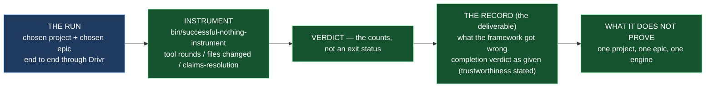

# Epic E47.3 — The Proof Run and Its Record

## Context

**Did it run — and can we show it did work?**

E47.3 is the milestone's point and the reason the other two epics exist. It needs E47.1 (a dispatch
route exists) and E47.2 (a ready project with a named, real epic). **The chat supervising this run
is manual. The run itself is the agentic thing being proven — that is the whole point — and the
milestone spec is explicit: do not let the proof's subject blur into the proof's supervision.**

The milestone spec's findings are carried here **as inputs, not re-derived**:

- **Z4 — the acceptance instrument exists and is tested. Nothing to build.** `bin/successful-nothing-instrument`
  and `tests/test_successful_nothing_instrument.py` (delivered by E41.2, +20 tests). It was
  validated in both directions — three recorded failures flagged, two negative controls passed —
  and then caught a live successful-nothing on the incumbent. **A replay set can be fitted to its
  own cases; a live catch cannot.** It is M47's acceptance criterion, not advice.

- **The three recorded false-successes** that the instrument's existence answers: **E33.2 Run A**
  (exit 0, 0 tool rounds, nothing produced), **E39.3** (`VERDICT: PASS`, zero rounds, citing a key
  the file does not contain), and **E41.2's DEV RUN 2** (exit 0, 4.2s, stub byte-identical, six
  tools genuinely advertised). **"It ran and we can show it worked" come apart, and in this project
  they usually have.**

**Planning-time re-measure (2026-09-04, this chat):** `bin/successful-nothing-instrument` and
`tests/test_successful_nothing_instrument.py` are present and tracked. **M45 and M42 are closed**
— so the completion signal's trustworthiness is real (M45), and the "undetermined" rendering (M46)
is available. The milestone spec's E47.3 detail notes: *"M45 makes that signal trustworthy; if M45
has not closed, record what the signal said and that it is not yet trustworthy."* **M45 has closed**
(M45 spec `status: completed` in `phase/P12`).

## Problem Statement

**The claim is not "a real epic ran agentically end to end." It is "a real epic ran agentically
end to end — AND WE CAN SHOW IT DID WORK." Those come apart, and in this project they usually
have.**

The proof run must therefore be checked by an instrument that is **not** the run's own report, and
the record must say **what the framework got wrong** — not merely that a process exited. A run that
surfaces a real defect is the stronger result, and this epic is scoped to say so **in advance**.

## Goals

By the end of this Epic, the record must:

1. **Record the run, end to end through Drivr** — dispatched, executed, completion-judged, gated,
   escalated if it blocked, handed back to its parent, merged by its parent. The chosen project's
   chosen epic, done agentically.
2. **Carry the instrument's verdict** — tool rounds, files changed, claims-resolution. **Not an
   exit status.**
3. **Record what the framework got wrong** — the framework's own failures during the run, committed.
4. **Record the completion judgment's verdict as given** — including `undetermined`. M45 is closed,
   so the signal is trustworthy; still record the verdict *as given*, not a human-substituted
   judgment.
5. **State what the run does NOT prove** — one project, one epic, one engine. The claim is exactly
   as large as the evidence.

## Non-Goals

This Epic explicitly does **not** aim to:

- **Establish the dispatch route** (E47.1) or **select the project** (E47.2) — it consumes both.
- **Prove that the framework is generally reliable.** One project, one epic, one engine. The proof
  is a single run, and the claim is bounded to it.
- **Fix defects it finds.** A surfaced defect is recorded as found; fixing it is a follow-on, not
  this epic's deliverable (the record is).
- **Substitute a human judgment for the completion signal.** The signal's verdict is recorded as
  given; if the record also carries an interpretation, it is separate from the verdict.

## Scope of Work

### 1. The run, end to end through Drivr (D1)

**The chosen project's chosen epic, dispatched and carried agentically.** Dispatched, executed,
completion-judged, gated, escalated if it blocks, handed back to its parent, merged by its parent.

**Must include:**
- The project, the epic, and the engine, named.
- The route (E47.1's chosen route) and the readiness result (E47.2's check) restated as the run's
  context.

### 2. The instrument's verdict (D2)

**`bin/successful-nothing-instrument` checked the run**, per HQ's acceptance criterion. **Tool
rounds, files changed, claims-resolution — in the record.** **No exit status stands in for them.**

### 3. The run record, including what the framework got wrong (D3)

**The record is the deliverable.** It includes the framework's own failures during the run,
committed — and it is scoped **in advance** to say that a run surfacing a real defect is the
stronger result.

### 4. The completion judgment's verdict, recorded as given (D4)

**The verdict as given, including `undetermined`.** M45 closed makes the signal trustworthy; the
record states *what the signal said*, not a human-substituted judgment — and states the signal's
trustworthiness (M45's status) so a reader knows whether to weight it.

### 5. A statement of what the run does NOT prove (D5)

**One project, one epic, one engine.** The claim is exactly as large as the evidence, and the
record says so.

## Deliverables

- [ ] **D1** — The run, end to end through Drivr, in the named project and epic
- [ ] **D2** — The instrument's verdict — tool rounds, files changed, claims-resolution — not an exit status
- [ ] **D3** — The run record, including what the framework got wrong, scoped in advance to say a real defect is the stronger result
- [ ] **D4** — The completion judgment's verdict recorded as given, with the signal's trustworthiness stated
- [ ] **D5** — A statement of what the run does not prove
- [ ] **Epic Delivery Notice**

## Binding Constraints

Settled above this epic — **not re-decidable here** (M47 milestone spec §Binding Constraints):

1. **M42 is a hard prerequisite.** **M42 has closed.** This epic may proceed (and its dispatch may
   run, since the block was on agentic dispatch before M42 closed).
2. **The proof run is checked by `bin/successful-nothing-instrument`** — tool rounds, files
   changed, claims-resolution. **Never an exit status.**
3. **The claim is *"and we can show it did work."*** Not *"it ran."*
4. **Project selection is the CFO's** — already obtained and recorded by E47.2.
5. **The run record is the deliverable, including what the framework got wrong.** A clean run that
   surfaced nothing is weaker than one that surfaced a real defect.

## Hard Constraint (binding — carried to every Epic)

> **M47 is the one milestone that can pass by accident.**

1. **Never accept the lane's own report of itself.** The instrument checks the run; the run's own
   "I did it" is not the evidence.
2. **Zero credentials is `UNDETERMINED`, never *unreachable*** — and record the effective
   credential path per dispatch.
3. **Inherit the substrate; do not rebuild it.**
4. **State the repository.** This epic spans this repo, Drivr, and the selected project. *"Suite
   green"* covers one.
5. **A run that surfaces a real defect is a SUCCESS.** The deliverable is the record, not a green
   tick.

## Design Decisions Delegated — decide, document, proceed

1. **What the run record must contain beyond the instrument's counts** — the milestone spec fixes
   "tool rounds, files changed, claims-resolution" as required; anything further (the command
   history, the completion signal's raw output, the merge trace) is yours to decide and record.
2. **The record's form and location** — following the precedent of prior run records under
   `.ai-project/artifacts/agentic-runs/`, with the milestone's "state the layer, repository, ref,
   date" discipline.
3. **How tool rounds, files changed and claims-resolution are presented** — the instrument produces
   its counts; the record carries them faithfully.

**Escalate instead of deciding:** anything that would substitute a human judgment for the
completion signal silently; a run that needs dispatch machinery beyond what E47.1 established; and
a route whose inherited defect manufactures a false success (Z5) — that must be surfaced, not
absorbed.

## Definition of Done

Epic E47.3 is complete when:

- [ ] A real epic ran end to end agentically through Drivr, in a named project
- [ ] **The instrument checked it and its counts are in the record** — tool rounds, files changed, claims-resolution
- [ ] The framework's own failures during the run are committed
- [ ] The completion signal's verdict is recorded as given, with its trustworthiness stated
- [ ] The limits of the claim are stated
- [ ] Every claim states its layer, repository, ref and date (`P11-GH-2`)
- [ ] Delivery Notice committed; PR opened from the epic branch to `milestone/M47`

## Acceptance Criteria

- [ ] A real epic ran end to end agentically through Drivr, in a named project
- [ ] **The instrument checked it and its counts are in the record**
- [ ] The framework's own failures during the run are committed
- [ ] The completion signal's verdict is recorded as given, with its trustworthiness stated
- [ ] The limits of the claim are stated

## Technical Constraints

**Repository:** the run record and the Delivery Notice land in `ai-project-system` (under
`.ai-project/artifacts/agentic-runs/`, following the E33.2/E33.4 precedent). The run itself
executes through **Drivr** against the **selected project** — both outside this repository and
outside this repository's suite. *"Suite green here"* is not the run's verification.

**Invocation:** `PYTHONPATH=. pytest -q` in `ai-project-system` for record/spec edits;
`bin/successful-nothing-instrument` is the checker, invoked on the run record per its own interface.

## Dependencies

**Internal**
- **M42 (gate, satisfied)** — closed; the block on agentic dispatch is cleared.
- **M45 (satisfied)** — closed; the completion signal is trustworthy, and the record states so.
- **E47.1** — the dispatch route (which route, which inherited defects).
- **E47.2** — the chosen project, the named real epic, the readiness check's result.

**External**
- **Drivr** — the dispatch path.
- **The selected project** — the run's subject.

**Blockers**
- None at planning, given E47.1 and E47.2 complete. If Z1 escalated (new machinery required) or
  E47.2 escalated (no ready project), this epic is blocked and records the escalated state rather
  than running.

## Timeline

**Estimated Effort:** 1 session — the run plus the instrument check plus the record.
**Target Completion:** last — **after** E47.1 and E47.2. It is the phase's last substantive work.
**Actual Completion:** In progress.

## Execution Notes

**Order:**
1. Restate the run's context: the chosen project/epic (E47.2), the route and its inherited defects
   (E47.1).
2. Dispatch and carry the epic end to end through Drivr.
3. Run `bin/successful-nothing-instrument` against the run; put its counts in the record.
4. Record what the framework got wrong — including the completion signal's verdict **as given**.
5. State what the run does not prove.

**Traps this project has already paid for:**

- **The run's own report as evidence.** E39.3 printed `VERDICT: PASS` with zero rounds and a key
  the file did not contain. The instrument exists because the run's own report is not trustworthy.
- **An exit status standing in for the counts.** E33.2 Run A exited 0 having done nothing. The
  record carries tool rounds, files changed and claims-resolution — never an exit status.
- **Interpreting `undetermined` instead of recording it.** The completion signal's verdict is
  recorded *as given*; a human-substituted judgment is a different claim, and if present it is
  kept separate and labelled.
- **Overclaiming from one run.** One project, one epic, one engine proves exactly that. The record
  says so.

## Related Documents

- [M47 Milestone Spec](P12-M47__milestone-spec.md) — E47.3 Epic Detail, finding Z4, Binding
  Constraints, Hard Constraint
- [M47 Milestone Execution Chat Starter](P12-M47__milestone-execution-chat-starter.md)
- [P12 Phase Spec](P12__phase-spec.md) — §P12.7 (M47)
- `bin/successful-nothing-instrument` + `tests/test_successful_nothing_instrument.py` — the acceptance instrument (Z4)
- `.ai-project/artifacts/agentic-runs/` — the run-record precedent (E33.2, E33.4)
- [PROJECT-SYSTEM-GUIDELINES.md](../../../governance/PROJECT-SYSTEM-GUIDELINES.md)
- [AI-OPERATING-GUIDELINES.md](../../../governance/AI-OPERATING-GUIDELINES.md)

## Visual Bindings

**Visual binding**
- **Link:** (inline — Structural diagram; no hosted link needed per AOG §17.3/§17.5)
- **What:** diagram
- **Level:** Epic
- **State:** proposed

- **Description:** E47.3 is the proof run — the chosen project's chosen epic carried end to end
  through Drivr — checked by `bin/successful-nothing-instrument` (tool rounds, files changed,
  claims-resolution, never an exit status), with the run record as the deliverable, including what
  the framework got wrong and the completion signal's verdict recorded as given. The record states
  what the run does not prove: one project, one epic, one engine. Proposed-track Structural
  diagram (AOG §17.3/§17.6), Mermaid.

## Notes

- **The record is the deliverable, not the green tick.** Every other epic in P12 exists to make *"it
  ran and we can show it worked"* not come apart. This epic is the one that either holds the claim
  or records why it fell short — and a run that surfaced a real defect is a success, because the
  record is what M47 owes the phase.

- **The supervision is manual; the run is the subject.** The milestone spec's own warning: *"Do not
  let the proof's subject blur into the proof's supervision."* The chat that oversees this run is
  manual; the run is the thing being proven agentic.

## Changelog

| Version | Date | Change |
|---|---|---|
| 1.0.0 | 2026-09-04 | Initial E47.3 spec, from the M47 milestone spec v1.0.0 (E47.3 Epic Detail, finding Z4, Binding Constraints, Hard Constraint). **Re-measured at planning (G2): `bin/successful-nothing-instrument` + its test present and tracked; M45 CLOSED** so the completion signal's trustworthiness is real (the milestone spec's "if M45 has not closed" branch is discharged). Scopes the run end-to-end through Drivr (chosen project/epic from E47.2, route from E47.1), the instrument's verdict (tool rounds, files changed, claims-resolution, never an exit status), the run record including what the framework got wrong, the completion verdict recorded as given, and a statement of what the run does not prove. Delegates the record's form/location and extra contents. No scope, ordering, gate or acceptance-criterion change from the milestone spec. |
