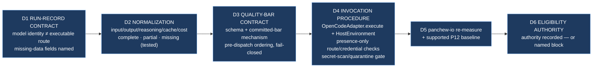

# Epic E48.1 — Operational Evidence and Run Gate

## Context

**Static validation is not operational proof.** A validator returning zero errors says a file
parses; it says nothing about whether a dispatch happens, whether work was done, or what it cost.
M48 exists to run the path, and E48.1 is the reason the runs E48.4 and E48.5 will have anything
trustworthy to show for themselves.

P12 ran exactly one real Epic end to end (`P1-M1-E1.1` on `panchew-io`), and the record that
proved it mattered because it normalized raw OpenCode events rather than trusting the executor's
prose. E48.1 turns that one-off record into a **common, committed, tested pre-run contract** that
every M48 attempt — and later P13 milestones — can reuse, and commits it **before any project
result is visible**, so no quality bar can be written after seeing the outcome.

The M48 milestone spec's planning-time findings are carried here **as inputs, not re-derived**:

- **Finding 1 — model identity is not an executable route.** The fleet projects declare
  `remote:deepseek-v4-flash`; Drivr passes the model string straight through to OpenCode, while the
  catalog exposes both `opencode/` and `opencode-go/` routes. Every record must distinguish the
  **declared model identity** from the **executable provider route actually chosen** for an attempt.
- **Finding 2 — credential lookup depends on the launch environment.** Drivr supplies a temporary
  `XDG_CONFIG_HOME` but inherits `XDG_DATA_HOME`; a confined value can hide the normal host
  credential store. Readiness records **presence and the effective path category only**; credential
  values never enter logs, artifacts, commands, or chat.
- **Finding 9 — P12's raw OpenCode events expose usage per step, not as a run summary.** Available
  fields per event include `input`, `output`, `reasoning`, `cache.read`, `cache.write`, and reported
  `cost` (measured at P12 `P12-M47-E47.3/dispatch-record-gemini.json`). Normalization must not
  double-count provider totals.
- **Finding 10 — `panchew-io` is verification evidence, not a third new run.** Its P12 proof is the
  first fleet run. E48.1 verifies that its committed seven-key `models:` block remains present and
  extracts only the P12 baseline fields its raw evidence supports.

**Re-measured at planning (2026-09-08, this chat):** `panchew-io` at `0b520aa` still carries the
seven-key `models:` block (`creation`/`hq`/`phase`/`milestone`/`epic_dev`/`epic_qa`/`epic_manual`,
all `remote:`). `footboard` (`d0c4c2a`) and `home_finance` (`fbfc4b1`) are both `state: benched`,
`state_basis: proposed` in `.ai-project/registry/fleet-registry.yml` — **eligibility requires
explicit human authority; this Epic records whatever authority is supplied and grants none.**

## Problem Statement

M48 is going to run real agentic Epics on two benched projects and fold the result into a
cost-and-quality baseline against `panchew-io`'s P12 run. Without a **committed contract and
quality bar defined before any run**, the traditional failure modes return: an exit status standing
in for work evidence; "cost" being read off the executor's summary paragraph; missing telemetry
being silently zero-filled; and a quality bar that gets designed after the result is in hand.

E48.1 closes that by producing — before dispatch — a versioned run-record contract, a tested
normalization path, a task-specific quality bar per selected Epic, an adapter-level invocation
procedure, and the explicit eligibility record each benched target requires.

## Goals

By the end of this Epic, the system must:

1. Provide a **versioned run-record contract** covering every attempt, whose fields capture task/
   project/level, repository and branch/ref, Drivr ref, declared model identity, executable
   provider route, launch-environment category, credential presence (no values), timestamps/elapsed
   time, raw event source, completion judgment, work-evidence counts, review result, defects,
   rework, intervention, and missing-data fields.
2. Provide a **tested normalization path** over raw OpenCode events producing raw counts and
   economic evidence separately, with `uncached input`, `cache creation/write`, `cache reads`,
   `output`, `reasoning`, and provider-reported cost — without summing overlapping provider totals
   twice.
3. Record a **committed, task-specific quality bar for each selected project Epic before dispatch**.
4. Provide a **reproducible adapter-level invocation procedure** using Drivr's
   `OpenCodeAdapter.execute`, plus presence-only route and credential checks — not a raw CLI
   substitute.
5. Re-measure **`panchew-io` model persistence** and extract the **supported P12 baseline fields**
   under the new contract; missing P12 fields stay missing.
6. Record **explicit fleet-eligibility authority for each benched target, or a named block** where
   that authority is absent. This Epic grants nothing.

## Non-Goals

This Epic explicitly does **not** aim to:

- **Grant fleet eligibility** to `footboard` or `home_finance`. It records authority; it never
  infers it from disk presence or from this spec.
- **Select or dispatch a real Epic.** That is E48.4/E48.5's work, under each project's own
  hierarchy. E48.1 builds the contract and bar they will consume.
- **Change Drivr code.** M48 authorizes no Drivr implementation; if a required run needs new
  machinery, E48.1's invocation work must surface that as a named blocker and escalation rather
  than absorb it.
- **Create M53's general model-selection mechanism.** Per-attempt route recording only.
- **Read credential values.** Presence and effective path category are the maximum permitted
  credential evidence.
- **Invent missing telemetry.** Absent data is recorded `unavailable`, never estimated or zero
  filled.

## Scope of Work

### 1. The normalized run-record contract (D1)

Define a versioned record schema — a documented field list plus a reference template — that every
M48 attempt (and the `panchew-io` baseline re-record) must satisfy.

**Must include:**
- Identity: task/project/level, repository, branch/ref, Drivr commit, date, attempt index.
- Model and route as **distinct** fields: `model_identity` (the declared `remote:deepseek-v4-flash`
  value) vs `executable_route` (the `opencode/` vs `opencode-go/` catalog route actually used).
- Launch-environment category and effective credential path category (host `XDG_CONFIG_HOME`/
  `XDG_DATA_HOME`, or confined override), with credential **presence only**.
- Timestamps and elapsed time.
- Raw event source reference (the retained OpenCode transcript/dispatch record).
- Completion judgment vs work-evidence counts kept separate; review result, defects count, rework,
  and human intervention as distinct fields.
- `missing_data` fields, each naming its reason; nothing zero-filled.

### 2. The tested normalization path (D2)

Implement and test a normalization routine over raw OpenCode structured events.

**Must include:**
- Per-step extraction of `input`, `output`, `reasoning`, `cache.read`, `cache.write`, and reported
  `cost` from the raw event shape measured in `P12-M47-E47.3/dispatch-record-gemini.json` (a
  matching `step_finish` part may carry `snapshot` to let every normalized figure be re-derived).
- Tests against **complete**, **partial**, and **missing** telemetry fixtures.
- An explicit rule that provider-reported totals are **never summed twice** where a step's total and
  its components overlap; raw counts and economic evidence reported separately.

### 3. Task-specific quality bars — concrete, with thresholds committed now (D3)

Commit the **quality-bar contract with its concrete pass bars now**, not a schema-only stub. The
bar is designed before the result is seen, never after.

**The bar schema (fixed), field-for-field:**

| Field | Meaning |
|---|---|
| `bar_id` | e.g. `E48.4-footboard` / `E48.5-home_finance` |
| `task_identity` | project, selected Epic id, selected spec + Starter ref (each by path and branch) |
| `instrument` | `bin/successful-nothing-instrument` — the reusable acceptance measure, by name and interface |
| `floor` | the ruled per-lane pass floor (below) |
| `review_fields` | review result; defects count; rework count; human-intervention list |
| `missing_fields` | each `unavailable` field with a reason |

**The concrete pass floor (every real M48 run is an `epic_dev`-lane dispatch):**

- `epic_dev` run: **tool rounds > 0 AND distinct files changed > 0**, judged by
  `bin/successful-nothing-instrument` (C-A rounds, C-B files, C-C claims). An exit code is never a
  signal; it is recorded, never scored.
- live qualification (E48.2's split): reported **separately**, never folded into the bar's pass/fail.

**Commit mechanism and enforcement (concrete):**

- The instantiated bar is a committed `quality-bar.yml` at a fixed path under each E48.4/E48.5
  record (`.ai-project/artifacts/agentic-runs/P13-M48-<E>/quality-bar.yml`), referenced by the run
  record D1 schema. The bar commit **precedes** the dispatch commit, verified by commit ordering;
  a run record whose bar commit is not an ancestor of the dispatch commit is **fail-closed**.
- The bar is the re-usable M41 instrument applied to a named task, **not** a re-derivation: the
  instrument and its floors are committed in `P12-M41-E41.2__check-list-and-floor.md` and are cited,
  not restated.

E48.1 does **not** select a project Epic — that is E48.4/E48.5's own hierarchy. What E48.1 commits
here is the **bar schema, the concrete floor, and the enforcement rule**, so the moment a project
Epic is selected, its bar is a fill-in of an already-fixed contract with thresholds already set —
not a new design.

### 4. Adapter-level invocation procedure (D4)

Document the invocation path **and exercise it** to the limit that a no-real-work probe permits —
a labeled transport smoke on `OpenCodeAdapter.execute`, never standing in for the real run (which
is E48.4/E48.5's).

**Must include:**
- `OpenCodeAdapter.execute(ExecutionRequest(...))` with `HostEnvironment` and an explicit route; the
  proven path, not a raw `opencode run`.
- A presence-only route check and a presence-only credential-store check as separate pre-dispatch
  steps, emitting no values.
- **An exercised adapter invocation** — a labeled probe (a trivial, non-delivery execution request)
  that exercises `OpenCodeAdapter.execute` and records its result. The probe is transport proof
  only; it is labeled as such and is explicitly not work evidence. Where the environment cannot
  support even a labeled probe (no route, no credential store), the exercise records that as a
  named blocker for escalation, not as a silent substitute.
- Raw-event retention instructions (transcript + dispatch record kept verbatim), **gated by a
  fail-closed secret scan** before any raw artifact is committed — see §Secret-scan gate (D4a),
  which is a separate, executable deliverable with a named interface, pattern set, quarantine
  location, error behavior, and safe reference format.

### 5. Secret-scan gate (D4a) — an executable detector, not a described intention

The secret-scan gate is a **committed, runnable check** with a named interface; it is not a
description of a future behavior.

**Must include (each concretely specified and tested):**

- **Interface.** A named command, `bin/retain-raw-events <input.json>` (or equivalent committed
  script), that reads a retained raw event set and returns a structured result
  (`{"scan": "clean"|"quarantined", "matches": [...]}`) and a non-zero exit on `quarantined`. The
  interface is committed and cited, not described.
- **Pattern set.** A committed detector with two tiers: (1) high-signal literal patterns (the token
  shapes in use across the fleet — e.g. `sk-…`, `ghp_…`, `-----BEGIN … PRIVATE KEY-----`), and (2) a
  context tier that flags long high-entropy strings in the `cost`/`reason`/message-bearing fields of
  raw events. Tiers and patterns are listed in the committed check doc, not prose here.
- **Quarantine location.** A fixed path, `.ai-project/artifacts/agentic-runs/<run>/quarantine/`,
  where a quarantined raw artifact is moved (not deleted) and replaced at the record by a
  `quarantine-notice.json` reference.
- **Safe reference format.** The record cites a quarantined source **by reference only** —
  `{"source": "quarantine/<file>", "redacted": true, "regions": [<offsets>]}` — with the matched
  regions redacted; the secret-bearing content is **never** embedded in any committed artifact, not
  even in the notice.
- **Error behavior.** Fail-closed: if the scanner itself cannot run (missing, crashes), retention
  **stops** rather than proceeding to commit the un-scanned artifact; the record marks `scan:
  unavailable` as a fail-closed gap.

### 6. `panchew-io` re-measure and baseline extraction (D5)

Verify the seven-key `models:` block is still committed at `panchew-io` HEAD, and re-express the P12
run under the new contract using only fields its raw evidence supports; missing P12 fields remain
missing.

### 7. Eligibility authority record (D6)

Record, for `footboard` and `home_finance`, the explicit benched-to-eligible authority that was or
was not supplied, or a named block. No transition is inferred or granted here.

## Deliverables

This Epic must produce:

- [ ] **D1** — The versioned run-record contract (field list + reference template), committed
- [ ] **D2** — The normalization path, tested against complete/partial/missing telemetry, committed
- [ ] **D3** — The quality-bar contract: bar schema + the concrete `epic_dev` pass floor (rounds>0
      AND files>0) + committed-bar mechanism + pre-dispatch ordering + fail-closed, committed
- [ ] **D4** — The adapter-level invocation procedure with presence-only route/credential checks and
      an exercised labeled probe of `OpenCodeAdapter.execute`
- [ ] **D4a** — The executable secret-scan gate (`bin/retain-raw-events`), with named interface,
      committed pattern set, quarantine location, safe-reference format, and fail-closed error
      behavior, tested
- [ ] **D5** — `panchew-io` model re-measure + supported P12 baseline extraction
- [ ] **D6** — The per-target eligibility authority record (authority or named block)
- [ ] **Epic Delivery Notice**

## Binding Constraints

Settled above this epic — **not re-decidable here** (M48 milestone spec §Binding Constraints):

1. **Static validation is not operational proof.** This Epic's contract exists to run the path.
2. **`remote:deepseek-v4-flash` is a model identity, not the route.** Record both, separately.
3. **Credential diagnostics are presence-only.** Never load or print credential values.
4. **Eligibility requires explicit authority.** Neither this Starter nor enrollment grants it.
5. **The proven path invokes `OpenCodeAdapter.execute`**; raw `opencode run` alone is not proof.
6. **M48 authorizes no Drivr implementation.** New machinery is a named blocker and escalation.
7. **Usage pairs with independently reviewed quality.** Missing telemetry is `unavailable`, never
   estimated or zero-filled.

## Definition of Done

Epic E48.1 is complete when:

- [ ] The run-record contract and quality-bar contract are committed, the contract distinguishes
      model identity from executable route in every field set, and the **concrete `epic_dev` floor
      (rounds > 0 AND files changed > 0)** is committed with them
- [ ] Normalization is tested against representative complete, partial, and missing telemetry
- [ ] No provider total is double-counted; raw counts and economic evidence are reported separately
- [ ] The invocation procedure references `OpenCodeAdapter.execute` with `HostEnvironment` and an
      explicit route, includes presence-only route and credential checks emitting no values, and is
      **exercised via a labeled probe** (or records a named blocker where the environment cannot
      support even a probe)
- [ ] The **executable** secret-scan gate (`bin/retain-raw-events`) is committed and tested: named
      interface, committed pattern set, quarantine location, safe-reference format, and fail-closed
      error behavior; any match quarantines and redacts rather than committing verbatim, and a missed
      scan is a fail-closed gap
- [ ] `panchew-io`'s seven-key `models:` block is independently verified present at its committed
      HEAD, and only supported P12 baseline fields are extracted
- [ ] Each benched target has explicit human transition authority recorded, or remains blocked with
      that missing authority named
- [ ] Every claim states repository, ref, date, and verification command (`P11-GH-2`)
- [ ] Delivery Notice committed; PR opened from `epic/E48.1` to `milestone/M48`

## Acceptance Criteria

- [ ] The contract and the concrete quality bar (the `epic_dev` floor: rounds > 0 AND files changed
      > 0) are committed before either real project dispatch
- [ ] Normalization is tested against representative complete, partial, and missing telemetry
- [ ] Route identity and model identity are distinct in every record
- [ ] Credential diagnostics prove presence only and emit no values
- [ ] The invocation exercises `OpenCodeAdapter.execute` via a labeled probe (transport proof, not
      work evidence)
- [ ] The secret-scan gate is a runnable command — not a description — and a missed scan fails closed
- [ ] `panchew-io` model persistence and available P12 baseline are independently verified
- [ ] Each benched target has explicit human transition authority recorded, or remains blocked with
      that missing authority named

## Technical Constraints

**Repository:** all E48.1 artifacts (contract, normalization code and tests, quality-bar contract,
invocation procedure, secret-scan gate, re-measure record, eligibility record) and the Delivery
Notice land in `ai-project-system` on `epic/E48.1`. The only cross-repository reads are `panchew-io`
(model block, ref only), Drivr (`OpenCodeAdapter` source, ref only), and the two benched projects'
registry state — **no write to any other repository**.

**Invocation:** `PYTHONPATH=. pytest -q` in `ai-project-system` for the normalization tests. No
credential value, token, or secret-bearing environment value is read into any committed artifact.

## Dependencies

**Internal**
- **E47.3 (P12, closed)** — the proof-run precedent whose raw event shape (Finding 9) this contract
  normalizes.
- **M48 spec** — Binding Constraints and Findings 1/2/9/10.

**External**
- **Drivr** — `OpenCodeAdapter` (`drivr/execution/opencode.py`), read-only; no code change.
- **`panchew-io`** — read-only verification of the `models:` block and P12 baseline fields.

**Blockers**
- None at planning. If eligibility authority is not supplied, D6 records the named block — this
  blocks E48.4/E48.5, not E48.1.

## Timeline

**Estimated Effort:** 1–2 sessions (contract + normalization + tests + procedure + re-measures).
**Target Completion:** first — E48.1 gates the evidence/quality contract E48.4/E48.5 consume.
**Actual Completion:** In progress.

## Execution Notes

**Order:**
1. Re-measure at your execution point (G2): `panchew-io` HEAD and `models:` block; P12 raw event
   shape; the fleet registry's state for `footboard`/`home_finance`.
2. Write and commit the run-record contract and quality-bar contract first — before any run or bar.
3. Implement and test the normalization path against the three telemetry classes.
4. Document the adapter-level invocation procedure with the two presence-only checks.
5. Extract the supported `panchew-io` P12 baseline fields; leave missing fields missing.
6. Record eligibility authority or the named block.

**Traps already paid for by this project:**
- **Designing the bar after the result.** The bar is committed before dispatch (M48 Binding
  Constraint 4).
- **Reading credential values.** Presence and path category only — the maximum permitted evidence.
- **Double-counting provider totals.** A step total and its components overlap; never sum both.
- **Treating the model string as the route.** `remote:deepseek-v4-flash` names a model, not the
  `opencode/` vs `opencode-go/` catalog route.

## Related Documents

- [M48 Milestone Spec](P13-M48__milestone-spec.md) — Findings 1/2/9/10, Binding Constraints, E48.1
  Epic Detail
- [M48 Milestone Execution Chat Starter](P13-M48__milestone-execution-chat-starter.md)
- [P13 Phase Spec](P13__phase-spec.md) — §Milestones (M48)
- [E47.3 Spec (P12)](../P12__Completion_Fail_Closed_Defaults_and_the_Drivr_MVP/P12-M47-E47.3__spec__proof-run-and-its-record.md)
- `.ai-project/registry/fleet-registry.yml` — benched states for `footboard`/`home_finance`
- `.ai-project/artifacts/agentic-runs/P12-M47-E47.3/dispatch-record-gemini.json` — raw event shape
- `bin/ai-project-validate` — the validator used for credential-adjacent §4 checks
- [PROJECT-SYSTEM-GUIDELINES.md](../../../governance/PROJECT-SYSTEM-GUIDELINES.md)
- [AI-OPERATING-GUIDELINES.md](../../../governance/AI-OPERATING-GUIDELINES.md)

## Notes

- **The contract is the deliverable, not the runs.** E48.1 makes M48's run records checkable; the
  runs themselves are E48.4/E48.5.
- **Eligibility is a hard boundary.** Neither this spec nor the Epic Starter nor enrollment moves a
  benched project to eligible; only explicit human authority recorded in D6 does, and that authority
  is E48.4/E48.5's prerequisite, not this Epic's to supply.

## Visual Bindings

**Visual binding**
- **Link:** (inline — Structural diagram; no hosted link needed per AOG §17.3/§17.5)
- **What:** diagram
- **Level:** Epic
- **State:** proposed

- **Description:** E48.1 commits the common pre-run contract before any project result is visible —
  a run-record contract (model identity recorded separately from executable route), a tested
  normalization path over raw OpenCode events, a fully-specified quality-bar contract instantiated
  (not redesigned) by E48.4/E48.5, an adapter-level invocation procedure with presence-only
  route/credential checks and a fail-closed secret-scan/quarantine gate on raw retention, the
  `panchew-io` baseline re-measure, and the per-target eligibility authority record. Proposed-track
  Structural diagram (AOG §17.3/§17.5), Mermaid.

## Changelog

| Version | Date | Change |
|---|---|---|
| 1.2.0 | 2026-09-08 | **Rework attempt 2 of 3 — responding to P13 Phase Chat review (6 findings).** (1) D3 now commits **concrete bars/thresholds**, not a schema-only contract: the reusable `bin/successful-nothing-instrument` as the named instrument, and the ruled `epic_dev` pass floor **rounds > 0 AND files changed > 0** committed here (cited from `P12-M41-E41.2__check-list-and-floor.md`, not restated), plus the fixed bar schema and commit-ordering enforcement. (2) Secret handling is now an **executable deliverable (D4a)**: `bin/retain-raw-events` with a named result interface, a two-tier committed pattern set, a fixed quarantine path, a safe by-reference redacted-citation format, and fail-closed error behavior. (4) The adapter invocation is now **exercised via a labeled probe** (transport proof, not work evidence) with a named-blocker recording where even a probe is impossible — reconciling the acceptance criterion with scope. (6) Front-matter `spec_version` corrected to 1.2.0. |
| 1.1.0 | 2026-09-08 | **Rework 1 of 3 — responding to P13 Phase Chat review (10 findings).** (1) D3 replaced the placeholder quality-bar rule with a **fully-specified quality-bar contract**: fixed bar schema (task identity, acceptance instrument, per-lane floor, review fields, missing-data fields), a concrete committed-bar mechanism (a fixed-path `quality-bar` entry referenced by the run record, not prose-in-a-commit-message), the pre-dispatch ordering rule, and a fail-closed rule that a run record lacking a committed bar cannot be delivery-ready. (2) D4/D2 add a **fail-closed secret-scan/quarantine gate** on raw-event retention — every retained raw event set is scanned before commit, any match quarantines and redacts rather than committing verbatim, and a missed scan is fail-closed (mirrors M49's boundary in pre-M49 minimal form). (7) Branch corrected to `epic/E48.1`. (9) Added proposed Structural visual binding. Findings 6 (separate deterministic/live commands) belongs to E48.2; finding 8 carries to the Starter. |
| 1.0.0 | 2026-09-08 | Initial E48.1 spec, from the M48 milestone spec v1.0.0 (Findings 1/2/9/10, Binding Constraints, E48.1 Epic Detail). **Re-measured at planning (G2):** `panchew-io` `0b520aa` carries the seven-key `models:` block; `footboard` `d0c4c2a` and `home_finance` `fbfc4b1` are `benched`/`proposed` in the fleet registry; the P12 raw event shape (`dispatch-record-gemini.json`) exposes per-step `input`/`output`/`reasoning`/`cache.read`/`cache.write`/`cost`. Scopes the run-record contract, tested normalization path, quality-bar contract, adapter-level invocation procedure with presence-only checks, `panchew-io` baseline extraction, and the per-target eligibility authority record. No scope, ordering, gate, or acceptance-criterion change from the milestone spec. |
