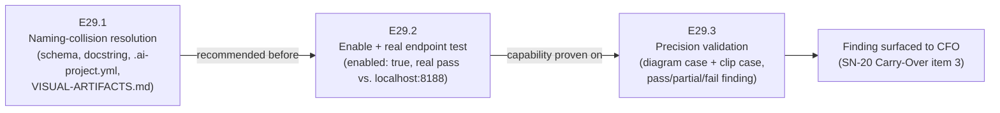

# Milestone M29 — Visual Artifacts Activation

## Purpose

Make `visual_artifacts` real in this repository. P5–P7 built the framework, flipped it
default-on framework-wide (M27), and verified the generative endpoint against three workflows
(P6) — but this source repo has never run its own capability; it still carries
`visual_artifacts.enabled: false` because of a naming collision between the `.ai-project.yml`
schema's `types: diagrams` value and AOG §16.3's endpoint-free Structural mode. M29 resolves
that collision, flips the switch, replaces the one remaining skip in the suite with a real pass
against the live local ComfyUI endpoint, and answers the precision question P6/P7 left open:
whether the verified workflows are good enough for technical explanation, not merely "renders
successfully."

**M29 is the sole milestone in P8** (`is_final: true`). On its consolidation, the Phase Chat
proceeds directly to phase delivery (`phase/P8 → master`) via the PSG §5C canonical closure
sequence — there is no further milestone to plan.

---

## Binding Context (settled scope — NOT for re-debate)

Per the P8 phase spec (v1.0.0) and SN-20 (Creation Chat, 2026-07-14), five ratified decisions
apply in full and are not open for re-examination in this Milestone or any Epic under it:

1. **P8 spine.** Make `visual_artifacts` real: enable it, fix the naming collision, generate for
   real against the P6 local endpoint.
2. **Local-agentic execution deferred.** Issue #126 (`epic_dev` upgrade, agentic-mode testing) is
   explicitly out of P8. `.ai-project.yml`'s `models.epic_dev`/`epic_qa` mapping stays untouched.
3. **Visual form is agent-chosen; precision is unconfirmed.** Structural vs. Generative selection
   happens contextually; whether the P6 workflows meet the technical-precision bar is an open
   question this milestone must answer, not assume.
4. **ComfyUI stays local for P8.** No cloud (Colab + ngrok) migration this milestone.
5. **No `.ai-project.yml` `governance.version` bump needed right now** — considered and retracted
   by the CFO.

The naming-collision **resolution direction** (E29.1) is the one open design decision this spec
does not pre-decide — it is scoped to the Milestone/Epic Chat, per the phase spec's own framing.

---

## Problem Statement

Three independent, verified gaps, each confirmed directly against current repository state:

- **The schema and its own documentation contradict the code.** `governance/ai-project-yml-spec.md`
  §3.5's field table states: `diagrams`: Mermaid/PlantUML structural. `bin/ai-project-visual`'s
  actual implementation has no code path where `--type diagrams` produces Structural output — it
  is unconditionally a ComfyUI generative call (txt2img workflow selection). AOG §16.3 defines
  Structural as "no ComfyUI needed" and Generative as "produced ... via the configured ComfyUI
  endpoint, using the `bin/ai-project-visual` helper" — by AOG's own definition, `diagrams` as
  implemented is Generative, not Structural, yet the schema table and this repo's own
  `.ai-project.yml` comment, `bin/ai-project-visual`'s docstring, and
  `.ai-project/artifacts/reference/comfyui-endpoint/VISUAL-ARTIFACTS.md`'s config example all
  continue to list `diagrams` as a plain `types` entry with no disambiguating note (VISUAL-
  ARTIFACTS.md's own prose *does* separate Structural/Generative correctly — only its config
  example still uses the colliding schema value). This is carry-forward **P7-GH-21**.
- **The capability has never run for real in this repo.** `.ai-project.yml:43-44` carries
  `visual_artifacts.enabled: false` with a comment explaining exactly why: enabling it un-skips
  `test_helper_generates_against_endpoint`, which then fails with connection-refused because no
  live endpoint was reachable at the time that comment was written (P7/M27). That premise has
  since changed — the endpoint is confirmed live and reachable as of P8 phase-open
  (`system_stats` responded; RTX 5060 Ti 16 GB; all six P6 models present) — but the repo config
  and the test's skip-when-disabled behavior have not been revisited since.
- **"Renders successfully" was never checked against "good enough to explain something technical."**
  P6 verified that FLUX-schnell, SDXL, and LTX-Video each produce valid output from
  `bin/ai-project-visual` against the live endpoint. No P5/P6/P7 milestone checked whether that
  output is precise enough for its intended governance use (per AOG §16.2, e.g. a Milestone
  component/flow diagram or a Creation-Chat concept image) — the phase and milestone specs both
  name this explicitly as an open question, not an assumption.

---

## Goals

By the end of this milestone:

1. **The naming collision is gone.** `governance/ai-project-yml-spec.md` §3.5, this repo's
   `.ai-project.yml` comment, `bin/ai-project-visual`'s docstring/help text, and
   `VISUAL-ARTIFACTS.md`'s config example all agree on what a `types` entry means, and none
   describes a ComfyUI-generative call as Structural output (E29.1).
2. **This repo dogfoods its own default-on flip.** `visual_artifacts.enabled: true` in this
   repo's `.ai-project.yml`, with the stale opt-out comment removed (E29.2).
3. **The suite is green with a real test, not a skip.** `test_helper_generates_against_endpoint`
   (or its renamed/replacement equivalent) passes for real against `http://localhost:8188` — not
   re-disabled, not re-skipped to get there (E29.2, hard constraint below).
4. **Precision is confirmed, not assumed.** A workflow-diagram-style case and a short
   explainer-clip case are produced and judged against the bar of "good enough for technical
   explanation," with the finding documented for the CFO (E29.3).

---

## Non-Goals

This milestone explicitly does **not**:

- Scope in issue #126, local-LLM agentic execution, or any `epic_dev`/`epic_qa` model change.
- Decide whether a separate governed ComfyUI-workflow project is needed (SN-20 Carry-Over 3) —
  E29.3 produces the evidence; it surfaces the finding to the CFO, it does not resolve the
  question.
- Migrate ComfyUI to cloud (Colab + ngrok) or otherwise change where the endpoint runs.
- Bump `.ai-project.yml`'s `governance.version` field.
- Build new ComfyUI workflows as a general effort — new workflow engineering is in scope only if
  E29.3's precision finding shows the existing three (FLUX-schnell, SDXL, LTX-Video) are
  insufficient, and only to the extent needed to complete that validation.
- Produce Epic specs or Epic Execution Chat Starters — that is the Milestone Chat's job
  (adjacency); this spec defines epic scope, deliverables, and acceptance criteria only.

---

## In Scope

- **E29.1** — `governance/ai-project-yml-spec.md` §3.5, `bin/ai-project-visual`'s
  docstring/help text, this repo's `.ai-project.yml` comment, and
  `.ai-project/artifacts/reference/comfyui-endpoint/VISUAL-ARTIFACTS.md`'s config example —
  reconciled to one naming scheme with no Structural/Generative collision.
- **E29.2** — `.ai-project.yml`'s `visual_artifacts.enabled` flag,
  `tests/integration/test_visual_artifacts_helper.py::test_helper_generates_against_endpoint`,
  and a decision on how a no-live-endpoint contributor/CI environment is handled.
- **E29.3** — one workflow-diagram-style generated case and one short explainer-clip case
  (LTX-Video), each judged against the technical-explanation precision bar and documented,
  hosted and linked per AOG §16.5 (never committed as binaries).

## Out of Scope

- Issue #126 / local-agentic execution; the spin-off software-factory project; the
  ComfyUI-as-a-governed-project decision (only its evidence, via E29.3); cloud ComfyUI migration;
  a `governance.version` bump; general new-workflow engineering beyond what E29.3's finding
  requires.

---

## Hard Constraint (binding — carries to every Epic under this Milestone)

**The suite MUST be green at milestone delivery with
`test_helper_generates_against_endpoint` (or its renamed/replacement equivalent) passing for
real against the live ComfyUI endpoint.** Re-disabling `visual_artifacts.enabled` or re-skipping
the test to keep the suite green is **not** an acceptable resolution under any epic. This
constraint governs E29.2 directly and constrains E29.1's naming-collision resolution (whichever
direction E29.1 takes, it must not reintroduce a reason to disable or skip).

---

## Planned Epics

### Confirmed Epics

- **E29.1 — Naming-collision resolution (P7-GH-21)**
- **E29.2 — Enable + real endpoint test**
- **E29.3 — Precision validation**

> **Artifact scope (adjacency).** This Phase Chat produces only this Milestone spec and the
> Milestone Execution Chat Starter. The **Milestone Chat** owns final epic planning and authors
> every Epic spec and Epic Execution Chat Starter. No Phase-level Epic drafts exist.

### Deferred Epics

- None. M29 is the only milestone in P8; there is no future milestone to defer work to within
  this phase.

---

## Epic Detail

### E29.1 — Naming-collision resolution (P7-GH-21)

**Source:** P7 phase closure carry-forward P7-GH-21; P8 phase spec P8.1.

**Grounding:** see Problem Statement above. `governance/ai-project-yml-spec.md` §3.5's `types`
field table states `diagrams`: Mermaid/PlantUML structural; `bin/ai-project-visual` has no code
path where `--type diagrams` yields Structural output — it is unconditionally a ComfyUI
generative call. The same wrong framing recurs in this repo's `.ai-project.yml` comment,
`bin/ai-project-visual`'s own docstring, and `VISUAL-ARTIFACTS.md`'s config example.

**This is a design decision for the Milestone/Epic Chat, not fixed by this spec.** Candidate
directions (non-exhaustive):
- Rename the schema's generative `diagrams` value to something that cannot be read as
  Structural (e.g., a name that signals "diagram-style generated image").
- Reframe `types` as generative-only categories, with documentation stating explicitly that
  Structural mode needs no `visual_artifacts` config at all, since it never calls
  `bin/ai-project-visual`.

Whichever direction is chosen, it MUST touch every surface named in Deliverables below — a
partial fix that leaves one surface still describing a generative call as Structural does not
close P7-GH-21.

**Deliverables:**
1. A single, coherent naming scheme for the `visual_artifacts.types` schema values that cannot
   be read as Structural mode.
2. `governance/ai-project-yml-spec.md` §3.5 updated: the field table no longer describes any
   `types` entry as "Mermaid/PlantUML structural."
3. `bin/ai-project-visual`'s docstring/help text updated to match.
4. This repo's `.ai-project.yml` `visual_artifacts` comment updated to match (independent of,
   but sequenced before, E29.2's flag flip).
5. `.ai-project/artifacts/reference/comfyui-endpoint/VISUAL-ARTIFACTS.md`'s config example
   updated to match (its prose already separates Structural/Generative correctly — only the
   config example needs the fix).
6. `governance/ai-project-yml-spec.md` version bump + changelog row (schema change).

**Definition of Done:**
- [ ] No governance document, docstring, or config example describes a ComfyUI-generative
      `types` value as Structural output
- [ ] All four named surfaces (yml-spec §3.5, `.ai-project.yml` comment,
      `bin/ai-project-visual` docstring, `VISUAL-ARTIFACTS.md`) agree with each other
- [ ] Full test suite passes

**Acceptance Criteria:**
- [ ] P7-GH-21 is closed: the schema value and AOG §16.3's Structural/Generative split no
      longer share a confusable name

**Sequencing:** recommended to land before E29.2 — enabling the capability against a
still-colliding schema risks doing the enable work twice. This is a **strong recommendation, not
a hard gate**; the Milestone Chat owns final sequencing.

---

### E29.2 — Enable + real endpoint test

**Source:** P8 phase spec P8.1; SN-20 ratified decision 1 (P8 spine).

**Grounding:** `.ai-project.yml:43-44` carries `enabled: false` with a comment stating the exact
reason (enabling un-skips the endpoint test, which then fails with connection-refused against a
then-unreachable endpoint). The endpoint is now confirmed live and reachable (`system_stats`
responded at phase-open; RTX 5060 Ti 16 GB; all six P6 models present).
`tests/integration/test_visual_artifacts_helper.py::test_helper_generates_against_endpoint` is
currently gated `@pytest.mark.skipif(not REPO_VA.get("enabled"), ...)` — flipping `enabled: true`
un-skips it, and it must then pass for real, not merely stop skipping.

**Deliverables:**
1. `.ai-project.yml`: `visual_artifacts.enabled: true`; remove the stale opt-out comment
   (lines 37-42) referencing the disabled state as a `false` default.
2. `test_helper_generates_against_endpoint` runs and passes for real against
   `http://localhost:8188` — no `xfail`, no re-skip, no re-disable.
3. A decision, implemented, for how a contributor/CI environment without a live ComfyUI endpoint
   is handled (e.g., an accepted local-only test, an environment-variable-gated marker, or
   another mechanism) — documented as part of this epic's own deliverable, not left implicit.
4. Confirm `test_helper_exits_clearly_when_disabled`,
   `test_helper_rejects_unconfigured_type`, and the execution-lock guardrail tests
   (`test_helper_refused_when_execution_lock_live` /
   `_stale` / `_absent`) remain green and unaffected by the flip — they construct their own
   isolated `.ai-project.yml` fixtures in `tmp_path` and do not depend on the repo config, but
   confirm this explicitly rather than assuming it.

**Definition of Done:**
- [ ] `visual_artifacts.enabled: true` in this repo's `.ai-project.yml`, no stale opt-out comment
- [ ] `test_helper_generates_against_endpoint` passes for real against the live endpoint
- [ ] A no-live-endpoint contributor/CI path is decided and implemented
- [ ] Full test suite passes with **no new skips** introduced to route around the change
      (hard constraint — see Hard Constraint above)

**Acceptance Criteria:**
- [ ] `pytest` runs the endpoint test as a real pass, not a skip
- [ ] The suite is green at delivery with a live network call exercised

**Dependency:** targets the naming scheme E29.1 lands (the `--type` value passed to the helper
and asserted in the test must match E29.1's resolved naming) — sequence accordingly (see E29.1's
Sequencing note).

---

### E29.3 — Precision validation

**Source:** P8 phase spec P8.1; SN-20 ratified decision 3; P7 closure's own open question
(technical-explanation precision bar left unconfirmed).

**Grounding:** P6 verified that FLUX-schnell, SDXL, and LTX-Video each produce valid output
(`.ai-project/artifacts/reference/comfyui-endpoint/VISUAL-ARTIFACTS.md`'s Status section) — valid
in the sense of "renders without error," not judged against any explanatory-precision bar. No
prior milestone performed that judgment.

**Deliverables:**
1. One **workflow-diagram-style case** — a generated visual explaining a governance or code
   flow (agent-chosen form and workflow per AOG §16.3/§16.6/§16.7; Structural vs. Generative is
   an open choice per SN-20 ratified decision 3, not fixed here).
2. One **short explainer-clip case** (LTX-Video) — narrating a proposed→implemented arc per AOG
   §16.6/§16.7 (single-parent binding to one node).
3. Both hosted and linked per AOG §16.5 / the §7 binding schema (`governance/guides/
   visual-artifacts.md`) — **never committed as binaries**.
4. A documented finding per case: pass / partial / fail against "could a reader unfamiliar with
   the underlying flow follow it from the artifact alone?" — not "did it render."
5. The finding surfaced (not resolved) to the CFO as the evidence for SN-20 Carry-Over item 3
   (whether a separate governed ComfyUI-workflow project is still wanted).

**Definition of Done:**
- [ ] Both cases produced against the live endpoint, hosted by link (no committed binaries)
- [ ] Both cases have a documented pass/partial/fail finding against the technical-explanation
      bar
- [ ] The finding is written up for the CFO, framed as evidence, not as a resolved decision on
      Carry-Over item 3
- [ ] Full test suite passes

**Acceptance Criteria:**
- [ ] A diagram-style and a clip-style artifact both exist by link, each with a documented
      precision judgment

**Dependency:** requires E29.2's live, enabled capability (cannot generate before the capability
is on and the endpoint call is proven to work) — runs after E29.2.

---

## Branch Strategy

```
master
└── phase/P8                     (branched at phase open)
    └── milestone/M29             ← this milestone (Milestone Chat branches from phase/P8)
        ├── epic/P8-M29-E29.1     ← naming-collision resolution
        ├── epic/P8-M29-E29.2     ← enable + real endpoint test
        └── epic/P8-M29-E29.3     ← precision validation
```

Epic PRs target `milestone/M29`. Consolidation PR: `milestone/M29 → phase/P8`. **M29 is the
final and only P8 milestone** (`is_final: true`). On its consolidation, the Phase Chat proceeds
to **phase delivery** (`phase/P8 → master`) via the PSG §5C canonical closure sequence (README
update + version bump + tag), closing with the P8 Phase Closure Declaration.

---

## Prerequisites

- This Milestone spec and its Milestone Execution Chat Starter are git-tracked on `phase/P8`
  (verify with `git ls-files --error-unmatch <path>` on `phase/P8` — the GH-1 convention).
- M29 targets present and git-tracked on `phase/P8`:
  - `governance/ai-project-yml-spec.md` §3.5
  - `bin/ai-project-visual`
  - `.ai-project.yml` (this repo's own config)
  - `.ai-project/artifacts/reference/comfyui-endpoint/VISUAL-ARTIFACTS.md`
  - `tests/integration/test_visual_artifacts_helper.py`
  - `governance/AI-OPERATING-GUIDELINES.md` §16.1–§16.8 (reference only — not an M29 edit
    target unless an epic finds a defect while working its own surface)
- **External dependency:** a live, reachable ComfyUI endpoint at `http://localhost:8188` for
  E29.2 and E29.3. Confirmed reachable at phase-open (`system_stats` responded; RTX 5060 Ti
  16 GB; all six P6 models present). Availability during Epic execution is the CFO's
  responsibility (AOG §16.5), as with any generative-mode work.

---

## Dependencies and Sequencing

- **E29.1 recommended before E29.2** (strong recommendation, not a hard gate — see E29.1's
  Sequencing note): enabling the capability against a still-colliding schema risks doing the
  enable work twice, since E29.2's test assertions reference a `--type` value E29.1 may rename.
- **E29.3 depends on E29.2**: precision validation needs the capability enabled and the endpoint
  call already proven to work — it cannot run first.
- **No dependency on any other P8 milestone** — M29 is the only one.
- Priority order: E29.1 → E29.2 → E29.3 is the natural sequence given the two dependencies
  above; the Milestone Chat may parallelize where its own investigation shows no actual file or
  behavioral contention (e.g., E29.1's documentation-only surfaces vs. E29.2's config/test
  surfaces), but must resolve the `--type` naming before E29.2's test assertions are finalized.

---

## Definition of Done (Milestone)

- [ ] E29.1, E29.2, and E29.3 each meet their Definition of Done above
- [ ] All three epic branches merged to `milestone/M29`
- [ ] The naming collision is resolved across all four named surfaces
- [ ] `visual_artifacts.enabled: true` in this repo, with `test_helper_generates_against_endpoint`
      passing for real against the live endpoint
- [ ] A diagram-style and a clip-style artifact are produced and judged, with the finding
      documented for the CFO
- [ ] Full test suite passes on `milestone/M29`, with **no new skips** introduced to route around
      the enable step (Hard Constraint)
- [ ] Milestone Closure Declaration produced (`is_final_milestone: true`)

---

## Acceptance Criteria (Milestone)

1. `governance/ai-project-yml-spec.md` §3.5 no longer describes a ComfyUI-generative `types`
   value as "Mermaid/PlantUML structural"; `.ai-project.yml`'s comment, `bin/ai-project-visual`'s
   docstring, and `VISUAL-ARTIFACTS.md`'s config example all agree (E29.1).
2. This repo's `.ai-project.yml` has `visual_artifacts.enabled: true` with no stale opt-out
   comment, and `pytest` runs the endpoint test as a real pass against the live endpoint, not a
   skip (E29.2).
3. A diagram-style and a clip-style generated artifact both exist by link (never committed as
   binaries) with a documented precision judgment for each, surfaced to the CFO as evidence for
   SN-20 Carry-Over item 3 (E29.3).
4. The full suite is green at milestone delivery with no regressions and no new skips (Hard
   Constraint, all epics).

---

## Timeline

**Target Start:** 2026-07-15
**Target Completion:** 2026-07-25 (4-6 days per phase spec estimate; 3 epics, 2 sequencing
dependencies)
**Actual Start:** Not started
**Actual Completion:** Not started

---

## Visual Bindings

**Visual binding**
- **Link:** (inline — Structural diagram; no hosted link needed per AOG §16.3/§16.5)
- **What:** diagram
- **Level:** Milestone
- **State:** proposed



- **Description:** M29's three-epic flow — resolve the naming collision, then enable and prove
  the capability against the live endpoint, then validate precision and hand the finding to the
  CFO. This is a proposed-track Structural diagram (AOG §16.3/§16.6); the milestone's
  implemented-track visual is E29.3's own deliverable — a Generative diagram-style case produced
  against the live endpoint once the capability is on, distinct from this planning-stage
  Structural flow diagram.

---

## Notes

- **M29 is the sole and final P8 milestone** (`is_final: true`). On consolidation, the Phase
  Chat proceeds to phase delivery (`phase/P8 → master`), via the PSG §5C canonical closure
  sequence P6 introduced and P7 already exercised twice, closing with the Phase Closure
  Declaration.
- **E29.1's resolution direction is intentionally left open.** The phase spec and this spec both
  name candidate directions but do not pick one — that is a design call for the Milestone/Epic
  Chat, per the Question Policy in the Phase Execution Chat Starter.
- **The Hard Constraint is the single most load-bearing rule in this milestone.** Every prior
  attempt at this repo's own visual-artifacts capability (P5-M22, P7-M27) preserved suite-green
  by leaving `enabled: false`. M29 is explicitly the milestone that stops deferring that trade —
  re-disabling or re-skipping to stay green is a **failure of this milestone's own purpose**, not
  a valid resolution path for any epic.
- **E29.3's finding is evidence, not a decision.** SN-20 Carry-Over item 3 (whether a separate
  governed ComfyUI-workflow project is needed) belongs to the CFO. E29.3 documents pass/partial/
  fail per case and stops there.
- Default-accept (PSG §11.6 / AOG §12) governs this milestone's own delivery: clean Epic/
  Milestone deliveries are auto-accepted by silence; a Review Decision is the exception path
  only. Per SN-19, Epic/Milestone acceptance and the merge instruction are in-chat acts — no
  Delivery Authorization artifact.
