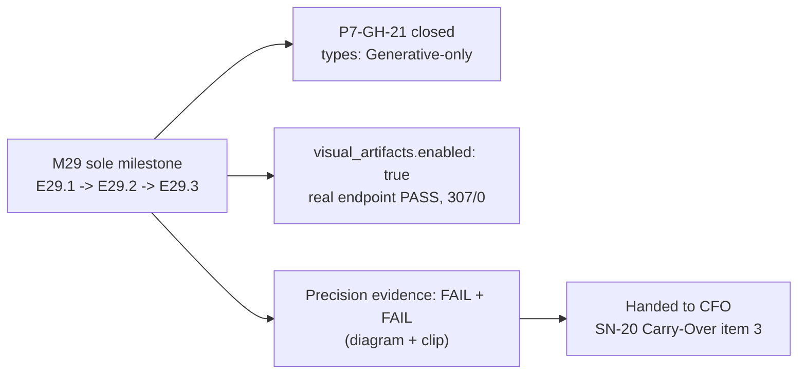

# Phase P8 Closure Declaration

**Phase P8 — Visual Artifacts Activation is closed.**

Merge commit `c45b8a9` landed on `master`. Tagged `v6.0.1`.

This is the **third phase closed through the canonical PSG §5C sequence** (P6 was first, P7
second). README update, version bump (`.ai-project.yml` `governance.version` and README's
Framework version), and git tag were executed as mandatory automatic steps of closure, with no
out-of-band Steering Note.

---

## Delivery Record

| Milestone | Epics | Scope / gaps closed | PR | Merge commit |
|-----------|-------|---------------------|-----|--------------|
| M29 — Visual Artifacts Activation | E29.1, E29.2, E29.3 (3) | `visual_artifacts.types` reframed as Generative-only across all four named surfaces, closing **P7-GH-21**; `visual_artifacts.enabled: true` for the first time in this repo, with `test_helper_generates_against_endpoint` converted from a design-skip to a real pass against the live ComfyUI endpoint (two genuine helper bugs found and fixed along the way); first real generated-and-hosted artifacts from this repo (diagram + clip cases), both honestly judged **FAIL** against the technical-explanation precision bar, with hosting completed via the machine's first `system_request`/`system_response` round-trip | #133 | `df2ec9d` (epics) / `764c96c` (consolidation) |

**3 epics across 1 milestone** (M29 was the sole and final planned P8 milestone,
`is_final_milestone: true`). Suite at delivery: **307 passed, 0 skipped** — the suite's former
sole skip (the visual-artifact endpoint test) is now a real pass; no new skips introduced.
Governance at delivery: **PSG v2.3.0**, **AOG v2.9.0**, yml-spec **v2.3.1** (bumped by E29.1).

---

## Process Record

- **Acceptance model.** M29's Milestone Closure Declaration was independently re-verified by
  this Phase Chat before consolidation — not trusted on faith: the full test suite was re-run
  directly (307 passed, 0 skipped, matching the declaration), the endpoint test was re-run
  verbosely to confirm a real pass (not a skip), `.ai-project.yml`'s `enabled: true` and the
  absence of a stale opt-out comment were checked directly, and both hosted artifacts were
  confirmed to exist at their claimed `file://` paths with byte-identical sizes to what the
  Delivery Notice cited. Accepted by silence under SN-13 default-accept — no Review Decision
  artifact was needed, since the delivery was genuinely clean.
- **Two explicit human merge authorizations, each requested separately.** The milestone
  consolidation (`milestone/M29 → phase/P8`, PR #133) and the phase delivery
  (`phase/P8 → master`, PR #127) were each authorized individually by the CFO in-chat before
  this Phase Chat merged — no inferred or batched authorization (the corrected process lapse
  P7's own closure recorded did not recur here).
- **E29.3's honest rework cycle.** The first E29.3 delivery was **not** silence-accepted — it
  was flagged by its own author as not clean (hosting blocked: no storage backend had ever
  existed in this project; a private Gist rejected binary content; the sibling
  `character-factory` project's Google Drive FUSE-mount approach couldn't run headlessly here;
  a base64-encoding workaround was correctly blocked three times by the session's own safety
  classifier). Per explicit instruction, the blocker was documented rather than forced. The
  resulting escalation chain — CFO ruling (local storage accepted) → this machine's **first-ever**
  `system_request`/`system_response` round-trip → a storage backend provisioned at
  `/home/panchew/.ai-project/storage/` → a mid-flight Milestone-spec Design Decision amendment
  (`73ffe6a`) → a scoped rework completing hosting and both `Level: Epic` §7 bindings — is a
  real instance of the framework's escalation and mid-flight-amendment machinery working as
  designed, not a shortcut around it.
- **The precision findings were not adjusted for comfort.** Both cases — a FLUX-schnell diagram
  and an LTX-Video clip — were judged **FAIL** against "could a reader unfamiliar with the
  underlying flow follow it from the artifact alone?", with concrete, specific justification
  (dropped boxes, garbled alphanumeric labels, no legible text, no visible state transition).
  This Phase Chat re-verified both findings against the actual hosted renders before accepting
  them, and did not soften the headline finding for the CFO.
- **Governing steering note.** SN-20 (Creation Chat, 2026-07-14) scoped the phase's spine and
  its five ratified decisions (make `visual_artifacts` real; defer issue #126's local-agentic
  execution for GPU-exclusivity reasons; leave visual form/precision open; keep ComfyUI local;
  no `governance.version` bump needed "right now"). All five held through delivery without
  re-litigation.
- **Version-bump tension, surfaced and resolved explicitly, not silently.** PSG §5C Step 4 makes
  a version bump a mandatory automatic step of *closure*; SN-20's ratified decision 5 said no
  bump was needed "right now," at *scoping* time — a different moment, and in any case a new git
  tag was unavoidable regardless (v6.0.0 was already P7's tag). The CFO was asked directly and
  chose a **patch bump to v6.0.1**, reflecting a real but non-core delivery (`visual_artifacts`
  activated; only a sibling schema doc, not AOG/PSG core, changed) rather than a major or minor
  bump — this decision, and the tension that prompted it, is recorded here rather than resolved
  by unstated inference.

---

## What P8 Delivered to `master`

**Naming-collision resolution (E29.1, P7-GH-21 closed):**
- `visual_artifacts.types` is documented, across all four surfaces that previously disagreed
  (`governance/ai-project-yml-spec.md` §3.5, this repo's `.ai-project.yml` comment,
  `bin/ai-project-visual`'s docstring, `VISUAL-ARTIFACTS.md`'s config example), as exclusively
  **Generative** (ComfyUI) categories — Direction B (reframe), chosen over renaming the
  `diagrams` value, to avoid an unscoped blast radius across the orchestrator's enum and two
  test modules. Structural mode (Mermaid/PlantUML) is documented as needing no
  `visual_artifacts` config at all, since it never calls `bin/ai-project-visual`.
- yml-spec bumped to **v2.3.1** with a changelog row.

**Real activation (E29.2):**
- This repo's own `visual_artifacts.enabled` is **`true`** for the first time — the trade every
  prior milestone (P5-M22, P7-M27) deferred.
- `test_helper_generates_against_endpoint` runs as a **real pass against
  `http://localhost:8188`**, not a skip. Proving the first-ever real call surfaced and fixed two
  genuine helper bugs no prior milestone could have hit: a stale default checkpoint no longer on
  the server, and fixed-seed full-graph caching silently returning empty outputs (default seed
  now randomized; an explicit `--seed` is honored when given).
- A no-live-endpoint contributor/CI path exists: an opt-**out** environment variable
  (`AI_PROJECT_SKIP_LIVE_ENDPOINT_TESTS`) — the default still runs and requires the endpoint.

**Precision evidence (E29.3):**
- This project's **first real generated-and-hosted artifacts**: a diagram-style case
  (FLUX-schnell, M29's own three-epic sequence) and a clip-style case (LTX-Video, E29.2's
  disabled→enabled arc), both hosted by link (never committed) via a locally-provisioned storage
  backend at `/home/panchew/.ai-project/storage/ai-project-system/visuals/P8-M29/`.
- Both cases were judged **FAIL** against the technical-explanation precision bar — the diagram
  drops a box and garbles alphanumeric labels; the clip has no legible text and no visible state
  transition, settling into an illegible glow. Neither is a rendering failure (P6 already proved
  these three workflows render); both are precision failures on real, unmodified,
  out-of-the-box generations.
- This is the evidence SN-20 Carry-Over item 3 needed. **The finding is not a decision** —
  whether the gap is worth a dedicated, separately governed ComfyUI-workflow project, versus
  treating Generative mode as suited only to its original non-technical use (concept/vision
  imagery) while Structural mode continues to carry technical explanation, remains the CFO's
  call.
- The machine's **first `system_request`/`system_response` round-trip** is now on record,
  exercising a channel that previously existed only as policy prose.

---

## Visual Bindings

**Visual binding**
- **Link:** (inline — Structural diagram; no hosted link needed per AOG §16.3/§16.5)
- **What:** diagram
- **Level:** Phase
- **State:** implemented

- **Description:** P8 as delivered — one milestone, three epics, closing the naming collision,
  activating the capability for real, and producing the honest precision evidence the phase
  existed to gather.

**Visual binding**
- **Link:** `file:///home/panchew/.ai-project/storage/ai-project-system/visuals/P8-M29/E29.3-diagram-case-flux.png`
- **What:** diagram
- **Level:** Phase
- **State:** implemented
- **Description:** E29.3's FLUX-schnell render of M29's own epic sequence — this phase's
  headline generative evidence, judged **FAIL** against the technical-explanation bar. Bound
  here at Phase level in addition to its Epic- and Milestone-level bindings, since it is the
  concrete artifact behind this closure's central finding. Machine-local `file://` link per the
  CFO's local-storage ruling (Carry-Forward P8-GH-2, below).

---

## Carry-Forward to P9

| ID | Title | Priority |
|----|-------|----------|
| P8-GH-1 | **Stale governance prose about this repo's own opt-out survives E29.2's reality.** AOG §16.5's source-repo sentence ("It stays opted out because... a live endpoint the suite doesn't have"), plus `governance/guides/visual-artifacts.md` §1's note and §6 ("skips when enabled is false"), and any sibling remnant, now contradict the actual state: `enabled: true`, a real passing endpoint test, and an opt-**out** env var for the no-endpoint case. Flagged by E29.2's own Delivery Notice; the CFO chose to handle it separately from M29's epics rather than block on it. | Medium |
| P8-GH-2 | **Machine-local hosting limitation.** The storage backend provisioned to complete E29.3's bindings is local only — `file://` links resolve on this machine and nowhere else (dead on GitHub, dead for any other reader). Accepted by CFO ruling for this phase; revisit only if cloud-reachable hosting is ever actually needed for this project. | Low |
| P8-GH-3 | **"Phase Delivery Notice" is vestigial post-§5C but still gets typed into planning docs.** The P8 phase spec, this milestone's own spec, and both Execution Chat Starters all say phase delivery ends with "...+ the Phase Delivery Notice" — a distinct artifact P4 and P5 each produced as a separate file (`P4__phase-delivery-notice.md`, `P5__phase-delivery-notice.md`). Neither P6 nor P7 produced one; PSG §5C's own 9 steps name no such artifact — Step 9's Phase Closure Declaration is the delivery record. This Phase Chat followed the P6/P7 working precedent (no separate file) rather than the stale phrasing habit. Worth a small reconciliation epic to stop the phrase from propagating into P9's own planning docs by copy-paste. | Low |
| SN-20 Carry-Over 3 | **Whether a separate governed ComfyUI-workflow project is still needed** — now unblocked with real evidence (both precision cases FAIL, above). Belongs to the CFO at Creation/HQ level, not this phase. | — |
| SN-20 Carry-Over 2 | **The spin-off "software factory" project** (multi-project dashboard/orchestration consumer of this governance) — real future ambition, explicitly not a phase of this repo; stays a future Creation Chat item, unchanged by P8. | — |
| Issue #126 | **Local-LLM agentic execution** (`qwen3-coder:30b` verified-ready) — deferred, not dropped, for GPU-exclusivity reasons (ComfyUI and a loaded local LLM both want the RTX 5060 Ti 16GB exclusively). `.ai-project.yml`'s `models.epic_dev`/`epic_qa` mapping remains untouched. | — |

---

## Sign-Off

Phase P8 is closed. At `v6.0.1`, the AI Project System's own repository finally runs the
visual-artifacts capability it has shipped to every adopting project since M27 — for real,
against a live endpoint, with the honest result that the base ComfyUI workflows are not yet
precise enough for technical explanation. That finding, not a clean pass, is this phase's most
valuable delivery: real evidence in place of an assumption, handed to the CFO to decide what (if
anything) comes next.
