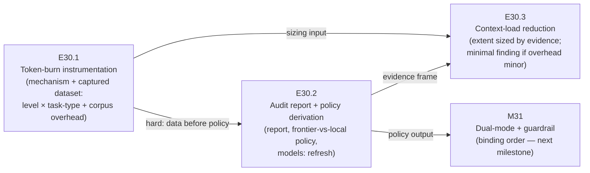

# Milestone M30 — Token Measurement & Model-Tier Audit

## Purpose

Measure actual token consumption across the governance workflow — per chat level, per task
type, and the governance-corpus overhead each chat carries — then audit where frontier/paid
tokens actually went versus where a local model would have sufficed, and derive from that
evidence a recorded frontier-vs-local policy plus a refreshed `.ai-project.yml` `models:`
mapping.

This milestone ensures:
- Token burn is **measured, not guessed** — a committed report from real captured data.
- The frontier-vs-local policy is **evidence-grounded**, replacing the failed
  Epics-only-local assumption.
- `.ai-project.yml`'s stale `models:` block is refreshed to match the policy.
- Context-load reduction work is **sized by the evidence**, not invented.

**M30 is the first P9 milestone and its ordering is binding: M31 consumes M30's policy
output** (measurement-before-policy is CFO-ratified — SN-22, phase spec Ratified Decision 2).
M32 is independent and scheduled separately by the Phase Chat. `is_final: false` — two
milestones follow.

---

## Binding Context (settled scope — NOT for re-debate)

Per the P9 phase spec (v1.0.0) and SN-22 (Creation Chat, 2026-07-17, all decisions
CFO-ratified), the following apply in full and are not open for re-examination in this
Milestone or any Epic under it:

1. **P9 spine.** Context handling / token efficiency: make token use as smart and effective
   as possible.
2. **Measurement before policy.** The model-tier audit starts with measurement so policies
   are realistic; the Epics-only-local assumption is dead.
3. **ComfyUI demoted.** The precision investigation is a non-blocking, CFO-side track —
   nothing in M30 references or blocks on it.
4. **Overarching goal.** The system running so every governed project makes progress — token
   efficiency is what makes eight governed projects on one machine and one quota sustainable.

Two design decisions are **intentionally open** and belong to the Milestone/Epic Chats, per
the phase spec ("HQ scopes the problem, not the resolution"):
- The measurement **mechanism** (E30.1).
- The policy's **documentation home** (E30.2) — governance doc, yml-spec section, or both.

---

## Problem Statement

Three verified gaps, each confirmed against current repository and project state:

- **The original model-tier assumption failed in practice.** Local models only at the Epic
  level, frontier everywhere else — this policy was written before any consumption evidence
  existed. In the field it exhausted the CFO's premium token quota and left them without
  frontier reasoning when it mattered. This failure is P9's founding evidence.
- **`.ai-project.yml`'s `models:` mapping is stale.** Lines 22–27 carry
  `hq: remote:gpt-4o`, `phase: remote:claude-3-5-sonnet`,
  `milestone: remote:claude-3-5-sonnet`, `epic_dev: local:qwen2.5-coder:14b`,
  `epic_qa: local:qwen2.5-coder:7b` — model names that no longer reflect what actually runs,
  mapped by a level→tier rule that the quota failure already falsified. M31's guardrail will
  verify chats against this mapping, so refreshing it from evidence is a prerequisite for M31.
- **No real measurement exists.** Prior local-model work (issue #126 context) produced
  order-of-magnitude *estimates* — the AOG+PSG core around 24K tokens, the full governance
  corpus roughly an order of magnitude larger — but no captured per-level, per-task-type
  consumption data. Estimates are motivation for this milestone; they do not meet its bar
  (see Hard Constraint).

---

## Goals

By the end of this milestone:

1. **A measurement mechanism exists and has captured real data** — token consumption per chat
   level (Phase / Milestone / Epic, plus HQ and Creation for the record), per task type
   (planning, execution, review, closure), including the governance-corpus overhead each chat
   pays (E30.1).
2. **A committed audit report** states where frontier/paid tokens actually go, which of those
   expenditures needed frontier reasoning, and which a local model could have carried (E30.2).
3. **A recorded frontier-vs-local policy** exists in its decided documentation home, and
   `.ai-project.yml`'s `models:` block is refreshed to match it — the stale
   `gpt-4o`/`claude-3-5-sonnet` entries gone (E30.2).
4. **Context-load reduction is sized by evidence** — either reduction work proportionate to
   what the measurements show governance-corpus overhead to cost, or a documented finding that
   the overhead is minor and no reduction is justified (E30.3).

---

## Non-Goals

This milestone explicitly does **not**:

- Build the manual/agentic mode switch, the agentic paid-vs-local decision logic, or the
  manual-mode startup guardrail — all M31, which consumes this milestone's output.
- Resolve GPU scheduling between local LLMs and ComfyUI (out of P9 entirely).
- Touch SN-21 canonization, the System Chat seed, or P8-GH-1/P8-GH-3 hygiene — all M32.
- Scope in P8-GH-2 (deferred on its recorded trigger), the software-factory spin-off, or the
  "mighty" governing System Chat (pinned vision).
- Invent context-reduction work the numbers don't justify — E30.3's extent is decided by
  E30.1's evidence, not by ambition.
- Produce Epic specs or Epic Execution Chat Starters — that is the Milestone Chat's job
  (adjacency); this spec defines epic scope, deliverables, and acceptance criteria only.

---

## In Scope

- **E30.1** — the measurement mechanism (design decision: candidates include harness/API
  usage logs, transcript token counting, or instrumentation in the orchestrator path) and the
  captured dataset: per-level, per-task-type, governance-corpus overhead.
- **E30.2** — the committed measurement/audit report; the recorded frontier-vs-local policy
  in its decided home; the `.ai-project.yml` `models:` refresh; a
  `governance/ai-project-yml-spec.md` version bump + changelog row **if** the refresh changes
  `models:` semantics (a pure value refresh needs no schema change).
- **E30.3** — evidence-driven context-load reduction: tighter per-level context scoping,
  retrieval instead of full loading, and/or caching — **or** a documented
  no-significant-reduction-needed finding, whichever the evidence supports.

## Out of Scope

- Everything listed under Non-Goals; additionally: changing which chats exist or how they are
  started (M31 territory), and any cross-repo rollout of the policy to the other governed
  projects (future triage — this milestone records the policy in this source repo).

---

## Hard Constraint (binding — carries to every Epic under this Milestone)

**The frontier-vs-local policy and the `models:` refresh MUST be derived from the captured
measurements — not from pre-existing assumptions.** Real captured data is the bar; estimates
do not count (phase acceptance criterion). If a measurement cannot be captured for some
level or task type, **record the gap explicitly** in the report rather than substituting a
guess — a policy row grounded in a recorded gap is acceptable; a policy row grounded in an
unlabeled assumption is not. This constraint governs E30.2 directly and sizes E30.3: no
reduction work may be scoped from the prior 24K/157K estimates alone.

---

## Planned Epics

### Confirmed Epics

- **E30.1 — Token-burn instrumentation**
- **E30.2 — Audit report + policy derivation**
- **E30.3 — Evidence-driven context-load reduction**
- **E30.4 — Reference-don't-display reconciliation (SN-23; added mid-flight, amendment A1)**

> **Artifact scope (adjacency).** The Phase Chat produces only this Milestone spec and the
> Milestone Execution Chat Starter. The **Milestone Chat** owns final epic planning and
> authors every Epic spec and Epic Execution Chat Starter. No Phase-level Epic drafts exist.

### Deferred Epics

- None at planning time. If E30.1's evidence shows governance-corpus overhead is minor,
  E30.3 is delivered minimal (finding-only), not deferred — the finding itself is the
  deliverable.

---

## Epic Detail

### E30.1 — Token-burn instrumentation

**Source:** P9 phase spec §P9.1; SN-22 workstream 1.

**Grounding:** no captured consumption data exists anywhere in the repo — only estimates from
prior local-model work. The failed tier assumption cannot be replaced with a better guess;
it must be replaced with data.

**The measurement mechanism is a design decision for the Milestone/Epic Chat, not fixed by
this spec.** Candidate directions (non-exhaustive):
- Harness/API usage logs (e.g., per-session token accounting the CFO's tooling already emits).
- Transcript token counting (tokenize stored chat transcripts / loaded context per level).
- Instrumentation in the orchestrator path (`bin/run-dev-agent` and the P7 adapter path).

Whichever direction is chosen, the captured data MUST cover:
1. **Per chat level:** Phase, Milestone, Epic — plus HQ and Creation for the record.
2. **Per task type:** planning, execution, review, closure.
3. **Governance-corpus overhead:** how many tokens the loaded governance context itself costs
   a chat at each level, separable from the tokens spent on the task.

**Deliverables:**
1. The measurement mechanism, documented (what it measures, how, and its known blind spots).
2. The captured dataset, committed to the repo in a stable location the Epic Chat decides and
   documents (e.g., under `.ai-project/artifacts/`), in a form E30.2 can audit.
3. An explicit gap record for any level/task-type cell that could not be captured (Hard
   Constraint — recorded gaps, never substituted guesses).

**Definition of Done:**
- [ ] The mechanism is documented with its design reasoning
- [ ] Real captured data exists in the repo covering the level × task-type matrix, with
      governance-corpus overhead separable
- [ ] Every uncaptured cell is recorded as an explicit gap
- [ ] Full test suite passes (307 baseline, no new skips)

**Acceptance Criteria:**
- [ ] A reader can answer "what does a chat at level X doing task Y actually cost, and how
      much of that is governance corpus?" from committed data, or find that cell's recorded
      gap

**Sequencing:** first — E30.2 is blocked on this epic's dataset (hard dependency).

---

### E30.2 — Audit report + policy derivation

**Source:** P9 phase spec §P9.1; SN-22 workstream 1; phase success criteria 1–2.

**Grounding:** the stale `models:` block (`.ai-project.yml` lines 22–27) and the absence of
any recorded policy on when paid models are worth it. M31's guardrail and agentic
paid-vs-local logic both consume this epic's outputs — this is the binding-order link.

**Deliverables:**
1. **The committed measurement/audit report:** per-level and per-task-type consumption from
   E30.1's data; where frontier/paid tokens actually go; which expenditures needed frontier
   reasoning and which a local model could have carried; governance-corpus overhead findings;
   the explicit gap records carried forward from E30.1.
2. **The recorded frontier-vs-local policy** — when paid models are worth it, when local
   models suffice, derived from the report. **Its documentation home is a design decision for
   the Epic Chat** (governance doc, `governance/ai-project-yml-spec.md` section, or both) —
   document the choice and reasoning.
3. **The `.ai-project.yml` `models:` refresh** replacing the stale entries
   (`remote:gpt-4o`, `remote:claude-3-5-sonnet`, `local:qwen2.5-coder:14b/7b`) with the
   evidence-grounded mapping. The refreshed block is what M31's guardrail will verify against.
4. `governance/ai-project-yml-spec.md` version bump + changelog row **if and only if** the
   refresh changes `models:` field semantics rather than just values.

**Definition of Done:**
- [ ] The report is committed and every claim in it traces to E30.1's captured data or an
      explicit recorded gap (Hard Constraint)
- [ ] The policy is recorded in its decided home, with the home choice documented
- [ ] `.ai-project.yml`'s `models:` block matches the policy; no stale entry remains
- [ ] Full test suite passes (307 baseline, no new skips)

**Acceptance Criteria:**
- [ ] The policy answers, for each chat level and task type (or recorded gap), whether paid
      or local is the default and why — grounded in the report, not assumption
- [ ] `grep` of `.ai-project.yml` shows no `gpt-4o` or `claude-3-5-sonnet` entry

**Dependency:** hard — requires E30.1's committed dataset. Runs after E30.1.

---

### E30.3 — Evidence-driven context-load reduction

**Source:** P9 phase spec §P9.1; SN-22 workstream 1 (context handling proper).

**Grounding:** prior local-model work estimated the full governance corpus roughly an order
of magnitude larger than the AOG+PSG core (~24K vs ~157K tokens) — an estimate this
milestone replaces with measurement. If the measured overhead is a dominant per-chat cost,
reduction is P9-spine work; if it is minor, the correct deliverable is the finding, not the
work.

**This epic is conditional in extent — sized by what E30.1/E30.2's evidence shows.**
Candidate reduction directions (non-exhaustive): tighter per-level context scoping (each
level loads only what its role needs), retrieval instead of full loading, caching. The
Milestone Chat scopes the epic's actual extent **after** the measurement evidence exists,
and records the sizing rationale in the Epic spec.

**Deliverables:**
1. A sizing decision, recorded with its evidence basis: how much reduction work the measured
   governance-corpus overhead justifies (possibly: none beyond documentation).
2. The reduction work itself, proportionate to that decision — or, on the minimal path, a
   documented finding that overhead is minor, with the numbers that show it.
3. If reduction work is done: before/after measurement using E30.1's mechanism, so the
   improvement is itself evidence, not assertion.

**Definition of Done:**
- [ ] The sizing decision is recorded and traces to measured data (Hard Constraint — not to
      the prior estimates)
- [ ] The proportionate work (or the documented minimal finding) is delivered
- [ ] Any reduction claim is backed by before/after numbers from the E30.1 mechanism
- [ ] Full test suite passes (307 baseline, no new skips)

**Acceptance Criteria:**
- [ ] Either measurable context-load reduction exists with before/after evidence, or the repo
      records why none was justified — no third state

**Dependency:** requires E30.1's data (sizing input); E30.2's report is its natural evidence
frame — recommended to run last. The Milestone Chat may overlap E30.3's sizing analysis with
E30.2 where no file contention exists, but the sizing decision cannot precede the data.

---

### E30.4 — Reference-don't-display reconciliation (SN-23; added mid-flight, amendment A1)

**Source:** SN-23
(`.ai-project/artifacts/steering-notes/2026-07-18__creation-chat__steering-note__reference-dont-display.md`,
master `a7a153c`); HQ triage via P9 phase spec **v1.1.0** (`e490394`) — added to M30 as a
follow-up epic under the mid-flight amendment protocol. The phase spec v1.1.0 §Indicative
Epics E30.4 entry is the authoritative scope statement; this section records it in the
milestone's own governing spec.

**Scope (per phase spec v1.1.0, both SN-23 decisions CFO-ratified and binding):**
reconcile the governance-mandated artifact-echo surfaces to reference-first handoff —
(a) AOG §3.1.1: parent emits starter path + one-line summary instead of the full fenced
block when the starter is a committed file, starter templates updated to match;
(b) `artifact-communication-protocol.md` §Integration with Manual Mode: paste replaced by
reference handoff, **paste retained as the documented repo-less fallback** (platform
agnosticism preserved); (c) a producer no-echo / consumer selective-read rule. Any
reduction claim carries before/after evidence via E30.1's mechanism.

**Boundary:** complementary to E30.3, **not a resize of it** — E30.3's pack-slice boundary
stands; E30.4 owns the AOG/protocol edits E30.3's Non-Goals forbid it.

**Dependency:** sequenced after E30.3 (its template edits must not be clobbered; rebase
constraint).

---

## Branch Strategy

```
master
└── phase/P9                      (branched at phase open)
    └── milestone/M30              ← this milestone (Milestone Chat branches from phase/P9)
        ├── epic/P9-M30-E30.1      ← token-burn instrumentation
        ├── epic/P9-M30-E30.2      ← audit report + policy derivation
        └── epic/P9-M30-E30.3      ← evidence-driven context-load reduction
```

Epic PRs target `milestone/M30`. Consolidation PR: `milestone/M30 → phase/P9`. **M30 is not
the final P9 milestone** (`is_final: false`) — on its consolidation, the Phase Chat proceeds
to plan M31 (which consumes M30's policy output; binding order) and schedules M32
independently. Phase closure (`phase/P9 → master`) happens only after all three milestones,
via the PSG §5C canonical closure sequence ending in the Phase Closure Declaration.

---

## Prerequisites

- This Milestone spec and its Milestone Execution Chat Starter are git-tracked on `phase/P9`
  (verify with `git ls-files --error-unmatch <path>` on `phase/P9` — the GH-1 convention).
- M30 targets present and git-tracked on `phase/P9`:
  - `.ai-project.yml` (the stale `models:` block, lines 22–27)
  - `governance/ai-project-yml-spec.md` (possible policy home / changelog target)
  - `bin/run-dev-agent` + the P7 orchestrator/adapter path (candidate instrumentation
    surface — reference, not a committed edit target until the Epic Chat picks the mechanism)
- **External dependency (CFO-side):** measuring paid-token burn spends some paid tokens; the
  CFO controls pacing (phase spec Dependencies). If quota pacing stalls a capture, record the
  affected cells as explicit gaps rather than waiting indefinitely — the gap record is the
  Hard Constraint's sanctioned outcome for exactly this case.
- Reference context: SN-22
  (`.ai-project/artifacts/steering-notes/2026-07-17__creation-chat__steering-note__p9-direction.md`);
  GitHub issue #126 (local-LLM readiness; reference only).

---

## Dependencies and Sequencing

- **E30.1 → E30.2 is a hard dependency:** the report and policy derive from the captured
  dataset (Hard Constraint). No policy drafting before the data exists.
- **E30.3 depends on E30.1's data** for its sizing decision and is recommended last among
  the originally planned three; its sizing analysis may overlap E30.2 where the Milestone
  Chat finds no contention.
- **E30.4 runs after E30.3** (amendment A1): it edits governance/protocol surfaces adjacent
  to E30.3's template changes and must preserve them.
- **M30 → M31 is binding at phase level:** M31 is not planned until M30's policy output
  exists. This spec's E30.2 is the link — its policy and `models:` refresh are M31's inputs.
- No dependency on M32 in either direction.

---

## Definition of Done (Milestone)

- [ ] E30.1, E30.2, and E30.3 each meet their Definition of Done above; E30.4 meets its
      DoD per its Epic spec under phase spec v1.1.0 (amendment A1)
- [ ] All four epic branches merged to `milestone/M30`
- [ ] Real captured token data is committed, covering the level × task-type matrix with
      governance-corpus overhead separable and all gaps explicit
- [ ] The audit report, the recorded policy (in its decided home), and the refreshed
      `models:` block all exist and agree with each other
- [ ] E30.3's sizing decision and its proportionate outcome are recorded with evidence
- [ ] Full test suite passes on `milestone/M30` (307 baseline, no regressions, no new skips)
- [ ] Milestone Closure Declaration produced (`is_final: false` — M31/M32 remain)

---

## Acceptance Criteria (Milestone)

1. The measurement report exists in the repo with real (not estimated) token data per level
   and task type, including governance-corpus overhead, and every uncaptured cell recorded as
   an explicit gap (E30.1, E30.2).
2. The frontier-vs-local policy is recorded in its documented home and `.ai-project.yml`'s
   `models:` block reflects it — `grep` shows no `gpt-4o`/`claude-3-5-sonnet` remnant (E30.2).
3. Every policy statement traces to captured data or a recorded gap — none to pre-existing
   assumption (Hard Constraint, all epics).
4. Context-load reduction either exists with before/after numbers or is recorded as
   not justified by the evidence (E30.3).
5. The full suite is green at milestone delivery with no regressions and no new skips.

---

## Timeline

**Target Start:** 2026-07-17
**Target Completion:** 2026-07-24 (~1 week per phase spec estimate; 3 epics, one hard
dependency chain)
**Actual Start:** Not started
**Actual Completion:** Not started

---

## Visual Bindings

**Visual binding**
- **Link:** (inline — Structural diagram; no hosted link needed per AOG §16.3/§16.5)
- **What:** diagram
- **Level:** Milestone
- **State:** proposed



- **Description:** M30's three-epic flow — capture real token data first, derive the audit
  report, policy, and `models:` refresh from it, and size context-load reduction by what the
  numbers show. E30.2's policy output is the binding-order link M31 consumes. Proposed-track
  Structural diagram (AOG §16.3/§16.6).

---

## Notes

- **The Hard Constraint is the load-bearing rule of this milestone.** P9 exists because a
  policy was written before evidence; M30 writing its policy from the old estimates (or new
  guesses) would repeat the founding failure inside the fix. Recorded gaps are the sanctioned
  escape valve — unlabeled assumptions are not.
- **The mechanism (E30.1) and the policy home (E30.2) are open design decisions** for the
  Milestone/Epic Chats — pick a direction, document the reasoning, proceed. They are not
  blockers to escalate (Phase Execution Chat Starter, Question Policy).
- **E30.3 can be small on purpose.** A minimal, finding-only E30.3 is a full success if
  that is what the evidence supports — the phase spec says so explicitly.
- **M30's output is M31's input.** The refreshed `models:` block is the mapping M31's
  manual-mode guardrail verifies against, and the recorded policy is what M31's agentic
  paid-vs-local logic applies. Deliver them as things another milestone can consume.
- Default-accept (PSG §11.6 / AOG §12) governs this milestone's delivery: clean Epic/
  Milestone deliveries are accepted by silence; a Review Decision is the exception path only.
  Per SN-19, acceptance and the merge instruction are in-chat acts — no ceremonial artifact.
  The harness enforces explicit human authorization on every merge regardless.

---

## Amendment History

| # | Date | Authority | Change |
|---|------|-----------|--------|
| A1 | 2026-07-19 | P9 phase spec v1.1.0 (`e490394`, HQ SN-23 triage, mid-flight amendment protocol) | E30.4 "Reference-don't-display reconciliation" added to the epic list, Epic Detail, sequencing, and Milestone DoD. The milestone executed E30.4 under the phase spec's authority; this amendment reconciles the milestone spec's record (owed per the GH-8 precedent, flagged in the M30 Milestone Closure Declaration, closed at consolidation). |
