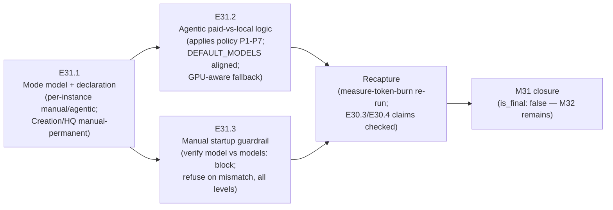

# Milestone M31 — Dual-Mode Working Levels & Model Guardrail

## Purpose

Give Phase, Milestone, and Epic Chats a **per-instance manual/agentic mode switch**; give
agentic mode a **paid-vs-local decision mechanism** grounded in M30's recorded policy; and
make **every manually started chat verify its model** against `.ai-project.yml`'s `models:`
block and refuse to proceed on mismatch.

This milestone ensures:
- The working levels are dual-mode, chosen one instance at a time — the direct fix for the
  failed static level→tier assumption.
- Creation Chat and HQ Chat are recorded **manual-only, permanently** — normative policy,
  not a deferral.
- The paid-vs-local decision moves from a hardcoded mapping to M30's evidence-grounded
  policy (rows P1–P7), applied per task by the agentic path.
- A manual chat on the wrong model refuses at startup — demonstrably.

**M31 consumes M30's outputs under the CFO-ratified binding order** (measurement before
policy; policy before enforcement). M32 is independent and scheduled separately by the Phase
Chat. `is_final: false` — M32 remains after M31.

---

## Binding Context (settled scope — NOT for re-debate)

Per the P9 phase spec (v1.1.0) and SN-22 (all decisions CFO-ratified):

1. **Dual mode for working levels only.** Phase/Milestone/Epic Chats become
   manual-or-agentic, set **per instance, one by one**. **Creation Chat and HQ Chat are
   manual at all times — permanent policy to be recorded normatively**, not a deferral.
2. **Agentic-by-default is deferred.** P9 delivers the switch, not the default — there is
   not yet evidence that a full Phase can be carried agentically. No epic may make agentic
   the default anywhere.
3. **The guardrail refuses.** Manually started chats verify model-per-level against
   `.ai-project.yml` and refuse to proceed on mismatch. The guardrail applies to **all**
   manually run chats, including HQ and Creation.
4. **GPU-contention awareness.** Local execution (Ollama) and ComfyUI contend for the same
   16 GB GPU (issue #126). M31 does **not** solve scheduling, but the paid-vs-local decision
   logic must not assume a local model is always loadable.
5. **M30's policy is consumed as recorded.** `model-routing-policy.md` rows P1–P7 and the
   `.ai-project.yml` `models:` block are the inputs. Policy rows change **only** with new
   cited evidence (the policy's Change Discipline) — never by assumption; the policy file and
   the `models:` block update together, and **divergence between them is an error** the
   guardrail must treat as such.

Design decisions **intentionally open** for the Milestone/Epic Chats (phase spec: "HQ scopes
the problem, not the resolution"): the mode **declaration mechanism** (`.ai-project.yml`,
the Execution Chat Starter, or both), what each mode concretely means per level, the
**level→model mapping definition** for manual chats, and **how a chat verifies its own
model**. Pick directions, document the reasoning, proceed.

---

## Problem Statement

- **The mode concept exists only as practice, not as a recorded model.** Every chat to date
  has been manual; the P7 orchestrator + `bin/run-dev-agent` adapter path exists (on master
  at v6.0.1) but nothing records which instances may run agentically, what agentic means per
  level, or that Creation/HQ never do.
- **The agentic path still carries the falsified defaults.** `bin/ai-project-orchestrator`'s
  `DEFAULT_MODELS` hardcodes `remote:gpt-4o` / `remote:claude-3-5-sonnet` /
  `epic_qa: local:qwen2.5-coder:7b` — the exact names M30 measured as never having run one
  session (dataset §2) — and it is the **fallback used whenever `.ai-project.yml` is absent
  or unparseable**, so it is runtime-load-bearing for M31, no longer inert (M30 closure
  handoff). The E26.2 consistency-guard tests cover only `epic_dev`.
- **Nothing verifies the model a manual chat runs on.** The quota failure happened partly
  because chats ran on whatever was selected, with no check against intended mapping. The
  refreshed `models:` block (E30.2) now exists as a verification target, but no startup
  check consumes it.

---

## Goals

By the end of this milestone:

1. **A recorded mode model exists** — where per-instance mode is declared, what
   manual/agentic means at each working level, and Creation/HQ recorded normatively as
   manual-only permanent (E31.1).
2. **A working-level chat can demonstrably be started in either mode**, with the mode
   recorded per instance (E31.1; phase acceptance criterion).
3. **The agentic path applies M30's policy per task** — paid-vs-local decided by policy rows
   P1–P7, not by hardcoded mapping; `DEFAULT_MODELS` aligned with the refreshed block;
   consistency-guard tests extended beyond `epic_dev`; the logic handles
   local-model-unavailable (GPU contention) without assuming loadability (E31.2).
4. **A manual chat on a mismatched model demonstrably refuses at startup**, per the
   `.ai-project.yml` mapping, with the refusal evidence committed in the epic's delivery
   (E31.3; phase acceptance criterion).
5. **A post-M31 measurement recapture is committed** — E30.1's mechanism re-run at milestone
   delivery to check the forward-looking billed-median claims from E30.3/E30.4 honestly
   (movement or no movement, recorded either way; TTL caveat +18% bound noted).

---

## Non-Goals

This milestone explicitly does **not**:

- Make agentic the default anywhere, or run a full phase/milestone agentically (deferred —
  SN-22).
- Change Creation/HQ manual-permanence in either direction — it is recorded, not revisited.
- Resolve GPU scheduling between Ollama and ComfyUI (out of P9; awareness only).
- Re-derive, extend, or re-debate M30's policy rows — new rows or changed defaults require
  new cited evidence under the policy's Change Discipline; M31 *applies* the policy.
- Touch M32's scope (SN-21 canonization, System Chat seed, P8-GH-1/3 hygiene).
- Scope in P8-GH-2, the software-factory spin-off, the "mighty" governing System Chat, or
  the MCP write path.
- Produce Epic specs or Epic Execution Chat Starters — that is the Milestone Chat's job
  (adjacency); this spec defines epic scope, deliverables, and acceptance criteria only.

---

## In Scope

- **E31.1** — the mode model: declaration mechanism (design decision), per-level mode
  semantics, per-instance recording, Creation/HQ manual-permanence recorded normatively in
  the governance home the Epic Chat decides (with reasoning), demonstrable dual start.
- **E31.2** — agentic paid-vs-local decision logic in the orchestrator/runner path applying
  policy rows P1–P7; `DEFAULT_MODELS` alignment; consistency-guard test extension;
  local-unavailable handling; run evidence including the row-P5 designated experiment
  (epic × execution local-offload) to the extent GPU availability permits.
- **E31.3** — the manual-mode startup guardrail: level→model mapping definition, self-model
  verification method (design decisions), verify-and-refuse behavior for all manual chats
  including HQ/Creation, refusal evidence.
- **Milestone-level:** the post-M31 mechanism recapture at delivery (Goal 5).

## Out of Scope

- Everything under Non-Goals; additionally: cross-repo rollout of mode/guardrail to the
  other governed projects (future triage), and any change to `bin/measure-token-burn`
  beyond running it for the recapture (within-session segmentation stays unowned, as the
  M30 closure declaration recorded).

---

## Hard Constraints (binding — carry to every Epic under this Milestone)

1. **Refusal means refusal.** The E31.3 guardrail on mismatch must stop the chat from
   proceeding — a warning that scrolls past is not a guardrail. The acceptance evidence is a
   demonstrated refusal, committed in the delivery.
2. **No agentic default.** Nothing delivered may flip any instance to agentic without an
   explicit per-instance choice; absence of a declaration means manual.
3. **Policy consumed, not re-authored.** E31.2 applies rows P1–P7 as recorded. If
   implementation surfaces a genuine policy defect, the path is the Change Discipline (new
   evidence, policy file + `models:` block updated together) escalated via the Milestone
   Chat — never a silent divergence. Guardrail and decision logic treat policy↔block
   divergence as an error.
4. **Local loadability is never assumed** (GPU contention). Every local-model code path has
   a defined, tested behavior for "model not loadable now".
5. **Suite green at every merge** — 307 baseline, no regressions, no skips introduced to
   route around changes (phase acceptance criterion). New tests raise the count; nothing
   lowers it.

---

## Planned Epics

### Confirmed Epics

- **E31.1 — Mode model + declaration mechanism**
- **E31.2 — Agentic paid-vs-local decision logic**
- **E31.3 — Manual-mode startup guardrail**

> **Artifact scope (adjacency).** The Phase Chat produces only this Milestone spec and the
> Milestone Execution Chat Starter. The **Milestone Chat** owns final epic planning and
> authors every Epic spec and Epic Execution Chat Starter. No Phase-level Epic drafts exist.

### Deferred Epics

- None at planning time.

---

## Epic Detail

### E31.1 — Mode model + declaration mechanism

**Source:** P9 phase spec §P9.2; SN-22 workstream 2 (ratified decision 3).

**Grounding:** no recorded mode model exists (Problem Statement). The P7 agentic path exists
mechanically; what is missing is governance: where an instance's mode is declared, what each
mode means per level, and the normative manual-permanence record for Creation/HQ.

**Design decisions for the Milestone/Epic Chat:** the declaration mechanism
(`.ai-project.yml`, the Execution Chat Starter, or both — SN-22 leaves it open) and the
governance home for the mode model and the manual-permanence rule (candidates:
`governance/systems/chat-hierarchy.md`, the yml-spec, AOG — document the choice).

**Deliverables:**
1. The recorded mode model: manual vs agentic semantics per working level (Phase /
   Milestone / Epic), per-instance declaration, absence-means-manual default (Hard
   Constraint 2).
2. The declaration mechanism implemented in its decided home(s); if `.ai-project.yml` gains
   a field, `governance/ai-project-yml-spec.md` is bumped with a changelog row.
3. Creation Chat and HQ Chat recorded **manual-only, permanently**, normatively, in the
   decided home.
4. Demonstration evidence: a working-level chat instance started in each mode, with the
   mode recorded per instance (phase acceptance criterion — "demonstrably", so evidence is
   part of the delivery, not an assertion).
5. If the M30 G7 one-task-one-session recommendation is adopted into the mode model's
   session-discipline prose, it is labeled as measured-evidence-based guidance
   (recommendation status; adopting or not is this epic's documented call — it is not an
   acceptance gate).

**Definition of Done:**
- [ ] Mode model recorded; declaration mechanism implemented and documented with reasoning
- [ ] Creation/HQ manual-permanence normative in the decided home
- [ ] Both-modes demonstration evidence committed
- [ ] Suite green (307 baseline, no new skips)

**Acceptance Criteria:**
- [ ] A reader can determine any instance's mode from its declaration, and no declaration
      means manual
- [ ] The phase acceptance criterion "a working-level chat can demonstrably be started in
      either mode, and the mode is recorded per instance" is met with committed evidence

**Sequencing:** first — E31.2 (agentic behavior) and E31.3 (manual behavior) both attach to
the mode model this epic records.

---

### E31.2 — Agentic paid-vs-local decision logic

**Source:** P9 phase spec §P9.2; SN-22 workstream 2; M30 closure handoffs (DEFAULT_MODELS
alignment, guard-test extension, row-P5 experiment, GPU awareness).

**Grounding:** `bin/ai-project-orchestrator` `DEFAULT_MODELS` still hardcodes the falsified
names and is the fallback when `.ai-project.yml` is absent/unparseable — runtime-load-bearing
for this epic. The E26.2 consistency guard covers only `epic_dev`. Policy rows P1–P7 and the
refreshed `models:` block are the recorded inputs (`.ai-project/artifacts/reference/
token-measurement/model-routing-policy.md`; `.ai-project.yml`).

**Deliverables:**
1. The agentic path decides paid-vs-local per task by applying the recorded policy — the
   decision moves out of hardcoded level→tier mapping (the direct fix for the founding
   failure).
2. `DEFAULT_MODELS` aligned with the refreshed `models:` block (no falsified name remains
   anywhere in the runtime path).
3. Consistency-guard tests extended beyond `epic_dev` to cover every `models:` key against
   its policy row (divergence = test failure — Hard Constraint 3's enforcement arm).
4. Local-unavailable handling: defined, tested behavior when the local model cannot load
   (GPU contention) — fallback decision documented, never an assumption of loadability
   (Hard Constraint 4).
5. Run evidence: at least one agentic run applying the policy, including the **row-P5
   designated experiment** (epic × execution offloaded to `local:qwen2.5-coder:14b`) if GPU
   availability permits during the epic — its outcome (run records: tokens, completion,
   fallbacks taken) committed as the first M31 run evidence rows P5–P7 name as their
   revisit trigger. If the GPU is contended throughout, record that as an explicit gap with
   the M30 gap-record discipline rather than blocking the epic.

**Definition of Done:**
- [ ] Policy-applying decision logic implemented; no hardcoded falsified name in the runtime
      path (grep-verifiable)
- [ ] Guard tests cover all `models:` keys; policy↔block divergence fails the suite
- [ ] Local-unavailable behavior defined and tested
- [ ] Run evidence (or the explicit GPU-contention gap record) committed
- [ ] Suite green (307 baseline, no new skips)

**Acceptance Criteria:**
- [ ] Phase criterion "agentic mode carries a paid-vs-local decision mechanism applying the
      recorded policy" is met and demonstrated by run evidence or gap record
- [ ] `grep` over `bin/` shows no `gpt-4o`, `claude-3-5-sonnet`, or `qwen2.5-coder:7b`

**Dependency:** E31.1's mode model (agentic behavior attaches to a declared agentic
instance). Runs after E31.1.

---

### E31.3 — Manual-mode startup guardrail

**Source:** P9 phase spec §P9.2; SN-22 workstream 3 (ratified decision 4).

**Grounding:** nothing verifies a manual chat's model today; the refreshed `models:` block
exists as the verification target. SN-22 leaves **both** design questions open: how the
level→model mapping is defined for manual chats (the current `models:` block configures
agentic execution — policy §Domain note — so the manual-mode mapping definition is design
work, possibly extending the block, possibly a companion field) and how a chat verifies its
own running model.

**Deliverables:**
1. The level→model mapping definition for manual chats, recorded (with yml-spec bump +
   changelog if `.ai-project.yml` changes shape).
2. The self-verification method, documented with its known limits (how a chat determines
   what model it is running on).
3. The verify-and-refuse startup check for **all** manually started chats — including HQ
   and Creation — refusing to proceed on mismatch (Hard Constraint 1); policy↔block
   divergence also refuses as an error (Hard Constraint 3).
4. Refusal evidence: a manual chat started on a mismatched model demonstrably refuses —
   committed in the delivery (phase acceptance criterion).
5. Starter-template integration as the design lands (the startup check has to live where
   chats actually start — likely the execution-chat-starter templates' startup sections;
   preserve E30.3's scoping blocks and E30.4's reference-first rules in any template edit).

**Definition of Done:**
- [ ] Mapping definition + self-verification method recorded with reasoning
- [ ] Verify-and-refuse implemented for all manual levels incl. HQ/Creation
- [ ] Mismatch-refusal evidence committed
- [ ] Suite green (307 baseline, no new skips)

**Acceptance Criteria:**
- [ ] Phase criterion "a manual chat started on a mismatched model demonstrably refuses
      (evidence in the epic's delivery)" is met

**Dependency:** E31.1's mode model (the guardrail governs instances declared/defaulted
manual); consumes E31.2's divergence-is-error enforcement if E31.2 lands first. Runs after
E31.1; ordering relative to E31.2 is the Milestone Chat's call (surfaces are mostly
disjoint: orchestrator/runner vs templates/startup docs — verify no contention before
parallelizing).

---

## Post-M31 Measurement Recapture (milestone-level deliverable)

At milestone delivery (after all three epics merge to `milestone/M31`), re-run
`bin/measure-token-burn` over the sessions since the M30 window and commit the recapture
beside the M30 dataset (mechanism unchanged — no edits to `bin/measure-token-burn`).
Purpose: check the **forward-looking** billed-median claims from E30.3 (pack reduction) and
E30.4 (echo elimination) against billed reality — movement or no movement, recorded
honestly, with the TTL caveat (+18% bound if 1h-TTL writes) noted in the comparison. This is
evidence collection, not a pass/fail gate: an honest "no movement yet, window too short"
is an acceptable finding. The Milestone Chat owns where this lands (closure-declaration
annex or a recapture note beside the dataset) and records the choice.

---

## Branch Strategy

```
master
└── phase/P9                      (long-lived PR #134 → master; merges at §5C closure)
    └── milestone/M31              ← this milestone (Milestone Chat branches from phase/P9)
        ├── epic/P9-M31-E31.1      ← mode model + declaration mechanism
        ├── epic/P9-M31-E31.2      ← agentic paid-vs-local decision logic
        └── epic/P9-M31-E31.3      ← manual-mode startup guardrail
```

Epic PRs target `milestone/M31`. Consolidation PR: `milestone/M31 → phase/P9`. **M31 is not
the final P9 milestone** (`is_final: false`) — M32 remains (independent; the Phase Chat may
plan it in parallel with M31 execution). Phase closure (`phase/P9 → master`) happens only
after all three milestones, via the PSG §5C canonical closure sequence ending in the Phase
Closure Declaration.

---

## Prerequisites

- This Milestone spec and its Milestone Execution Chat Starter git-tracked on `phase/P9`
  (verify with `git ls-files --error-unmatch <path>` on `phase/P9` — the GH-1 convention).
- M31 inputs present and git-tracked on `phase/P9` (all landed with M30 consolidation,
  `1711a97`):
  - `.ai-project/artifacts/reference/token-measurement/model-routing-policy.md` (rows
    P1–P7 + Change Discipline)
  - `.ai-project.yml` (refreshed `models:` block — the guardrail target)
  - `.ai-project/artifacts/reference/token-measurement/audit-report.md` + dataset (the
    evidence base; gap register G1–G14)
  - `bin/ai-project-orchestrator` + `bin/run-dev-agent` (the agentic path; stale
    `DEFAULT_MODELS` confirmed at planning time)
  - `bin/measure-token-burn` (recapture tool — run, not modified)
  - `governance/templates/*-execution-chat-starter.md` (E30.3 scoping blocks + E30.4
    reference-first form — E31.3 must preserve both in any template edit)
- **External / CFO-side:** Ollama availability for E31.2's run evidence; GPU contention with
  ComfyUI acknowledged — the explicit-gap path exists if the GPU is contended throughout
  (E31.2 Deliverable 5). Paid-token pacing remains CFO-controlled.

---

## Dependencies and Sequencing

- **E31.1 first** — both other epics attach to its mode model.
- **E31.2 and E31.3 after E31.1**; their relative order is the Milestone Chat's call —
  surfaces look disjoint (runtime path vs startup/templates), but verify contention before
  parallelizing. E31.3's divergence-refusal should agree with E31.2's divergence-test
  semantics — whichever lands second conforms to the first.
- **Recapture last** — after all epic merges, at milestone delivery.
- **M32 has no dependency on M31** in either direction; the Phase Chat may run M32 planning
  in parallel with M31 execution.

---

## Definition of Done (Milestone)

- [ ] E31.1, E31.2, and E31.3 each meet their Definition of Done above
- [ ] All three epic branches merged to `milestone/M31`
- [ ] Phase success criteria 3–5 evidenced: dual start demonstrable + mode recorded per
      instance; agentic paid-vs-local mechanism applying the recorded policy; manual
      mismatch refusal demonstrated
- [ ] Creation/HQ manual-permanence recorded normatively
- [ ] No falsified model name remains in the runtime path; guard tests cover all `models:`
      keys
- [ ] The post-M31 recapture is committed with its honest comparison
- [ ] Full suite green on `milestone/M31` (307 baseline, no regressions, no new skips)
- [ ] Milestone Closure Declaration produced (`is_final: false` — M32 remains)

---

## Acceptance Criteria (Milestone)

1. A working-level chat can demonstrably be started in either mode, mode recorded per
   instance; no declaration means manual (E31.1).
2. Agentic mode decides paid-vs-local by applying policy rows P1–P7 — run evidence or an
   explicit GPU-contention gap record committed; `DEFAULT_MODELS` aligned; guard tests
   cover every key (E31.2).
3. A manual chat started on a mismatched model demonstrably refuses, evidence in the
   delivery; the check runs at all manual levels including HQ and Creation (E31.3).
4. Creation Chat and HQ Chat are normatively recorded manual-only permanent (E31.1).
5. The recapture comparison exists with the TTL caveat noted, claims checked honestly
   (milestone-level).
6. Suite green at delivery; no regressions; no new skips (all epics).

---

## Timeline

**Target Start:** 2026-07-19
**Target Completion:** 2026-07-26 (~1 week per phase spec estimate; 3 epics, E31.1-first
dependency)
**Actual Start:** Not started
**Actual Completion:** Not started

---

## Visual Bindings

**Visual binding**
- **Link:** (inline — Structural diagram; no hosted link needed per AOG §17.3/§17.5)
- **What:** diagram
- **Level:** Milestone
- **State:** proposed



- **Description:** M31's flow — record the mode model first, then attach agentic
  policy-application and the manual refusal guardrail to it, then recapture measurements to
  check M30's forward-looking claims at delivery. Proposed-track Structural diagram (AOG
  §17.3/§17.6).

---

## Notes

- **The founding failure closes here.** M30 replaced the assumption with evidence; M31
  replaces the hardcoded enforcement with policy application (agentic) and verification
  (manual). The two Hard-Constraint pillars — refusal means refusal, policy consumed not
  re-authored — are what make the fix real rather than documentation.
- **Open design decisions are open on purpose** (SN-22): mode declaration mechanism, mode
  semantics detail, manual mapping definition, self-model verification. Pick, document,
  proceed — not blockers to escalate (Phase Execution Chat Starter, Question Policy).
- **Carried recommendations from M30's closure declaration** and their homes in this spec:
  `DEFAULT_MODELS` alignment + guard-test extension → E31.2 (deliverables 2–3); row-P5
  local-offload experiment → E31.2 (deliverable 5, gap path allowed); one-task-one-session
  (G7) → E31.1 deliverable 5 as adoptable guidance, not a gate; post-M31 recapture + TTL
  caveat → milestone-level deliverable. Nothing from the handoff list is silently dropped.
- **Reference-first applies to this milestone's own workflow** (AOG §3.1.1 v2.10.0, E30.4):
  all deliveries by reference, producer no-echo, consumer selective-read. E31.3's template
  edits must preserve E30.3's scoping blocks and E30.4's handoff rules.
- Default-accept (PSG §11.6 / AOG §14) governs this milestone's delivery: clean deliveries
  accepted by silence; Review Decision is the exception path. Per SN-19, acceptance and
  merge instruction are in-chat acts; the harness enforces explicit human authorization on
  every merge regardless.
