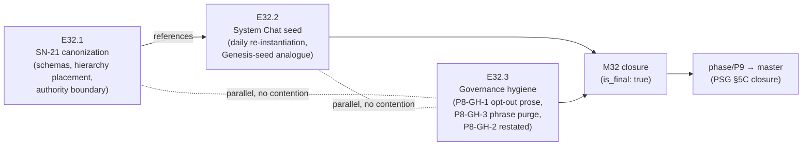

# Milestone M32 — System Participant Canonization & Governance Hygiene

## Purpose

Canonize the system-level participant ("System HQ") that has been live in the field since
2026-07-16 across all 8 governed projects on the CFO's machine — its `system_request` /
`system_response` artifact pair, its place relative to the chat hierarchy, and its authority
boundary — and pay down the two carried-forward P8 documentation debts (P8-GH-1, P8-GH-3).

This milestone ensures:
- Field practice that already works is written into governance, closing the gap between
  what the framework does and what it says.
- The system-level participant's authority boundary is normative: it executes, it never
  decides — review, merge, and scope stay human.
- The CFO has a usable, recurring System Chat re-instantiation seed.
- P8's two Medium/Low documentation carry-forwards are closed with the same
  grep-verifiable discipline M30/M31 used for their own hygiene lines.

**M32 is the third and final planned P9 milestone** (`is_final: true`). On its
consolidation, the Phase Chat proceeds directly to phase delivery (`phase/P9 → master`) via
the PSG §5C canonical closure sequence — there is no further milestone to plan.
**M32 has no dependency on M30 or M31 in either direction** — it was schedulable in
parallel throughout their execution and is only now taken up because the Phase Chat chose
this order, not because anything gated it.

---

## Binding Context (settled scope — NOT for re-debate)

Per the P9 phase spec (v1.1.0) and SN-21/SN-22 (Creation Chat, all decisions CFO-ratified),
the following apply in full and are not open for re-examination in this Milestone or any
Epic under it:

1. **Canonize now, in P9 — not observe-and-wait** (HQ triage decision). Rationale: the
   pattern is live across all 8 governed projects, the CFO has asked for a recurring
   re-instantiation seed, and it is load-bearing for SN-22's overarching goal (every
   governed project makes progress).
2. **SN-21 stands as written — no authority expansion.** The executor "System HQ" is
   confirmed as-is: it may execute within tool authority; it may never make review
   decisions, merge authorizations, or scope changes — those escalate to the human via
   `status: escalated`. The CFO's larger "mighty governing System Chat" vision is a
   **pinned vision item**, explicitly out of scope here.
3. **P8-GH-1 and P8-GH-3 are Into P9** (HQ triage table), both routed to M32 (E32.3).
   P8-GH-2 stays deferred on its recorded trigger — not scoped into P9 at all.
4. **SN-21's carry-over items stay out.** The MCP bridge write path
   (ai-project-system-mcp roadmap territory) and scheduled request-sweep/SLA cadence
   (future triage if volume grows) are explicitly not this milestone's work.

Design decisions **intentionally open** for the Milestone/Epic Chats (SN-21's own framing:
"HQ triages whether and how to canonize" the *mechanics*, not the *fact* of canonization):
- Whether the `system_request`/`system_response` schemas land inside
  `artifact-communication-protocol.md` directly or in a companion system-participant
  document (E32.1).
- Whether System HQ's hierarchy placement is a new level, an annex, or an explicitly
  out-of-hierarchy pointer (E32.1).
- The System Chat re-instantiation seed's concrete form and home (E32.2).

---

## Problem Statement

Three verified gaps, confirmed against current repository state and the SN-21 field record:

- **Field practice has outrun the written framework.** System HQ has operated since
  2026-07-16 (`~/.ai-project/SYSTEM-GOVERNANCE.md`, outside this repo) — writing
  `system_request`/`system_response` artifacts, discovered zero-cost through the existing
  read-only MCP bridge — with no schema, no hierarchy placement, and no normative authority
  statement anywhere in `governance/`. The Artifact Communication Protocol's existing
  artifact types (Delivery Notice, Review Decision) don't cover this pair.
- **No recurring seed exists for the CFO to spawn the System Chat daily**, unlike Creation
  Chat's Genesis seed. SN-21 names this explicitly as a concrete requirement, confirmed by
  the CFO.
- **Two P8 documentation debts are unresolved, both grep-verified still live:**
  - AOG §17.5 (lines ~948–953) still states this repo's `visual_artifacts.enabled: false`
    is the current state and explains why — contradicting E29.2's actual flip to
    `enabled: true` with a real passing endpoint test. `governance/guides/visual-artifacts.md`
    carries the same stale claim (line ~48's callout) plus a §6 framing (line ~360) that
    reads as if this repo is still in the skipped-test state, when the no-live-endpoint
    skip path is now something *other* contributor/CI environments hit, not this repo.
  - `docs/`-wide grep for "Phase Delivery Notice" still returns six pre-P9 planning
    documents (P5, P6 ×2, P7, P8 ×2 — the closure declaration's occurrence is the correct,
    intentional carry-forward record and stays) using the vestigial phrase PSG §5C's nine
    steps never named. P9's own documents were written clean of it from the start
    (verified: every P9 occurrence found is a *discussion* of the carry-forward item in
    quotes, never a live requirement statement) — E32.3 does not need to touch P9's own
    planning docs, only the pre-P9 ones and the templates the phrase could still propagate
    from.

---

## Goals

By the end of this milestone:

1. **`system_request`/`system_response` schemas are written into governance** — in the
   protocol or a companion document (design decision), following the protocol's existing
   frontmatter+body and immutability rules, with SN-21's storage/naming conventions
   (E32.1).
2. **The system-level participant's place relative to `chat-hierarchy.md` is decided and
   recorded** — new level, annex, or explicit out-of-hierarchy pointer (E32.1).
3. **The authority boundary is normative** — execute within tool authority, never decide;
   `status: escalated` is mandatory for review/merge/scope requests (E32.1).
4. **A System Chat re-instantiation seed exists and is usable daily** — the CFO can spawn
   System HQ from it the way Creation Chat spawns from Genesis (E32.2).
5. **P8-GH-1 is reconciled** — no governance surface describes this repo as opted out of
   `visual_artifacts` (E32.3).
6. **P8-GH-3 is reconciled** — no template or living pre-P9 planning document still uses
   the vestigial "Phase Delivery Notice" phrasing; P8-GH-2's deferred status (with its
   trigger) is preserved, not silently dropped (E32.3).

---

## Non-Goals

This milestone explicitly does **not**:

- Expand System HQ's authority beyond execute-never-decide, or move toward the CFO's
  "mighty governing System Chat" vision — that stays pinned, out of scope.
- Build the MCP bridge write path or a scheduled request-sweep/SLA mechanism (SN-21
  carry-overs — future triage, different repo's roadmap for the write path).
- Touch M30's or M31's deliverables, or re-open any of their gap records (G1–G14 plus the
  three recapture-mechanism findings) — this milestone is independent of both.
- Revisit P8-GH-2 (machine-local hosting) — it stays deferred on its recorded trigger; this
  milestone's only obligation is to restate that status, not resolve it.
- Touch P9's own planning documents for the Phase Delivery Notice purge — they were
  already written clean (verified in the Problem Statement); E32.3 targets the pre-P9 docs
  and the templates only.
- Produce Epic specs or Epic Execution Chat Starters — that is the Milestone Chat's job
  (adjacency); this spec defines epic scope, deliverables, and acceptance criteria only.

---

## In Scope

- **E32.1** — SN-21 canonization: `system_request`/`system_response` schemas; hierarchy
  placement decision; normative authority-boundary statement.
- **E32.2** — System Chat re-instantiation seed: the daily-spawn artifact, Genesis-seed
  analogue, its home decided and documented.
- **E32.3** — Governance hygiene reconciliation: P8-GH-1 (AOG §17.5 +
  `visual-artifacts.md`) and P8-GH-3 (vestigial phrase purge across pre-P9 docs and
  templates); P8-GH-2's deferred-with-trigger status restated, not resolved.

## Out of Scope

- Everything under Non-Goals; additionally: any change to the MCP bridge's read/write
  posture, any daemon/cron mechanism for request sweeps, and any edit to
  `ai-project-system-mcp` (a sibling repo, out of this repo's jurisdiction).

---

## Hard Constraints (binding — carry to every Epic under this Milestone)

1. **No authority expansion.** Every schema, hierarchy note, or seed E32.1/E32.2 produce
   must state the execute-never-decide boundary explicitly wherever System HQ's authority
   is described — silence on the boundary is not acceptable; `status: escalated` is the
   mandatory path for anything review/merge/scope-shaped.
2. **Grep-verifiable hygiene.** E32.3's acceptance is a clean grep, matching the phase
   spec's own bar: no remaining stale opt-out prose (P8-GH-1) and no remaining "Phase
   Delivery Notice" phrasing in templates/living docs outside the intentional carry-forward
   record (P8-GH-3). A partial fix that leaves one surface still wrong does not close
   either item.
3. **P8-GH-2 is restated, not resolved.** E32.3's deliverable includes confirming
   P8-GH-2's deferred status and trigger remain recorded somewhere reachable at P9 closure
   — silently dropping it is not acceptable, and neither is scoping in the hosting work
   itself.
4. **Suite green at every merge** — 363 baseline (post-M31), no regressions, no skips
   introduced to route around changes.

---

## Planned Epics

### Confirmed Epics

- **E32.1 — SN-21 canonization**
- **E32.2 — System Chat re-instantiation seed**
- **E32.3 — Governance hygiene reconciliation (P8-GH-1, P8-GH-3)**

> **Artifact scope (adjacency).** The Phase Chat produces only this Milestone spec and the
> Milestone Execution Chat Starter. The **Milestone Chat** owns final epic planning and
> authors every Epic spec and Epic Execution Chat Starter. No Phase-level Epic drafts exist.

### Deferred Epics

- None. M32 is the final milestone in P9; there is no future P9 milestone to defer work to.

---

## Epic Detail

### E32.1 — SN-21 canonization

**Source:** SN-21
(`.ai-project/artifacts/steering-notes/2026-07-16__creation-chat__steering-note__system-hq-adoption.md`);
P9 phase spec §P9.3; HQ triage decision (canonize now, in P9).

**Grounding:** System HQ has operated in the field since 2026-07-16 across all 8 governed
projects, discovered zero-cost via the existing read-only MCP bridge
(`list_governance_state` indexes artifact directories by name). Two artifact types are
already in use — `system_request` (project → system,
`.ai-project/artifacts/system-requests/`) and `system_response` (system → project,
`.ai-project/artifacts/system-responses/`) — following the protocol's existing
frontmatter+body, ISO-8601 UTC timestamp, and immutability rules, with `status: pending |
in_progress | done | declined | escalated`.

**Design decisions for the Milestone/Epic Chat** (SN-21 leaves both open):
- Schema home: inside `artifact-communication-protocol.md`'s existing `## Artifact Types`
  section (as a new numbered type alongside Delivery Notice and Review Decision) or a
  companion system-participant document, cross-referenced from the protocol.
- Hierarchy placement: `chat-hierarchy.md` currently tops out at Level 0 (Creation Chat)
  *within* a project; System HQ is orthogonal — one desk per *machine*, spanning every
  governed project on it. Candidate directions: a clearly-marked out-of-hierarchy annex
  with a pointer (SN-21's own framing: "closest in spirit to Layer-8/CFO support staff");
  or a new, explicitly-orthogonal level. Whichever direction, it must not be read as
  slotting System HQ *into* the four-level per-project chain (Levels 0–4) — it sits above
  and across, not inside.

**Deliverables:**
1. `system_request`/`system_response` schemas recorded in the decided home, with SN-21's
   storage/naming conventions and status vocabulary.
2. The hierarchy-placement decision recorded in `chat-hierarchy.md` (even if the answer is
   "explicitly out-of-hierarchy, see [pointer]" — the pointer itself is the deliverable).
3. A normative authority-boundary statement: system agents execute within tool authority;
   review decisions, merge authorizations, and scope changes escalate to the human;
   `status: escalated` is mandatory for those. This statement must be locatable from both
   the schema home and the hierarchy-placement location (Hard Constraint 1).

**Definition of Done:**
- [ ] Both artifact-type schemas exist in governance, matching field usage
- [ ] Hierarchy placement recorded, with System HQ's orthogonal (not per-project-level)
      nature unambiguous
- [ ] Authority boundary stated normatively and locatable from both surfaces
- [ ] Full test suite passes (363 baseline, no new skips)

**Acceptance Criteria:**
- [ ] A reader can find, from either the protocol or the hierarchy doc, what
      `system_request`/`system_response` are, where System HQ sits, and what it may never
      do without cross-referencing SN-21 itself

**Sequencing:** recommended first — E32.2's seed references the canonized schema/authority
language this epic produces.

---

### E32.2 — System Chat re-instantiation seed

**Source:** SN-21 Required Action 4; P9 phase spec §P9.3; SN-22 (CFO input, daily
re-instantiation seed named as a concrete requirement).

**Grounding:** Creation Chat has `governance/templates/genesis.md` /
`governance/templates/seed.md` as its bootstrap/re-instantiation pattern (both already
touched once this phase, by E31.3, for the manual-mode guardrail instruction — E32.2 must
preserve that). System HQ has no analogous artifact; the CFO currently has no recorded,
repeatable way to spawn it daily.

**Design decision for the Milestone/Epic Chat:** the seed's concrete form and home —
options include a dedicated template under `governance/templates/` (mirroring
genesis.md/seed.md's pattern) or a system-tier document outside the per-project template
set, given System HQ is explicitly not a per-project chat. Document the choice and why.

**Deliverables:**
1. A System Chat re-instantiation seed artifact — usable by the CFO to spawn System HQ
   recurrently (SN-21: "ideally daily"), analogous in spirit to Genesis/seed but reflecting
   System HQ's cross-project, execute-never-decide identity.
2. The seed references E32.1's canonized authority boundary and schema home rather than
   restating them divergently (single source of truth).
3. Confirmation that the seed's own instructions do not grant System HQ any review/merge/
   scope authority — consistent with Hard Constraint 1.

**Definition of Done:**
- [ ] The seed artifact exists, documented, and usable as a repeatable re-instantiation
      prompt
- [ ] It cross-references E32.1's canonized material rather than duplicating it
- [ ] Full test suite passes (363 baseline, no new skips)

**Acceptance Criteria:**
- [ ] The CFO can use the seed to spawn System HQ without consulting SN-21 directly —
      the seed alone is sufficient

**Dependency:** benefits from E32.1 landing first (references its canonized schema/
authority language), but the Milestone Chat may parallelize if it finds no actual content
contention — record the call either way.

---

### E32.3 — Governance hygiene reconciliation (P8-GH-1, P8-GH-3)

**Source:** P8 phase closure declaration Carry-Forward table; P9 phase spec §P9.3; HQ
triage (both Into P9, routed to M32).

**Grounding — P8-GH-1 (Medium), confirmed still live at M32 planning time:**
- `governance/AI-OPERATING-GUIDELINES.md` §17.5 (~lines 948–953): "It stays opted out
  because `bin/ai-project-visual`'s `--type diagrams` is a ComfyUI-generative call in the
  current implementation... enabling the capability here would require a live endpoint the
  suite doesn't [have]" — contradicts `.ai-project.yml`'s actual `enabled: true` since
  E29.2, with a real passing `test_helper_generates_against_endpoint`.
- `governance/guides/visual-artifacts.md` line ~48's callout: "the governance **source**
  repository's `enabled: false` is one instance of that universal rule" — same stale claim.
- `governance/guides/visual-artifacts.md` §6 (~line 360): describes the endpoint test as
  skipping "when `visual_artifacts.enabled` is `false`" in a way that reads as this repo's
  current behavior; needs reframing so it's clear this repo now runs the test for real,
  while the skip path remains correctly documented for *other* contributor/CI environments
  without a live endpoint (E29.2's own no-live-endpoint decision, not something to remove).

**Grounding — P8-GH-3 (Low), confirmed still live at M32 planning time:** `docs/`-wide grep
for "Phase Delivery Notice" returns six pre-P9 documents (P5-M22 milestone spec; P6 phase
starter + P6-M25 milestone spec; P7-M28 milestone spec; P8 phase starter + P8-M29 milestone
spec) using the phrase as if it names a real deliverable. The P8 phase closure
declaration's own occurrence is the intentional carry-forward record and must be preserved,
not purged. **P9's own documents need no edit** — verified clean at planning time (every
occurrence in P9 docs is a discussion of the carry-forward item in quotes).

**Deliverables:**
1. AOG §17.5 updated to state the current, accurate status (`enabled: true`, real passing
   endpoint test since E29.2) — remove the "stays opted out because" framing entirely.
2. `governance/guides/visual-artifacts.md` line ~48's callout and §6 both updated to match
   current reality for this repo, while preserving §6's still-accurate general guidance for
   *other* projects/environments without a live endpoint.
3. Every pre-P9 living document (the six identified above) and any template still carrying
   copy-paste risk, purged of "Phase Delivery Notice" phrasing — except the P8 phase
   closure declaration's carry-forward table entry, which stays verbatim as the historical
   record.
4. A one-line restatement, somewhere reachable from this milestone's own closure record,
   that P8-GH-2 (machine-local hosting) remains deferred with its recorded trigger —
   confirming it, not resolving it (Hard Constraint 3).

**Definition of Done:**
- [ ] `grep` for the P8-GH-1 stale-opt-out framing across `governance/` returns nothing
- [ ] `grep` for "Phase Delivery Notice" across `docs/`/`governance/templates/` returns
      only the P8 closure declaration's intentional carry-forward record
- [ ] P8-GH-2's deferred status + trigger is restated and locatable
- [ ] Full test suite passes (363 baseline, no new skips)

**Acceptance Criteria:**
- [ ] Both grep checks named in the phase spec's own acceptance criteria pass cleanly
- [ ] No historical record (P8's closure declaration) is altered in the course of the purge

**Dependency:** none on E32.1/E32.2 — may run in parallel with either; the Milestone Chat
decides ordering.

---

## Branch Strategy

```
master
└── phase/P9                      (long-lived PR #134 → master; merges at §5C closure)
    └── milestone/M32              ← this milestone (Milestone Chat branches from phase/P9)
        ├── epic/P9-M32-E32.1      ← SN-21 canonization
        ├── epic/P9-M32-E32.2      ← System Chat re-instantiation seed
        └── epic/P9-M32-E32.3      ← governance hygiene reconciliation
```

Epic PRs target `milestone/M32`. Consolidation PR: `milestone/M32 → phase/P9`. **M32 is the
final and only remaining P9 milestone** (`is_final: true`). On its consolidation, the Phase
Chat proceeds directly to **phase delivery** (`phase/P9 → master`) via the PSG §5C canonical
closure sequence (README update + version bump + tag + Phase Closure Declaration) — no
further milestone to plan.

---

## Prerequisites

- This Milestone spec and its Milestone Execution Chat Starter git-tracked on `phase/P9`
  (verify with `git ls-files --error-unmatch <path>` on `phase/P9` — the GH-1 convention).
- M32 targets present and git-tracked on `phase/P9`:
  - `governance/systems/artifact-communication-protocol.md` (v1.3.0 at planning time —
    schema addition target)
  - `governance/systems/chat-hierarchy.md` (hierarchy-placement target; already carries
    M31's Execution Mode section and manual-guardrail additions — E32.1 must not disturb
    them)
  - `governance/templates/genesis.md` / `governance/templates/seed.md` (System Chat seed
    reference pattern; already carry E31.3's guardrail instruction — E32.2 must preserve
    it)
  - `governance/AI-OPERATING-GUIDELINES.md` §17.5 and `governance/guides/
    visual-artifacts.md` (P8-GH-1 edit targets)
  - The six pre-P9 documents named in E32.3's grounding (P8-GH-3 edit targets) and the P8
    phase closure declaration (preserve, do not edit)
- Reference: SN-21
  (`.ai-project/artifacts/steering-notes/2026-07-16__creation-chat__steering-note__system-hq-adoption.md`);
  `~/.ai-project/SYSTEM-GOVERNANCE.md` (outside this repo — the field adoption record,
  informative context only, not an edit target).
- **External dependency:** none — this milestone is documentation/schema work with no live
  endpoint or paid-token measurement dependency.

---

## Dependencies and Sequencing

- **E32.1 recommended before E32.2** (soft — E32.2's seed cross-references E32.1's
  canonized material; the Milestone Chat may parallelize if no actual contention exists).
- **E32.3 has no dependency on E32.1 or E32.2** — may run in parallel with either.
- **No dependency on M30 or M31** in either direction.
- Priority order: E32.1 → E32.2, with E32.3 schedulable anywhere including fully parallel
  to both — the Milestone Chat owns final sequencing given the near-total surface
  disjointness (E32.1/E32.2 touch protocol/hierarchy/templates for the system participant;
  E32.3 touches AOG/visual-artifacts.md/pre-P9 docs).

---

## Definition of Done (Milestone)

- [ ] E32.1, E32.2, and E32.3 each meet their Definition of Done above
- [ ] All three epic branches merged to `milestone/M32`
- [ ] `system_request`/`system_response` schemas, hierarchy placement, and the normative
      authority boundary all exist and agree with each other
- [ ] The System Chat re-instantiation seed exists and is usable
- [ ] Both P8-GH-1 and P8-GH-3 grep checks pass cleanly; P8-GH-2's deferred status is
      restated
- [ ] Full test suite passes on `milestone/M32` (363 baseline, no regressions, no new
      skips)
- [ ] Milestone Closure Declaration produced (`is_final: true` — triggers phase delivery)

---

## Acceptance Criteria (Milestone)

1. `system_request`/`system_response` schemas are in the protocol (or companion doc), the
   hierarchy placement is recorded, and the System Chat re-instantiation seed is usable
   daily (E32.1, E32.2 — phase acceptance criterion, verbatim).
2. Grep-level checks show no remaining stale opt-out prose (P8-GH-1) and no remaining
   "Phase Delivery Notice" phrasing in templates/living docs outside the intentional
   carry-forward record (P8-GH-3 — phase acceptance criterion, verbatim).
3. No authority expansion anywhere in the delivered material — execute-never-decide is
   explicit at every surface that describes System HQ (Hard Constraint 1).
4. P8-GH-2 remains recorded as deferred with its trigger, not silently dropped (Hard
   Constraint 3).
5. The full suite is green at milestone delivery with no regressions and no new skips.

---

## Timeline

**Target Start:** 2026-07-20
**Target Completion:** 2026-07-25 (3–5 days per phase spec estimate; 3 epics, near-total
surface disjointness, minimal dependency chain)
**Actual Start:** Not started
**Actual Completion:** Not started

---

## Visual Bindings

**Visual binding**
- **Link:** (inline — Structural diagram; no hosted link needed per AOG §17.3/§17.5)
- **What:** diagram
- **Level:** Milestone
- **State:** proposed



- **Description:** M32's flow — canonize the system participant and its seed as one
  reference-linked pair, with governance hygiene running independently in parallel since
  its surfaces don't overlap. M32's closure is the final P9 milestone gate before phase
  delivery. Proposed-track Structural diagram (AOG §17.3/§17.6).

---

## Notes

- **M32 closes P9.** `is_final: true` — its Milestone Closure Declaration is what the Phase
  Chat's next action (the PSG §5C closure sequence) depends on. Frame the closure
  declaration accordingly: it should restate P8-GH-2's deferred status and the ComfyUI
  non-blocking track's status (phase acceptance criteria items 7–8), even though neither
  is M32's own work — the phase spec requires the *phase* closure declaration to carry
  them, and M32's declaration is the natural place to confirm they were never dropped along
  the way.
- **Field practice, not invention.** E32.1/E32.2 write down what already runs — SN-21's own
  framing is "the framework has a working extension point it never named." Resist the urge
  to redesign System HQ's behavior while canonizing it; the milestone's job is documentation
  and schema-writing, not a new authority model.
- **The open design decisions are open on purpose** (SN-21 leaves both the schema home and
  the hierarchy placement to HQ/Milestone-Chat triage) — pick, document, proceed; not
  blockers to escalate (Phase Execution Chat Starter, Question Policy).
- **E32.3 is genuinely independent** — do not let its low priority cause it to be
  deprioritized into never landing; the phase's own acceptance criteria require both grep
  checks to pass before P9 can close.
- Reference-first applies to this milestone's own workflow (AOG §3.1.1 v2.10.0, E30.4): all
  deliveries by reference, producer no-echo, consumer selective-read.
- Default-accept (PSG §11.6 / AOG §14) governs this milestone's delivery: clean deliveries
  accepted by silence; Review Decision is the exception path. Per SN-19, acceptance and
  merge instruction are in-chat acts; the harness enforces explicit human authorization on
  every merge regardless.
