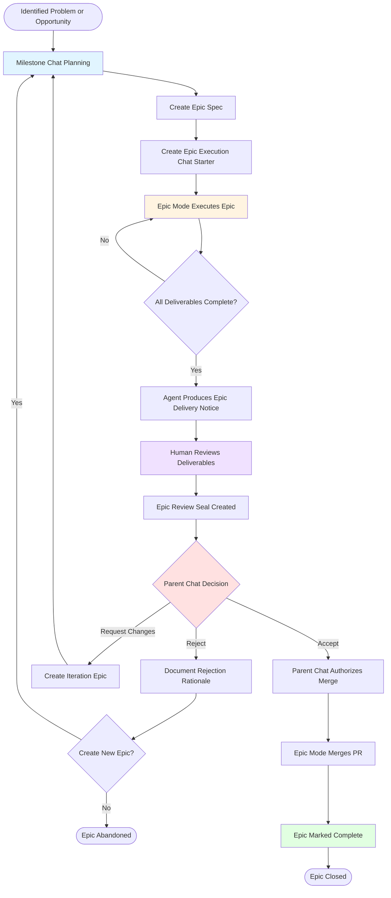

# Epic Lifecycle Flow

This diagram shows the complete lifecycle of an Epic in the AI Project System, from initial ideation through closure.

## Where This Fits

The Epic lifecycle is the fourth and most granular level of the planning cascade. Before an Epic is planned, the following must already exist:

```
HQ Chat ──→ Phase spec + Phase Execution Chat Starter
               │
               ▼
          Phase Chat ──→ Milestone spec + Milestone Execution Chat Starter
                            │
                            ▼
                       Milestone Chat ──→ Epic spec + Epic Execution Chat Starter  ←─ YOU ARE HERE
                                               │
                                               ▼
                                          Epic mode executes
```

Each level is planned by its parent and accepted before the next begins. This diagram focuses on the Epic level — steps 4-6 of the full cascade.

---

## Lifecycle Stages



---

## Key Stages Explained

### **1. Planning (Milestone Chat)**
- Milestone Chat reviews the Milestone spec
- Creates Epic Spec defining goals, deliverables, DoD
- Creates Epic Execution Chat Starter with execution instructions

### **2. Execution (Epic Mode)**
- Agent receives Chat Starter
- Executes work according to Epic Spec
- Creates all required deliverables
- Self-validates against Definition of Done

### **3. Delivery (Epic Mode)**
- Agent produces Epic Delivery Notice (chat message, not committed)
- Summarizes work, lists deliverables, confirms DoD completion
- Opens PR and **stops** (does not merge)

### **4. Review (Human)**
- Human reviews all deliverables
- Tests functionality
- Validates against acceptance criteria
- Creates Epic Review Seal documenting findings

### **5. Decision (Parent Chat)**
Evaluated by Milestone Chat (or Phase Chat / HQ during bootstrap).
Three possible outcomes:
- **Accept:** Work meets requirements → proceed to authorization
- **Reject:** Work fundamentally flawed → create new Epic or abandon
- **Request Changes:** Work needs iteration → create iteration Epic

### **6. Authorization & Closure (Parent Chat + Epic Mode)**
- Parent chat authorizes merge (explicit instruction required)
- Epic mode merges PR
- Epic marked complete
- Agent **stops immediately** after merge

---

## Critical Decision Points

### Decision Point 1: Agent Self-Check
**Question:** "Are all deliverables complete per the Definition of Done?"

- **No:** Continue execution
- **Yes:** Produce Delivery Notice and stop

### Decision Point 2: HQ Acceptance
**Question:** "Does this work meet the Epic's goals and acceptance criteria?"

- **Accept:** Authorize merge → Epic closes
- **Reject:** Document rationale → create new Epic or abandon
- **Request Changes:** Define iteration scope → create iteration Epic

---

## Who Does What

| Stage | Responsible Party | Authority Level |
|-------|------------------|-----------------|
| Planning | Milestone Chat | Creates Epic Spec and Chat Starter |
| Execution | Epic mode | Executes according to spec |
| Delivery Notice | Epic mode | Documents completion |
| Review | Human | Evaluates deliverables |
| Review Seal | Human | Documents findings |
| Decision | Parent chat (Milestone/Phase/HQ) | Accept/Reject/Iterate |
| Authorization | Parent chat | Explicit merge approval |
| Merge | Epic mode | Executes authorized merge |

---

## Canonical Happy Path

The ideal flow is:

1. Milestone Chat creates Epic Spec
2. Milestone Chat creates Epic Execution Chat Starter
3. Epic mode executes Epic
4. Epic mode produces Delivery Notice
5. Human reviews
6. Parent chat accepts
7. Parent chat authorizes merge
8. Epic mode merges PR
9. Epic closed

**Epic mode stops at step 4 and awaits parent chat instruction.**

---

## Common Variations

### Fast Iteration Loop
If minor changes needed:
- Parent chat may provide inline correction instructions
- Epic mode makes changes, updates Delivery Notice
- Review cycle repeats

### Rejection with Pivot
If Epic fundamentally misaligned:
- Parent chat rejects with rationale
- Milestone Chat creates new Epic with revised goals
- Original Epic closed without merge

### Multi-Phase Review
For complex Epics:
- Human may request intermediate reviews
- Epic mode produces draft deliverables
- Parent chat provides feedback before final delivery

---

## References

- [AI-OPERATING-GUIDELINES.md](../AI-OPERATING-GUIDELINES.md) — Canonical happy path definition
- [PROJECT-SYSTEM-GUIDELINES.md](../PROJECT-SYSTEM-GUIDELINES.md) — Epic structure and governance
- [Epic Execution Chat Starter Template](../templates/epic-execution-chat-starter.md) — Execution instructions format
- [Epic Review Seal Template](../templates/epic-review-seal.md) — Review documentation format
