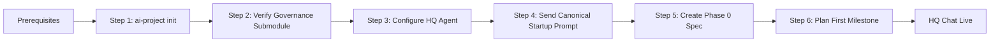

# Adoption Guide: AI Project System

**Get your project from zero to HQ Chat live in under 30 minutes.**

> **Starting an existing project?** This guide covers greenfield projects initialized with `ai-project init`.
> If you already have a project with code and history, use the
> [Legacy Migration Guide](legacy-project-migration.md) instead — it provides
> workflows for adding governance to existing repositories without disruption.

---

## Overview

This guide walks you through adopting the AI Project System governance framework for a new project. By the end, you will have a fully scaffolded project with an active Governance Agent ready to help you plan and execute work.

**Time budget:** 25–30 minutes total.

### Adoption Sequence



If Mermaid is not rendered, here is the ASCII equivalent:

```
┌────────────────────────────────────────────┐
│           PREREQUISITES                     │
│  git, repository host, AI chat, CLI        │
└────────────────┬───────────────────────────┘
                 ▼
        ┌──────────────────┐
        │ Step 1           │
        │ ai-project init  │  (3 min)
        └────────┬─────────┘
                 ▼
        ┌──────────────────┐
        │ Step 2           │
        │ Verify Submodule │  (2 min)
        └────────┬─────────┘
                 ▼
        ┌──────────────────┐
        │ Step 3           │
        │ Configure Agent  │  (3 min)
        └────────┬─────────┘
                 ▼
        ┌──────────────────┐
        │ Step 4           │
        │ Startup Prompt   │  (2 min)
        └────────┬─────────┘
                 ▼
        ┌──────────────────┐
        │ Step 5           │
        │ Phase 0 Spec     │  (10 min)
        └────────┬─────────┘
                 ▼
        ┌──────────────────┐
        │ Step 6           │
        │ Plan Milestone   │  (5 min)
        └────────┬─────────┘
                 ▼
        ┌──────────────────────────────┐
        │   ✅ HQ CHAT LIVE            │
        │   Governance framework       │
        │   is operational             │
        └──────────────────────────────┘
```

---

## Prerequisites

Before starting, ensure you have:

| Item | Required | Check |
|------|----------|-------|
| **Git** (v2.30+) | Yes | `git --version` |
| **Code repository host** (GitHub, GitLab, etc.) | Yes | Repository created and accessible |
| **AI chat tool** with custom agent/file context support | Yes | Supports agent instructions via markdown |
| **`ai-project` CLI** | Yes | See installation below |
| **Node.js** (v18+, for CLI) | Yes | `node --version` |

### Install the `ai-project` CLI

The CLI is available via npm (`@panchew/ai-project`) or as a local script in the governance source repository.

#### Option A: Install from npm (preferred)

```bash
npm install -g @panchew/ai-project
```

Verify installation:

```bash
ai-project --version
```

Expected output:
```
ai-project v1.0.0
```

> **Troubleshooting:** If `npm install -g` fails due to permissions, use `npx @panchew/ai-project init` instead, or install with `sudo npm install -g @panchew/ai-project` (Unix/Mac).

#### Option B: Use the local script directly

If the npm package is unavailable, the CLI script is available in the governance source:

```bash
# Clone the governance source and use the script directly
git clone https://github.com/panchew/ai-project-system /tmp/ai-project-system
/tmp/ai-project-system/bin/ai-project-init init my-project
```

Or reference it after adding the governance submodule:

```bash
./governance/bin/ai-project-init init my-project
```

### Node.js Version Management

The `ai-project` CLI requires **Node.js v18+**. If your system has an older version:

- **Recommended:** Use [nvm](https://github.com/nvm-sh/nvm) to install and manage Node.js versions:
  ```bash
  nvm install 18
  nvm use 18
  ```
- **Alternative:** Governance itself is language-agnostic. If you cannot upgrade Node.js, skip the CLI and use the manual setup steps below.

---

## Step 1: Initialize Your Project

**Time:** ~3 minutes

> **If you already have an existing project** (with code, history, and data),
> skip this step and follow the [Legacy Migration Guide](legacy-project-migration.md)
> instead. That guide provides a "Governance Install" workflow for adding governance
> without disrupting existing content.

Run the CLI to scaffold a new project with governance:

```bash
ai-project init my-project
```

The CLI will prompt for:

1. **Project name** (slug format, e.g., `my-awesome-app`)
2. **Project description** (short, one line)
3. **Governance source URL** (default: `https://github.com/panchew/ai-project-system`)

Provide the values and confirm. The CLI output will show:

```
✅ Created .ai-project.yml
✅ Created docs/phases/
✅ Created .github/agents/governance.agent.md
✅ Created governance submodule at .governance/
✅ Project initialized successfully
```

### Verification Check

```bash
ls -la .ai-project.yml .governance/
```

Expected: `.ai-project.yml` exists at root; `.governance/` is a populated directory (not empty).

### Troubleshooting

> **If `ai-project init` is not found:** The CLI may not be installed globally. Run `npx @panchew/ai-project init my-project` instead.
>
> **If `git submodule` fails:** Ensure your Git credentials are configured (`git config --global user.name` and `user.email`).

---

## Step 2: Verify Governance Submodule

**Time:** ~2 minutes

Confirm the governance submodule is at the correct version.

### Check Submodule Status

```bash
git submodule status
```

Expected output (a leading space indicates initialized, `-` indicates uninitialized):

```
 v3.0.0 governance
```

The commit SHA should match the governance tag `v3.0.0`.

> **Note on submodule paths:** The CLI may create the submodule at `governance/`
> or `.governance/` depending on the version. Both paths are valid — verify
> against what your `.ai-project.yml` expects. Check the configured path with
> `git config --file .gitmodules --get submodule.governance.path`.

### Verify Governance Files Are Accessible

```bash
ls .governance/governance/PROJECT-SYSTEM-GUIDELINES.md .governance/governance/AI-OPERATING-GUIDELINES.md
```

Expected: Both files exist and are readable.

### Check `.ai-project.yml` Governance Version

```yaml
# .ai-project.yml
governance:
  source: https://github.com/panchew/ai-project-system
  version: "3.0.0"
  ref: v3.0.0
```

```bash
cat .ai-project.yml
```

Expected: `governance.ref` matches the checked-out commit in `.governance/`.

### Verification Check

```bash
cd governance && git log --oneline -1 && cd ..
```

Expected output:
```
<sha> (HEAD -> v3.0.0, tag: v3.0.0) Release v3.0.0
```

> **Note:** If the git tag `v3.0.0` does not exist in the governance source repository,
> the submodule may default to `master` or an older tag. In that case, use the branch
> `milestone/M10` or `develop` as the ref instead, and update `.ai-project.yml` accordingly.

> **Troubleshooting:** If `governance/` is empty, run `git submodule update --init --recursive`. If the version is wrong, see the [FAQ](ADOPTION-FAQ.md#governance-submodule-issues).

---

## Step 3: Configure HQ Agent

**Time:** ~3 minutes

### 3.1 Install the Governance Agent

The `ai-project init` command may create an older `hq.agent.md`. Replace it with the unified Governance Agent:

```bash
mkdir -p .github/agents
cp governance/agents/governance.agent.md .github/agents/governance.agent.md
# Remove old separate agent file if present
rm -f .github/agents/hq.agent.md
```

Verify the file exists:

```bash
cat .github/agents/governance.agent.md
```

Expected: YAML front-matter and agent definition describing all four modes.

> **Note for governance source repositories:** If your project IS the governance source
> (e.g., `ai-project-system` itself), governance is at `./governance` locally rather than
> as a submodule. Use `cp ./governance/agents/governance.agent.md .github/agents/governance.agent.md`
> instead of the submodule path.

### 3.2 Register the Agent in Your AI Tool

- **VS Code + GitHub Copilot:** Detects `.github/agents/*.agent.md` automatically. Select **"hq"** from the agent selector (`Ctrl+Shift+P` → "GitHub Copilot: Select Agent"). The single agent handles all four modes.
- **Other IDEs / chat tools:** Consult your tool's documentation for registering custom agent instructions. The key requirement is that the tool makes the full contents of the agent file and the governance directory available as context.
- **Manual / copy-paste:** If your tool does not support agent files, open `governance.agent.md` and copy the entire file contents into a new chat session.

### Verification Check

Your AI chat tool is configured with the Governance Agent.

> **Troubleshooting:** If the agent instructions are not available, ensure `.github/agents/governance.agent.md` exists with correct YAML front-matter and that your tool is referencing it. See [FAQ: Governance Agent Not Appearing](ADOPTION-FAQ.md#3-governance-agent-not-appearing).

---

## Step 4: Send Canonical Startup Prompt

**Time:** ~2 minutes

With the **Governance Agent** active, send one of these prompts to activate **HQ mode**:

**For a new project:**
```
I'm starting a new project using the AI Project System governance framework.
Initialize HQ Chat for my-project and help me create a Phase 0 project formalization.
```

**For an existing project (adoption):**
```
I want to adopt the AI Project System governance framework for my existing project at [repository-path].
Initialize HQ Chat for this project, help me assess what's needed for adoption, and create a migration plan.
```

The agent (in HQ mode) will:

1. Read `.ai-project.yml` to discover governance source and version
2. Load governance files from `.governance/`
3. Confirm governance is valid
4. Propose a plan for Phase 0 creation (new project) or a migration plan (existing project)

### Verification Check

The agent responds with a confirmation that governance was loaded successfully, and proposes next steps.

> **Troubleshooting:** If the agent does not respond or reports missing governance, verify Step 2 (submodule) and Step 3 (agent selection). The agent will provide recovery guidance if `.ai-project.yml` is missing or invalid.

---

## Step 5: Create Phase 0 Spec

**Time:** ~10 minutes

Follow the Governance Agent's guidance (in HQ mode) to create a Phase 0 spec. The agent will typically ask:

- What is the project's purpose?
- What are the major phases (Phase 0 is the project formalization)?
- What milestones are expected in Phase 0?

Answer these questions in natural language. The Governance Agent (in HQ mode) will produce:

- `docs/phases/P0__phase__project-formalization.md` — Phase 0 spec
- A Milestone M1 spec outline

### Example Phase 0 Front-Matter

```yaml
---
project: my-project
phase: P0
milestone: null
epic: null
type: phase
status: planned
last_updated: 2026-05-21
---
```

### Verification Check

```bash
ls docs/phases/
```

Expected: `docs/phases/` contains at least one Phase spec file.

> **Troubleshooting:** If the agent is unable to write files, ensure it has the correct write permissions. The Governance Agent writes only to its allowed scope per mode (e.g., HQ mode writes to `docs/`). Files can also be created manually from templates at `.governance/governance/templates/`.

---

## Step 6: Plan First Milestone

**Time:** ~5 minutes

After Phase 0 is created, ask the Governance Agent (still in HQ mode):

```
Let's plan Milestone M1 for Phase 0. What Epics should we include?
```

The agent will:

1. Review the Phase 0 spec
2. Propose 2–4 Epics for the first milestone
3. Help refine Epic descriptions, goals, and deliverables
4. Create a Milestone spec at `docs/phases/P0__Project_Formalization/P0-M1__milestone.md`
5. Optionally draft the first Epic Execution Chat Starter

### Example Milestone Front-Matter

```yaml
---
project: my-project
phase: P0
milestone: M1
type: milestone
status: planned
last_updated: 2026-05-21
---
```

### Verification Check

```bash
ls docs/phases/P0__Project_Formalization/
```

Expected: Milestone spec file `P0-M1__milestone.md` exists.

---

## What's Next

Your HQ Chat is now live and your project is running under the AI Project System governance framework.

### Next Steps

1. **Execute your first Epic** — Create an Epic spec and a Chat Starter, then launch a Coding Agent to execute
2. **Review the troubleshooting FAQ** — [ADOPTION-FAQ.md](ADOPTION-FAQ.md) covers common issues
3. **Read the governance documents** — [PROJECT-SYSTEM-GUIDELINES.md](../PROJECT-SYSTEM-GUIDELINES.md) and [AI-OPERATING-GUIDELINES.md](../AI-OPERATING-GUIDELINES.md)
4. **Browse the guides index** — [README.md](README.md) for the complete guide directory
5. **Explore templates** — [governance/templates/](../templates/) for spec templates and chat starters

### Related Resources

| Resource | Location |
|----------|----------|
| Governance Guidelines | `governance/PROJECT-SYSTEM-GUIDELINES.md` |
| Operating Guidelines | `governance/AI-OPERATING-GUIDELINES.md` |
| `.ai-project.yml` Spec | `governance/ai-project-yml-spec.md` |
| Submodule Setup Guide | `governance/submodule-setup.md` |
| Troubleshooting FAQ | [ADOPTION-FAQ.md](ADOPTION-FAQ.md) |
| Legacy Migration Guide | [legacy-project-migration.md](legacy-project-migration.md) |
| Quick Start (older) | [QUICK-START.md](QUICK-START.md) |

---

## Appendix: Quick Reference

### Common Commands

```bash
# Initialize project
ai-project init my-project
ai-project init my-project --dir ~/projects  # specify target directory

# Verify governance submodule
git submodule status
git submodule update --init --recursive

# Verify governance files (path depends on CLI version)
ls governance/governance/          # new path
ls .governance/governance/         # legacy path (older CLI versions)

# Install Governance Agent manually (if not done by CLI)
mkdir -p .github/agents
cp governance/agents/governance.agent.md .github/agents/governance.agent.md
```

### File Locations

| Artifact | Path |
|----------|------|
| Project config | `.ai-project.yml` |
| Governance submodule | `governance/` (or `.governance/` in older versions) |
| Governance Agent definition | `.github/agents/governance.agent.md` |
| Governance guidelines | `governance/governance/PROJECT-SYSTEM-GUIDELINES.md` |
| Operating guidelines | `governance/governance/AI-OPERATING-GUIDELINES.md` |
| CLI script (local) | `governance/bin/ai-project-init` |
| Phase specs | `docs/phases/*/` |
| Milestone specs | `docs/phases/*/P*-M*__milestone.md` |
| Epic specs | `docs/phases/*/P*-M*-E*__spec__*.md` |
