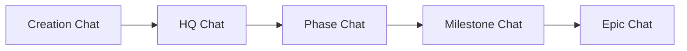
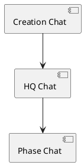
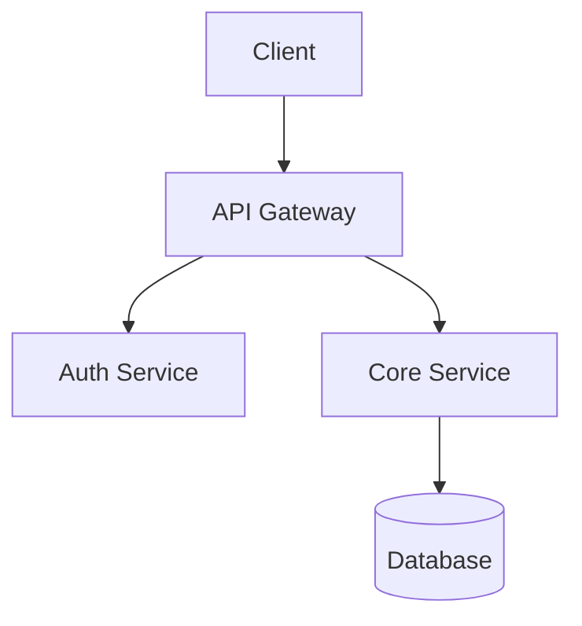
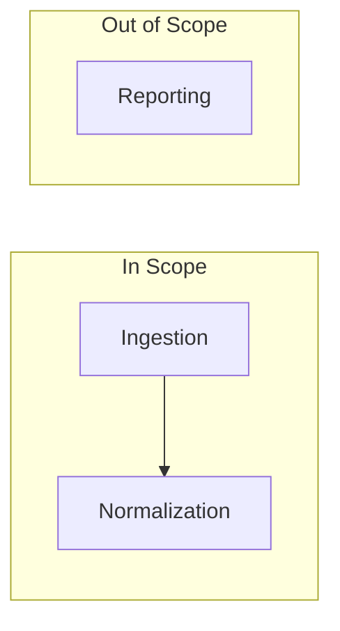
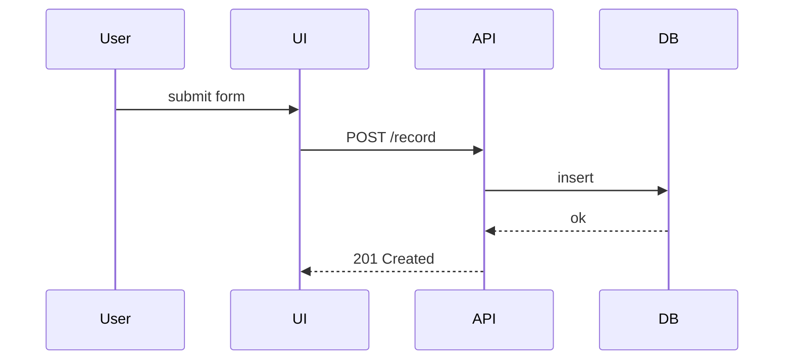

# Visual Artifacts — Integration Guide

Visual artifacts let each chat level produce an image, diagram, or video appropriate to its level of
abstraction. The capability is **opt-in** and **off by default**: nothing is generated unless a
project enables it. This guide covers enabling the capability, the two production modes, the
`bin/ai-project-visual` helper, output formats, and a worked example for every chat level.

| | |
|---|---|
| **Audience** | Adopters enabling visual generation; tool-capable agents producing visuals |
| **Configuration spec** | [`../ai-project-yml-spec.md`](../ai-project-yml-spec.md) §3.5 |
| **Operating policy** | [`../AI-OPERATING-GUIDELINES.md`](../AI-OPERATING-GUIDELINES.md) §16 |
| **Helper** | [`../../bin/ai-project-visual`](../../bin/ai-project-visual) |

---

## 1. Enabling the capability

Add a `visual_artifacts` block to your project's `.ai-project.yml`:

```yaml
visual_artifacts:
  enabled: true                       # opt-in; absent or false ⇒ disabled
  comfyui_url: http://localhost:8188  # your ComfyUI endpoint (http/https)
  types:                              # subset of the allowed types
    - diagrams
    - infographics
    - video
```

- **`enabled`** (bool) — the master switch. Absent block or `false` means the capability is off and
  the helper exits with a clear "disabled" message.
- **`comfyui_url`** (URL) — a well-formed `http(s)` endpoint for a reachable ComfyUI instance.
  Standing up that endpoint is the **CFO's** responsibility, not the framework's.
- **`types`** (list) — any subset of `diagrams`, `infographics`, `video`. The helper refuses a
  `--type` that is not listed.

The full schema, defaults, and validation rules live in
[`ai-project-yml-spec.md`](../ai-project-yml-spec.md) §3.5. The block is read through a single source
— `bin/ai-project-orchestrator`'s `load_yml_config()` / `resolve_visual_artifacts()` — so the helper,
the orchestrator, and the tests never disagree about the effective config.

> **No** project commits generated binaries — the governance **source** repository's `enabled: false`
> is one instance of that universal rule. It ships the guidance, the helper, and the test — not
> generated output — and its test suite stays green without a live endpoint.

---

## 2. The two modes

### Structural (Mermaid / PlantUML)

Diagrams expressed as **text**, committed alongside the artifact they illustrate. No endpoint and no
tool capability beyond writing a fenced code block are required. Prefer structural mode for
architecture, scope, component, and flow diagrams — anything whose meaning is its structure.

````markdown

````

PlantUML is equally acceptable where your renderer supports it:



Commit structural diagrams **inline** in the governing artifact, or as a sibling `.mmd` / `.puml`
file next to it.

### Generative (ComfyUI)

Imagery or video produced from a natural-language prompt via the configured ComfyUI endpoint, using
the `bin/ai-project-visual` helper. Prefer generative mode for concept/vision imagery, infographics,
and UI mockups — anything where a rendered image communicates better than a diagram.

---

## 3. The `bin/ai-project-visual` helper

A minimal, callable **prompt → artifact** path for any tool-capable agent. One prompt, one artifact:
no queue, no batch, no UI.

```
ai-project-visual --prompt "<text>" --type <type> --output <path> [--workflow graph.json]
                  [--checkpoint NAME] [--width N] [--height N] [--seed N] [--timeout S]
```

| Flag | Meaning |
|------|---------|
| `--prompt` (required) | Natural-language prompt for the visual. |
| `--type` (required) | One of the configured `visual_artifacts.types`. |
| `--output` (required) | Local working file to write the artifact to, then host and link — not a committed path (parent dirs are created). |
| `--workflow` | A ComfyUI **API-format** workflow JSON. Required for non-image types (e.g. `video`). The literal token `%prompt%` in the file is replaced with `--prompt`. |
| `--checkpoint` | Checkpoint name for the built-in text-to-image workflow (must exist on the server). |
| `--width` / `--height` / `--seed` | Built-in-workflow image dimensions and sampler seed. |
| `--timeout` | Generation timeout in seconds (default 120). |

Run it from the project root (it reads that project's `.ai-project.yml`):

```bash
# --output is a local working file — host it on your storage backend and link it; do not commit it.
ai-project-visual \
  --prompt "isometric system architecture diagram, clean, labelled services" \
  --type diagrams \
  --output ./architecture.png
```

When no `--workflow` is given, the helper submits a standard text-to-image graph (CheckpointLoader →
CLIP encode → KSampler → VAE decode → SaveImage) with your prompt injected, polls `/history`, and
downloads the result via `/view`. For `video` or any bespoke pipeline, supply your own graph with
`--workflow` and mark the prompt insertion point with `%prompt%`.

### Exit codes

| Code | Meaning |
|------|---------|
| `0` | Success — artifact written to `--output`. |
| `2` | Capability disabled (`enabled: false` or block absent). |
| `3` | Configuration error — invalid endpoint, `--type` not in `types`, or missing `--workflow`. |
| `4` | Runtime error — endpoint unreachable, generation failed, or no output produced. |

Each failure prints a one-line, actionable message to stderr.

---

## 4. Output formats

| Mode | Typical format(s) | Where it comes from |
|------|-------------------|---------------------|
| Structural | `.mmd`, `.puml`, or inline fenced block | Authored by the agent |
| Generative — image | `.png` (default ComfyUI `SaveImage`) | `/view?type=output` |
| Generative — video | `.webp` / `.mp4` / `.gif` per your workflow | `/view` (gifs/videos output) |

Generated artifacts are **referenced by link, never committed to git.** The helper writes a local
working file; host it on your storage backend — the **adopter owns the storage backend** — and
reference it by link from the governing artifact, so the **link**, not the binary, travels with the
decision record. Where generated binaries live is the adopting team's decision; the framework is
infrastructure-agnostic about storage just as it is about endpoints.

---

## 5. Per-level worked examples

Each chat level produces the visual appropriate to its altitude (the SN-11 abstraction). An agent
produces the visual for **its own** level — it does not reach up or down the cascade. Visual intent
originates at the Creation Chat (elicited via `seed.md` Rule 4) and propagates downward.

In the generative examples below, `--output` names a **local working file**: host it on your storage
backend and reference it by link from the governing artifact — it is not committed to git.

### Creation Chat — concept / vision imagery

> *Generative.* Capture the look and feel of the finished product.

```bash
ai-project-visual \
  --prompt "warm, approachable mobile budgeting app hero image, soft gradients, friendly" \
  --type infographics \
  --output ./vision.png
```

### HQ Chat — system architecture

> *Structural* for the canonical diagram; *generative* when a polished render is wanted.



### Phase Chat — phase scope diagram

> *Structural.* Show what is in and out of the phase.



### Milestone Chat — component + flow diagrams

> *Structural.* Components and the flow between them.



### Epic Chat — UI mockups, before/after, implementation diagrams

> *Generative* for a mockup; *structural* for an implementation diagram.

```bash
ai-project-visual \
  --prompt "clean settings screen mockup, toggle list, light theme, mobile" \
  --type diagrams \
  --output ./E12.3-settings-mockup.png
```

---

## 6. Testing without a live endpoint

The integration test under [`../../tests/integration/`](../../tests/integration/) exercises the
helper against the configured endpoint but **skips when `visual_artifacts.enabled` is `false`**. It
reads the effective config through the same resolver as the helper, so the suite stays green with no
ComfyUI instance running. Set `enabled: true` and point `comfyui_url` at a reachable server to make
the endpoint test run.

---

## 7. Binding a visual to an artifact

Under by-link (§4), the only thing that lands in git is a **link** — and a bare link rots: the host
moves, the file is renamed, the URL 404s, and the decision record loses the visual it referenced. A
**binding** is the small, load-bearing record that travels with the decision in the binary's place —
the link plus four metadata fields that outlive it. A binding always records a **link, never a
committed `.ai-project/visuals/...` path** — committing the binary is exactly what §4 reversed.

### The binding schema

A visual binding has five elements:

| Element | Meaning |
|---------|---------|
| **Link** | The hosted URL of the generated visual (**required**; never a committed path). |
| **What** | The visual's kind: `image` / `infographic` / `mockup` / `diagram` / `clip`. |
| **Level** | The governance level it binds to: `Creation` / `HQ` / `Phase` / `Milestone` / `Epic`. |
| **State** | The two-track state: `proposed` (before build) or `implemented` (after). |
| **Description** | Short text that survives link rot — what the visual shows and why. |

Record a binding as a labeled block:

```markdown
**Visual binding**
- **Link:** <hosted URL>
- **What:** image | infographic | mockup | diagram | clip
- **Level:** Creation | HQ | Phase | Milestone | Epic
- **State:** proposed | implemented
- **Description:** <short text that survives link rot>
```

**State is a field, not a second schema.** A level may carry both a `proposed` binding (the visual
intent, before build) and an `implemented` binding (what was actually built) — the same five-element
block, distinguished by **State**. Record as many bindings as a level needs; omit the binding
entirely when a level has no visual.

### Where a binding lives — per-level placement

A binding attaches to the **governing artifact of its level**, so the link sits beside the decision
it illustrates. Each level has a defined home:

| Level | Artifact | Where the binding goes |
|-------|----------|------------------------|
| Creation | [`../templates/seed.md`](../templates/seed.md) | The Project Brief's **_Visual success_** element (Rule 4), where visual intent is already elicited. |
| HQ | [`../templates/genesis.md`](../templates/genesis.md) | The **HQ Context Packet**, beside the system-architecture record. |
| Phase | [`../templates/phase-spec.md`](../templates/phase-spec.md) | The **Visual Bindings** section. |
| Milestone | [`../templates/milestone-spec.md`](../templates/milestone-spec.md) | The **Visual Bindings** section. |
| Epic | [`../templates/epic-spec.md`](../templates/epic-spec.md) | The **Visual Bindings** section. |

An agent records the binding for **its own** level only — it does not reach up or down the cascade
(the altitude rule from §5). Visual intent still originates at the Creation Chat (`seed.md` Rule 4)
and propagates downward; this convention formalizes how the resulting link + metadata is recorded at
each level the intent reaches. The schema is documented **once, here** — each template's home
references it rather than restating it.

---

## Related documents

| Document | Purpose |
|----------|---------|
| [`../ai-project-yml-spec.md`](../ai-project-yml-spec.md) §3.5 | The `visual_artifacts` config block (schema + validation) |
| [`../AI-OPERATING-GUIDELINES.md`](../AI-OPERATING-GUIDELINES.md) §16 | Operating policy: per-level abstraction, modes, gating, by-link storage guidance |
| [`../templates/seed.md`](../templates/seed.md) | Rule 4 — visual-intent elicitation at inception |
| [`../../bin/ai-project-visual`](../../bin/ai-project-visual) | The ComfyUI helper |

---

## Changelog

| Date | Change |
|------|--------|
| 2026-06-29 | **Reversal of v5.0.0 shipped guidance.** Reversed the commit-the-binary storage model to **by-link**: generated artifacts are referenced by link and **never committed to git** — the helper writes a local working file, which the agent hosts on the adopter's storage backend (the adopter owns the storage backend) and links from the governing artifact. Updated §1 (source-repo note generalized — no project commits generated binaries), §3 and §5 (`--output` examples now name local working files), §4 prose, and the §16 related-documents row. Structural-diagram (Mermaid/PlantUML) guidance unchanged. Per SN-16 (ratified 2026-06-29); E23.1 (P6-M23). |
| 2026-06-29 | **Binding convention added (by-link survivability).** Added §7 "Binding a visual to an artifact": a five-element **binding schema** (link + What / Level / State / Description) that records a hosted **link, never a committed path**, and a **per-level placement convention** (Creation → `seed.md` Rule 4 *Visual success*; HQ → `genesis.md` HQ Context Packet; Phase / Milestone / Epic → a "Visual Bindings" section in each spec template). `State` is a single field carrying the proposed/implemented two-track, so a level can hold one of each. Per-level templates updated with a defined binding placement. By-link reversal (§4) and structural-diagram guidance unchanged. Per SN-16 (ratified 2026-06-29), binding decision 2; E23.2 (P6-M23). |
