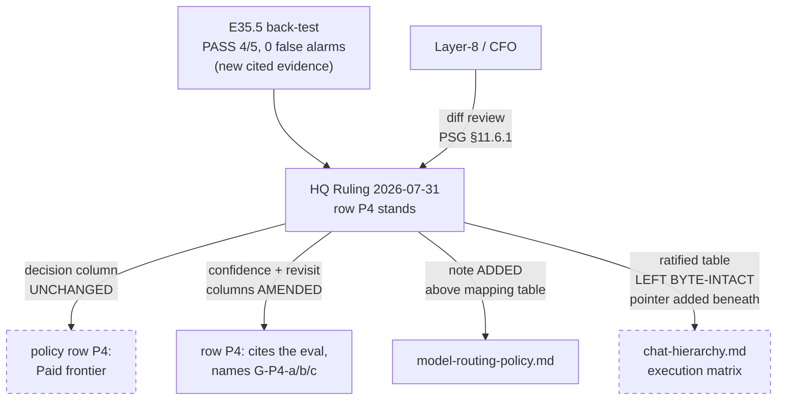

# HQ Chat (Headquarters / Control Room)

## Purpose

An **HQ Chat** (Headquarters Chat) is the **control room** for a project governed by the AI Project System.

It is responsible for:
- Defining intent
- Establishing structure
- Producing authoritative artifacts that enable execution

HQ Chats **do not execute work**.  
They define *what* should be done and *how execution is governed*.

---

## What an HQ Chat Is

An HQ Chat is a **planning, governance, and coordination surface**, typically hosted in:
- ChatGPT
- Other LLM-based chat interfaces
- Web or mobile applications

HQ Chats:
- Are long-lived
- Accumulate strategic context
- Produce durable Markdown artifacts
- Coordinate multiple Epics and Coding Agent chats

---

## What an HQ Chat Is NOT

An HQ Chat is **not**:

- A substitute for documentation
- A Coding Agent (Epic mode) — it does not write production code or modify source files

### Review and Acceptance Behavior

- Collect human review findings in plain language; do not require markdown edits from humans.
- Use AI (HQ Chat or Epic mode) to structure those findings into an Epic Review Seal for confirmation.
- Keep acceptance decisions explicit and human-owned; do not introduce execution loops or implicit acceptance.

---

## Primary Responsibilities

An HQ Chat is responsible for producing and maintaining:

- Project vision and scope
- Phase definitions
- Phase Execution Chat Starters
- System references
- Governance updates (when required)

---
## Epic Closure Enforcement (Mandatory)

HQ Chats MUST enforce the canonical happy path for Epic closure:

1. Require a structured Delivery Notice from the Coding Agent before review begins. No review or closure may proceed without it.
2. Issue explicit delivery authorization (accept, accept-with-follow-ups, or reject) after human review and Epic Review Seal.
3. Decide and record the resolution for any uncommitted changes before closure. No Epic may close with a dirty working tree.
4. Declare Epics closed only after PR is merged and all closure conditions are met.
5. No step may be skipped, inferred, or collapsed.

These rules are mandatory and override any prior practice.

---

## Phase Execution Chat Starters (Critical Responsibility)

Every Phase planning session MUST be initiated using a
**Phase Execution Chat Starter produced by HQ mode**.

HQ mode MUST:
- Produce the Phase Execution Chat Starter
- Ensure it references an existing Phase spec
- Ensure delivery requirements are explicit
- Ensure governance versions are referenced

HQ mode MUST NOT:
- Infer or reconstruct planning contracts
- Delegate starter creation to Layer 8

The Phase Execution Chat Starter is a **binding planning contract**.

---

## Interaction with Epic Mode

The relationship is strictly asymmetric:

- HQ mode defines **intent and constraints**
- Epic mode performs **execution and delivery**

---

## Review and Delivery Notice Protocol

HQ mode MUST:
- Require a Delivery Notice before review or acceptance.
- Use the Delivery Notice as the trigger for human review and Epic Review Seal generation.
- Refuse to proceed to acceptance or closure if a Delivery Notice is missing or incomplete.

HQ mode may:
- Clarify intent
- Adjust future scope
- Respond to blocked execution

HQ mode must NOT:
- Micro-manage execution
- Suggest implementation details during execution
- Override active execution contracts mid-Epic

---

## Typical HQ Mode Lifecycle

1. Project initialization (bootstrap)
2. Phase definition
3. Phase Execution Chat Starter generation
4. Launch Phase mode for Milestone planning
5. Oversight during execution
6. Validation of completion
7. Transition to next Phase

HQ Chats persist across all of these steps.

---

## Standard HQ Chat Opener (Recommended)

When starting an HQ Chat for a new project, the following context should be established:

- Project name
- Repository (if applicable)
- Governance versions in use
- Current Phase (or Phase 0)
- Intended Milestone(s)
- Known constraints

This ensures continuity and prevents context drift.

---

## Review Diagram on HQ Rulings (Structural)

*(Added 2026-07-31, CFO direction, alongside PSG §11.6.1.)*

PSG **§11.6.1** makes Layer-8/the CFO the mandatory **diff reviewer** for HQ-authored deliveries,
because HQ has no parent chat to review it. This section exists to make that review *cheap enough
to actually perform*. A reviewer verifying a ruling should not have to open four files to confirm
that what the ruling claims it changed is what it changed.

**An HQ Ruling that amends a normative document SHOULD carry a Structural diagram** showing four
things, and only these four:

1. **Which documents were touched** by the ruling.
2. **What changed in each** — named to the row, column, section or table, not "updated."
3. **What was deliberately left untouched**, where the ruling claims a freeze or a
   decision-column-unchanged.
4. **Where authority flowed** — who decided, who applies, who reviews.

**Structural only** (Mermaid/PlantUML — AOG §16.3 "Two modes"). It commits as a fenced code block
inside the ruling itself, needs **no ComfyUI endpoint and no `visual_artifacts` configuration at
all** (AOG §16.3/§16.8), renders in the PR diff, and is reviewable as text. This is the mode AOG
§16 already tells you to prefer for most coverage.

**Not Generative.** The ComfyUI track is a different capability with its own gating, and its
precision-validation evidence in this repository is two recorded FAILs (P8-M29-E29.3). A diagram
whose job is to let a reviewer *verify a claim* must be exact by construction; a generated image
is not, and the evidence here says so.

**SHOULD, not MUST.** A ruling that changes no normative document (a triage, a placement, a
disposition) needs no diagram, and one is worse than none if it adds a box that the ruling's text
does not support. The test is whether it shortens the reviewer's path to "this matches."

**Worked example** — the 2026-07-31 row P4 ruling, whose central claim is that new evidence
changed two columns and left the decision untouched:

The dashed nodes are the freezes — the two claims a reviewer would otherwise have to open two
files to check.

**Note on this document:** `hq-chat.md` carries no version or changelog, like 10 of the 15
documents in `governance/systems/`. Inventing one here under an adjacent edit is the corpus-wide
convention change recorded as **P10-GH-8** and above this edit's authority, so none is added —
the same call E35 made when it amended `chat-hierarchy.md` three times.

---

## Relationship to Governance

HQ mode operates under:
- `PROJECT-SYSTEM-GUIDELINES.md`
- `AI-OPERATING-GUIDELINES.md`

If an HQ mode recommendation conflicts with governance,
**governance wins**.

HQ mode may propose governance changes,
but those changes must be formalized in documentation.

---

## Relationship to Documentation

HQ mode:
- Produces documentation
- References documentation
- Never replaces documentation

If information matters after the chat ends,
it belongs in `docs/`.

---

## Closing Statement

HQ mode is the **strategic nervous system** of the project.

It thinks.
It decides.
It prepares execution.

It delegates execution to Phase, Milestone, and Epic modes.

---

## Changelog

| Version | Date | Change |
|---------|------|--------|
| 1.0.0 | 2026-08-05 | **Versioning convention adopted** (HQ Ruling 2026-08-04, P10-GH-8; applied by E37.1, P11-M37). This document previously carried neither a `version` field nor a `## Changelog` section. **This is its first recorded row, and no prior history is reconstructed** — for changes before this date, see `git log -- governance/systems/hq-chat.md`. |
